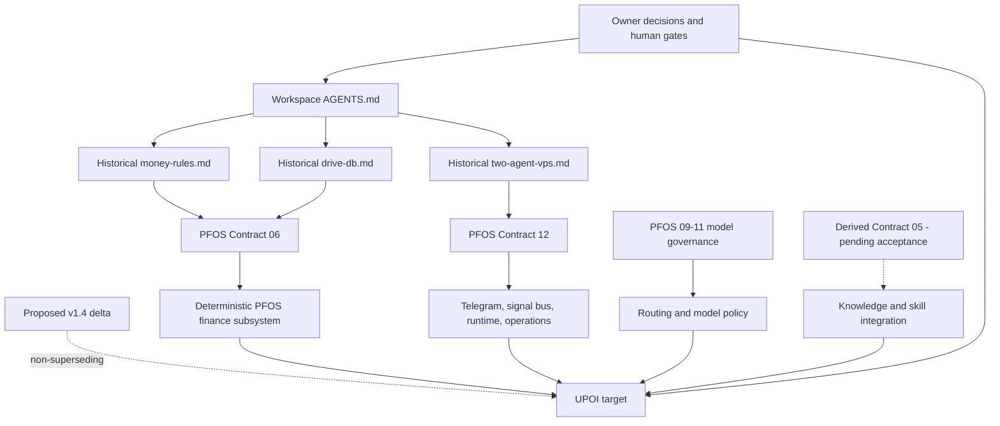
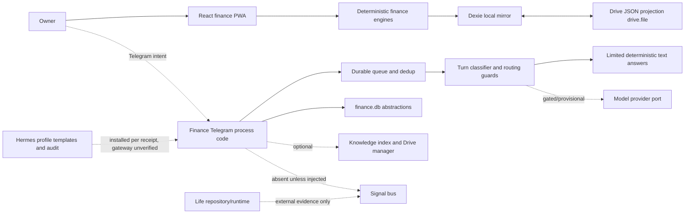
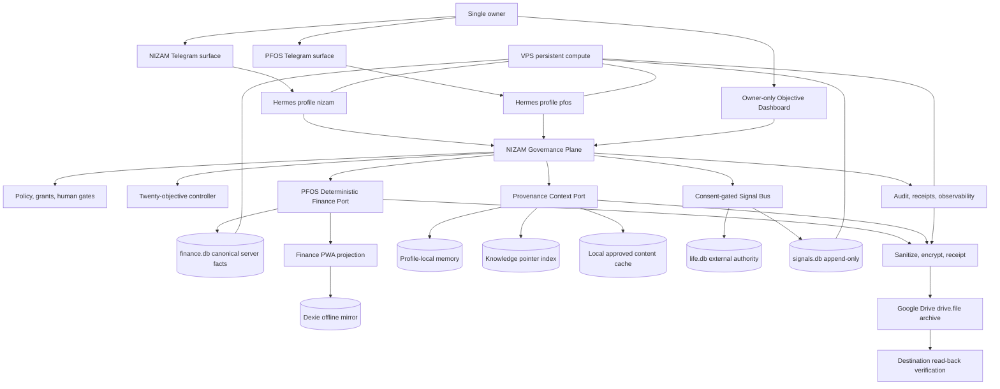
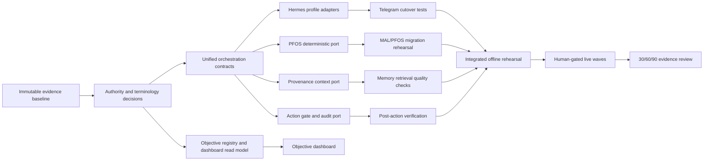
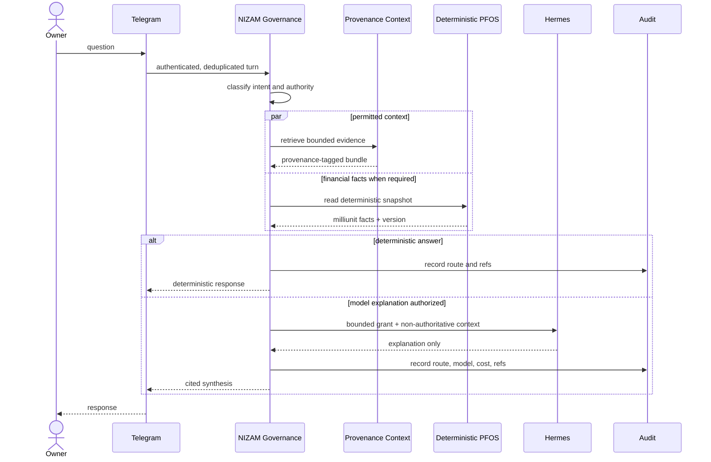
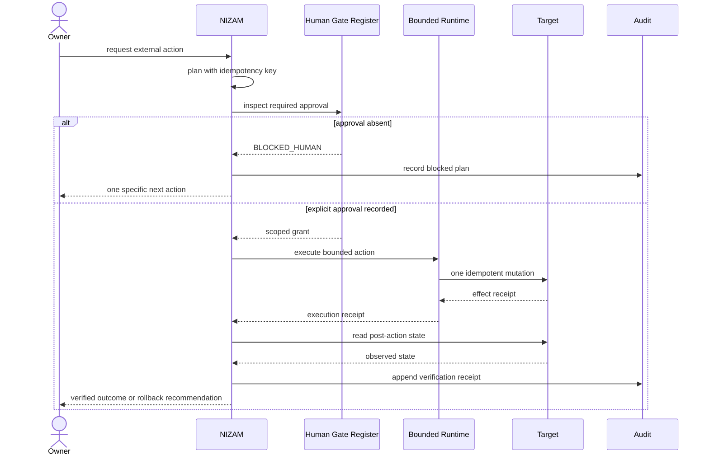
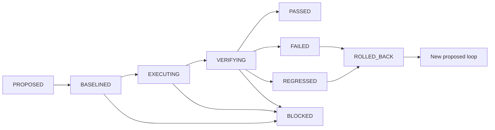

# Technical Design: Unified Personal Operating Intelligence

> **Workflow:** design-first · new feature · High-Level Design + Low-Level Design  
> **Status:** PROPOSED — design evidence only; no production code, deployment, credential, network, secret, commit, or push action is authorized by this document.  
> **Notation:** Structured Pseudocode, selected by the owner. All algorithm and interface examples are language-neutral and use `pascal` fences.  
> **Evidence date:** current working tree inspected during this design session.  
> **Privacy:** repository paths and redacted artifact names only; no secret values, personal ledger rows, deployment particulars, host identifiers, Drive identifiers, bot identifiers, or real financial values.

## Overview

Unified Personal Operating Intelligence (UPOI) is the governed composition of NIZAM, the deterministic PFOS financial subsystem, bounded Hermes profiles, Telegram operator surfaces, provenance-tagged contextual knowledge, narrow-scope Google Drive archival projection, and persistent VPS compute. It is not a new autonomous authority and it is not permission to merge all stores, agents, or repositories.

The target gives one owner a coherent control plane while preserving domain ownership: NIZAM coordinates and synthesizes; PFOS alone owns deterministic financial truth; Hermes executes only explicitly granted tools; Telegram carries operator intent but is not a system of record; local memory and indexed knowledge provide attributed context; Drive holds reviewed, encrypted, read-back-verified projections under `drive.file`; and the VPS hosts isolated, observable processes.

This design is conservative because the current working tree is not a releasable baseline. Existing user changes include deleted historical `.kiro/steering` and `.kiro/specs` files, modified contracts and runtime code, plus untracked Wave artifacts. No existing change is restored, overwritten, reverted, staged, committed, or pushed.

## 2. Evidence Vocabulary

Every material claim uses one of these labels:

- **FACT** — directly observed repository/configuration/document state.
- **VERIFIED_IMPLEMENTATION** — implementation plus colocated tests or a mechanical guard was inspected; this session does not imply the current full gate passes.
- **INFERENCE** — reasoned conclusion from cited evidence, not directly observed runtime behavior.
- **ASSUMPTION** — unresolved premise that must be validated before implementation.
- **RECOMMENDATION** — proposed target or action, not current reality.

Evidence-state words remain distinct: `BUILT`, `INSTALLED`, `RUNNING`, `VERIFIED`, and `SYNCED` never imply one another.


## 3. Reconstructed Reality

### 3.1 Repository and authority state

| Label | Material finding | Evidence |
|---|---|---|
| FACT | The exact feature slug did not exist before this spec. | Broad repository search; new directory created by this workflow. |
| FACT | The working tree contains extensive pre-existing deletions, modifications, and untracked files. | `git status --short --branch` observed in this session. |
| FACT | The `.kiro` tree was absent from the working filesystem before this spec, while committed historical steering remains readable from `HEAD`. | Directory read failed; `git show HEAD:.kiro/steering/...` succeeded. |
| FACT | Historical committed steering makes `money-rules.md` and `drive-db.md` invariant, and gives server/agent/deployment precedence to `two-agent-vps.md`. | Historical committed steering files read from `HEAD`. |
| FACT | `ops/DEPLOYMENT_CONTROL.md` is the current working-tree human-gate record and keeps G1-G8 human-only. | `AGENTS.md`; `ops/DEPLOYMENT_CONTROL.md`. |
| FACT | Contract 13 is a proposed, non-superseding v1.4 delta. | `contracts/pfos/13_NIZAM_v1.4_Production_Controller_Delta.md`. |
| FACT | Contract 05 is a newly derived, untracked working-tree artifact and therefore cannot be treated as accepted upstream authority. | Working-tree status and contract header. |
| INFERENCE | This spec should integrate existing authorities without superseding them; any new policy needs owner acceptance and an ADR/contract amendment. | Authority precedence plus non-supersession rule. |

### 3.2 Implemented and evidenced surfaces

| Label | Surface | Current evidence and limit |
|---|---|---|
| VERIFIED_IMPLEMENTATION | Deterministic finance | Browser features exist for budget, accounts, transactions, reconciliation, obligations, safe-to-spend, forecast, decisions, reports, and net worth. Server data code imports the same integer-money core. Current full-tree green status was not rerun before design. |
| VERIFIED_IMPLEMENTATION | Finance persistence | Contract 06 and `src/server/db/**` define isolated `finance.db`, append-only history, idempotent forward migrations, typed integer boundaries, spend ledger, telemetry, queue, dedup, and document pointers. |
| VERIFIED_IMPLEMENTATION | Telegram finance transport | Auth/allowlist, `(botId, updateId)` dedup, durable queue, bounded worker retry, long-poll/webhook adapter, uniform acknowledgements, and redacted provider handling exist in `src/server/telegram/**`. |
| VERIFIED_IMPLEMENTATION | Signal boundary | `src/server/signals/**` validates a closed, nonnumeric envelope, consent scope, de-identification, integrity hash, and append-only signal store. Cross-agent widening defaults closed. |
| VERIFIED_IMPLEMENTATION | Model routing | T0-T4 classification, minted grants, provisional registry refusal, eligibility admission, per-agent cap logic, privacy posture, and model-channel guards exist. Model routing is not financial authority. |
| VERIFIED_IMPLEMENTATION | Knowledge index | `knowledgeIndex.ts` classifies 12 classes, hashes content, reports unclassified/refused documents, and refuses incomplete ordered sets. `profileMemoryLoader.ts` loads only caller-resolved cached bytes with provenance. |
| VERIFIED_IMPLEMENTATION | Hermes boundary | `src/server/hermes/**` audits profile templates, policy, tools, and gateway wiring. It does not prove a live Hermes gateway. |
| FACT | Current browser UI | `App.tsx` exposes finance-oriented routes and Drive sync; no unified twenty-objective dashboard exists. |
| FACT | Historical loop evidence | `.loop/baseline-manifest.json` records an immutable baseline; `.loop/verification-ledger.json` is hash-linked and records historical 20/20 evidence. Historical evidence does not prove the current working tree. |
| FACT | Deployment evidence | Sanitized receipts state Hermes 0.15.2 and isolated profile homes were installed, but gateways/model calls/production credentials were not completed. Phase-0 artifacts also record incomplete runtime deployment. |
| FACT | Rollback evidence | The runbook uses halt-first, immutable known-good image redeploy, forward-only migrations, pre-migration encrypted snapshots, integrity checks, and human-controlled promotion. |
| INFERENCE | Memory support is provenance-aware retrieval, not a complete vector RAG implementation. | No vector or embedding implementation was found; indexed pointers and bounded contextual loading were found. |
| INFERENCE | “Unified” must mean one governed operator experience, not one mutable database or one omnipotent agent. | Existing isolation, single-writer, consent-bus, and least-authority invariants. |

### 3.3 Unknowns and conflicts

1. **FACT:** Historical `.kiro/specs/**` files are deleted in the working tree, so their current intended requirements/tasks cannot be assumed.
2. **FACT:** README reports a 17-check acceptance harness while historical steering and ledger evidence report 20; documentation is stale.
3. **FACT:** Interop prose describes the life agent as built, while later verified-state evidence says no production-ready image exists and per-bot dedup is incomplete. Later evidence governs claims of deployability.
4. **FACT:** Some receipts say actions were complete locally or on a host; this session did not independently repeat those operations and treats them as provenance-tagged evidence, not fresh verification.
5. **ASSUMPTION:** The owner intends to accept PFOS/MAL as one financial subsystem name, not to create a third agent.
6. **ASSUMPTION:** The objective dashboard may be implemented in the existing React application without making it a server-side authority.
7. **RECOMMENDATION:** Resolve these assumptions by owner decision before production implementation.

## 4. Authority Map



### Authority allocation

| Concern | Authority | Prohibited authority transfer |
|---|---|---|
| Owner intent, consent, external mutation | Human operator and gate record | No agent completes or infers a gate. |
| Financial facts and derived figures | Deterministic PFOS engine, one implementation | NIZAM, Hermes, Telegram, LLMs, memory, and Drive mirrors cannot source or overwrite figures. |
| Financial writes | PFOS single writer | MAL alias, life agent, Hermes, or dashboard cannot write canonical finance state. |
| Cross-domain coordination | NIZAM governance | Coordination cannot reinterpret domain truth. |
| Tool execution | Hermes profile policy plus NIZAM grant | A profile cannot self-grant a tool or widen its scope. |
| Operator interaction | Telegram and owner-only web UI | Neither interface is canonical storage. |
| Context | Provenance-tagged local memory/index | Retrieved text is untrusted data, never policy or instruction. |
| Durable mirror/archive | Drive under `drive.file`, after review/encryption/read-back | Drive is not the live server database and stores no key. |
| Persistent compute | Isolated VPS processes and local volumes | Co-location does not authorize shared mutable state. |
| Release evidence | Loop ledger and THABAT receipts | A document cannot promote itself from built to verified. |


## Architecture

### 5.1 Current-state architecture



**FACT:** The current state is fragmented across a mature finance PWA, substantial server modules, unverified live integration, an external life repository, and sanitized operational receipts.  
**INFERENCE:** The largest gap is not another model or database; it is an authority-preserving composition layer with objective evidence.

### 5.2 Target-state architecture



### 5.3 Target invariants

1. **RECOMMENDATION:** NIZAM is the coordination and governance plane, not a second domain writer.
2. **RECOMMENDATION:** PFOS/MAL is one subsystem with one canonical name, one deterministic money implementation, and one financial write authority.
3. **RECOMMENDATION:** Hermes profiles are replaceable bounded runtimes; all authority enters through explicit grants and tools.
4. **RECOMMENDATION:** Each Telegram identity, profile home, model key, cap, environment file, store, queue namespace, and process is isolated.
5. **RECOMMENDATION:** Context items carry provenance, privacy class, confidence, observed time, content hash, and authority class.
6. **RECOMMENDATION:** Drive mirrors only reviewed and permitted material, under `drive.file`, with encryption where required and destination read-back.
7. **RECOMMENDATION:** Every external or irreversible action has a human gate, idempotency key, audit receipt, and post-action verification.
8. **RECOMMENDATION:** A unified dashboard reads objective evidence but cannot bypass domain writers.

### 5.4 Dependency graph



No human-gated live wave may start before all predecessor offline gates are green and the owner records approval.

## Components and Interfaces

Interfaces below are target contracts. A repository/file mapping is included only where current evidence supports it.

### 6.1 Governance Plane

**Purpose:** Authenticate intent, classify authority, select the bounded subsystem, require human approval when applicable, and write append-only evidence.

```pascal
INTERFACE GovernancePlane
  PROCEDURE planTurn(turn: OperatorTurn): ActionPlan
  PROCEDURE authorize(plan: ActionPlan, grants: GrantSet): AuthorizationDecision
  PROCEDURE dispatch(plan: AuthorizedPlan): ExecutionReceipt
  PROCEDURE verify(receipt: ExecutionReceipt): VerificationReceipt
END INTERFACE
```

**Evidence mapping:** `src/server/process/turnIntake.ts`, `src/server/routing/**`, `src/server/hermes/**`, `src/server/process/haltGate.ts`.  
**Limit:** No single current module implements the complete governance plane.

### 6.2 Deterministic Finance Port

```pascal
INTERFACE DeterministicFinancePort
  PROCEDURE readFinancialSnapshot(query: FinanceQuery): FinancialSnapshot
  PROCEDURE evaluateDecision(request: FinanceDecisionRequest): FinanceDecisionResult
  PROCEDURE appendFinancialCommand(command: ApprovedFinanceCommand): FinancialWriteReceipt
  PROCEDURE verifyFinancialWrite(receipt: FinancialWriteReceipt): VerificationReceipt
END INTERFACE
```

**Preconditions:** all money is integer milliunits; input authority is explicit; write command has an idempotency key.  
**Postconditions:** only PFOS writes canonical finance facts; no LLM-provided magnitude reaches persistence; the receipt identifies the resulting version without exposing private content.  
**Evidence mapping:** `src/lib/money/**`, deterministic `src/features/**`, `src/server/db/**`.  
**Limit:** Existing chat composition explicitly does not wire all Stage 1-4 engines into Telegram.

### 6.3 Hermes Runtime Adapter

```pascal
INTERFACE HermesRuntimeAdapter
  PROCEDURE invoke(profile: ProfileName, grant: ToolGrant, input: BoundedInput): ToolResult
  PROCEDURE listCapabilities(profile: ProfileName): CapabilitySet
  PROCEDURE readiness(profile: ProfileName): RuntimeReadiness
END INTERFACE
```

**Rule:** Hermes executes; it does not decide policy, create grants, source financial truth, or complete human gates.  
**Evidence mapping:** `src/server/hermes/gatewayWiring.ts`, profile/tool policy modules, tracked `ops/hermes/**` templates.  
**Limit:** Template audits and installation receipts do not prove live gateway behavior.

### 6.4 Telegram Operator Port

```pascal
INTERFACE OperatorMessagePort
  PROCEDURE accept(delivery: AuthenticatedDelivery): AcceptDecision
  PROCEDURE claim(key: DeliveryKey): ClaimDecision
  PROCEDURE enqueue(turn: QueuedTurn): QueueReceipt
  PROCEDURE send(message: OperatorReply): SendReceipt
END INTERFACE
```

**Evidence mapping:** `src/server/ports/telegram.ts`, `src/server/telegram/**`, `src/server/process/financeAgent.ts`.  
**Invariant:** duplicate delivery is a successful no-op; offset advances only after durable enqueue; refusal reveals no guard detail.

### 6.5 Provenance Context Port

```pascal
INTERFACE ProvenanceContextPort
  PROCEDURE search(query: ContextQuery): ContextBundle
  PROCEDURE loadProfile(profile: ProfileName, limit: Integer): ContextBundle
  PROCEDURE explain(itemRef: Reference): ProvenanceRecord
  PROCEDURE readiness(profile: ProfileName): KnowledgeReadiness
END INTERFACE
```

**Evidence mapping:** `knowledgeIndex.ts`, `profileMemoryLoader.ts`, `knowledgeBoundary.ts`, `agentReadiness.ts`.  
**Limit:** This design does not assume embeddings, vector search, or autonomous ingestion exist.

### 6.6 Drive Archive Port

```pascal
INTERFACE DriveArchivePort
  PROCEDURE stage(artifact: SanitizedArtifact): StagedArtifact
  PROCEDURE encrypt(staged: StagedArtifact, publicKeyRef: Reference): EncryptedArtifact
  PROCEDURE upload(encrypted: EncryptedArtifact): UploadReceipt
  PROCEDURE readBack(receipt: UploadReceipt): ReadBackReceipt
END INTERFACE
```

**Invariant:** `drive.file` only; no key on Drive; no success until destination content proves the expected version/hash marker.  
**Evidence mapping:** browser `src/lib/drive/**`, server Drive ports/adapters, backup/runbook templates, sanitized THABAT receipts.

### 6.7 Objective Control Port

```pascal
INTERFACE ObjectiveControlPort
  PROCEDURE listExactlyTwenty(): ObjectiveSet
  PROCEDURE evaluate(objectiveId: ObjectiveId, evidence: EvidenceSet): ObjectiveEvaluation
  PROCEDURE rankBacklog(snapshot: ObjectiveSnapshot): RankedBacklog
  PROCEDURE openLoop(objectiveId: ObjectiveId, baseline: BaselineRef): LoopRecord
  PROCEDURE closeLoop(loopId: LoopId, checks: CheckSet): LoopClosure
END INTERFACE
```

This is a new read-model/control-plane interface. It may reference evidence but may not mutate domain stores directly.


## Data Models

### 7.1 Evidence and authority

```pascal
ENUM EvidenceLabel
  FACT
  VERIFIED_IMPLEMENTATION
  INFERENCE
  ASSUMPTION
  RECOMMENDATION
END ENUM

ENUM AuthorityClass
  OWNER
  GOVERNANCE
  DETERMINISTIC_DOMAIN
  EXECUTION_RUNTIME
  OPERATOR_INTERFACE
  CONTEXT
  ARCHIVE
  EVIDENCE_ONLY
END ENUM

STRUCTURE ProvenanceRecord
  source_ref: Reference
  source_version: String
  content_hash: Sha256
  observed_at: UtcInstant
  evidence_label: EvidenceLabel
  authority_class: AuthorityClass
  privacy_class: PrivacyClass
  confidence: ConfidenceBand
END STRUCTURE
```

**Validation rules:** hashes are lowercase SHA-256; timestamps are UTC; `INFERENCE`, `ASSUMPTION`, and `RECOMMENDATION` cannot satisfy a release gate without supporting verification.

### 7.2 Objective model

```pascal
ENUM ObjectiveState
  UNKNOWN
  BASELINED
  AT_RISK
  IMPROVING
  VERIFIED
  REGRESSED
  BLOCKED_HUMAN
END ENUM

STRUCTURE ObjectiveDefinition
  id: ObjectiveId
  name: String
  validation_question: FiveWordQuestion
  owner: AuthorityClass
  evidence_contract: EvidenceContract
  positive_checks: CheckSet
  negative_checks: CheckSet
  regression_checks: CheckSet
END STRUCTURE

STRUCTURE ObjectiveEvaluation
  objective_id: ObjectiveId
  state: ObjectiveState
  baseline_ref: BaselineRef
  evidence_refs: List<Reference>
  findings: List<LabeledFinding>
  evaluated_at: UtcInstant
END STRUCTURE
```

**Validation rules:** exactly twenty objective definitions exist; each validation question contains exactly five whitespace-delimited words after punctuation normalization; every evaluation references an immutable baseline.

### 7.3 Loop record

```pascal
ENUM LoopState
  PROPOSED
  BASELINED
  EXECUTING
  VERIFYING
  PASSED
  FAILED
  REGRESSED
  BLOCKED
  ROLLED_BACK
END ENUM

STRUCTURE LoopRecord
  loop_id: LoopId
  objective_id: ObjectiveId
  hypothesis: String
  baseline_ref: BaselineRef
  allowed_scope: ScopeSet
  prohibited_scope: ScopeSet
  positive_checks: CheckSet
  negative_checks: CheckSet
  regression_checks: CheckSet
  rollback_ref: Reference
  state: LoopState
  evidence_chain_head: Sha256
END STRUCTURE
```

### 7.4 Action plan and receipts

```pascal
ENUM ActionRisk
  READ_ONLY
  LOCAL_REVERSIBLE
  EXTERNAL_REVERSIBLE
  HUMAN_GATED
  IRREVERSIBLE
END ENUM

STRUCTURE ActionPlan
  plan_id: PlanId
  intent: Intent
  target_authority: AuthorityClass
  risk: ActionRisk
  idempotency_key: IdempotencyKey
  required_grants: GrantSet
  human_gate: Optional<GateId>
  preconditions: CheckSet
  postconditions: CheckSet
  rollback_ref: Optional<Reference>
END STRUCTURE

STRUCTURE ExecutionReceipt
  plan_id: PlanId
  idempotency_key: IdempotencyKey
  outcome_code: String
  effect_refs: List<Reference>
  audit_ref: Reference
  executed_at: UtcInstant
END STRUCTURE

STRUCTURE VerificationReceipt
  execution_ref: Reference
  observed_state_hash: Sha256
  expected_state_hash: Sha256
  matched: Boolean
  verified_at: UtcInstant
END STRUCTURE
```

### 7.5 Financial boundary

```pascal
TYPE Milliunits = SafeInteger

STRUCTURE FinancialSnapshot
  version_ref: Reference
  observed_at: UtcInstant
  values: Map<String, Milliunits>
  provenance: ProvenanceRecord
END STRUCTURE
```

No generic context object, signal envelope, Hermes tool result, or LLM response may contain a field typed `Milliunits` unless it is a read-only value obtained from `DeterministicFinancePort` and remains outside model-generated persistence.

## 8. Sequence Diagrams

### 8.1 Read-only operator question



### 8.2 Human-gated action



### 8.3 Loop Engineering cycle

```mermaid
sequenceDiagram
    participant Dashboard
    participant Loop
    participant Builder
    participant Checks
    participant Ledger

    Dashboard->>Loop: select ranked objective
    Loop->>Ledger: freeze baseline hash
    Loop->>Builder: authorize bounded change scope
    Builder->>Checks: run positive checks
    Builder->>Checks: run negative checks
    Builder->>Checks: run regression checks
    Checks-->>Loop: observations
    alt all green and evidence newer
      Loop->>Ledger: append VERIFY and CERTIFY
      Loop-->>Dashboard: objective improving/verified
    else any red
      Loop->>Ledger: append failure evidence
      Loop->>Builder: diagnose or rollback
      Loop-->>Dashboard: at-risk/regressed/blocked
    end
```

## 9. Key Procedures with Formal Specifications

### 9.1 Plan and execute an operator turn

```pascal
PROCEDURE handleOperatorTurn(delivery)
  INPUT: delivery of type OperatorDelivery
  OUTPUT: receipt of type TurnReceipt

  REQUIRE delivery authenticated by applicable transport gates
  REQUIRE delivery key claimed atomically or identified duplicate

  IF delivery IS duplicate THEN
    RETURN DuplicateNoOpReceipt(delivery.key)
  END IF

  queued ← DurableEnqueue(delivery)
  ASSERT queued.committed = true

  turn ← ReadTurn(queued)
  plan ← GovernancePlane.planTurn(turn)
  authorization ← GovernancePlane.authorize(plan, CurrentGrants())

  IF authorization IS Refused THEN
    RETURN RefusalReceipt(plan.id, authorization.code)
  END IF

  execution ← GovernancePlane.dispatch(authorization.plan)
  verification ← GovernancePlane.verify(execution)

  ASSERT execution.audit_ref EXISTS
  ASSERT verification.execution_ref = execution.audit_ref
  RETURN TurnReceipt(execution, verification)
END PROCEDURE
```

**Preconditions:** delivery is bounded; secrets remain opaque; no human gate is inferred.  
**Postconditions:** duplicate input causes no duplicate effect; every accepted effect has audit and verification; failure is explicit and bounded.  
**Loop invariants:** none; queue draining loops preserve “all settled prior rows remain settled” and “every running row is either settled or safely reclaimable.”

### 9.2 Evaluate an objective loop

```pascal
PROCEDURE evaluateLoop(loop, currentEvidence)
  INPUT: immutable loop record and current evidence
  OUTPUT: loop closure

  REQUIRE Hash(loop.baseline_ref) MATCHES baseline manifest
  REQUIRE currentEvidence DOES NOT modify baseline

  positive ← RunChecks(loop.positive_checks, currentEvidence)
  negative ← RunChecks(loop.negative_checks, currentEvidence)
  regression ← RunChecks(loop.regression_checks, currentEvidence)

  IF positive.all_pass AND negative.all_pass AND regression.all_pass THEN
    RETURN Close(loop, PASSED, AppendEvidenceChain(positive, negative, regression))
  END IF

  IF regression.any_fail THEN
    RETURN Close(loop, REGRESSED, AppendEvidenceChain(positive, negative, regression))
  END IF

  RETURN Close(loop, FAILED, AppendEvidenceChain(positive, negative, regression))
END PROCEDURE
```

**Preconditions:** baseline is content-addressed and immutable.  
**Postconditions:** a loop cannot pass by weakening or deleting a check; negative proof and regression proof are mandatory.  
**Loop invariants:** evidence chain head always hashes the previous event; test/check floors never decrease.

### 9.3 Archive to Drive

```pascal
PROCEDURE mirrorApprovedArtifact(artifact, approval)
  INPUT: local artifact and explicit approval
  OUTPUT: verified mirror receipt

  REQUIRE Scope() = drive.file
  REQUIRE approval permits artifact privacy class
  REQUIRE artifact contains no key or deployment particular

  sanitized ← Sanitize(artifact)
  encrypted ← EncryptWhenRequired(sanitized)
  upload ← DriveArchivePort.upload(encrypted)
  readBack ← DriveArchivePort.readBack(upload)

  IF readBack.hash != encrypted.hash THEN
    RETURN Refused("READ_BACK_MISMATCH")
  END IF

  RETURN VerifiedMirrorReceipt(upload, readBack)
END PROCEDURE
```

**Postconditions:** no success without destination read-back; encryption private key never reaches Drive; retry with the same idempotency key produces no duplicate canonical artifact.


## 10. Objective Dashboard — Exactly Twenty Objectives

The dashboard is an evidence read model. It never writes canonical domain state. The acceptance universe below is the user-supplied twenty-objective program; the validation questions are preserved verbatim and are not replaced by architecture-control objectives.

| # | Objective | Exact five-word validation question | Technical sub-objectives | Current status | Evidence | Dependency / risk | Owner | Metric / acceptance test | Rollback or containment | Next validation action |
|---:|---|---|---|---|---|---|---|---|---|---|
| 1 | Build Persistent Personal Operating Intelligence | **Does NIZAM operate continuously autonomously?** | VPS Hermes runtime; Telegram interface; always-on orchestration; LLM gateway; persistent state | PARTIAL — implementation exists, continuous live operation unverified | `src/server/process/**`, `src/server/hermes/**`, `ops/PHASE0_RUNTIME_INVENTORY_2026-08-15.md` | Live readiness and human gates; high | NIZAM governance | Restart/recovery rehearsal plus bounded scheduled-work observation | Halt intake; restore known-good runtime; retain queue | Produce current redacted runtime evidence without executing deployment gates |
| 2 | Maintain Continuous Agent Memory | **Does NIZAM remember relevant history?** | Drive mirror; retrieval; indexing; cross-session reconstruction; synchronization | PARTIAL — index/loader exist, end-to-end history not proven | `src/server/ingest/**`, `contracts/pfos/05_*`, `ops/knowledge/**` | Drive OAuth/ingestion gates; high privacy | Memory/context authority | Retrieval relevance and provenance completeness on synthetic history | Disable retrieval; retain local index; restore prior index snapshot | Run synthetic cross-session retrieval and stale/correction tests |
| 3 | Transform Thoughts Into Intelligence | **Are thoughts becoming useful intelligence?** | Voice ingestion; intent classification; TAFRIGH; extraction; artifact generation | UNKNOWN — no current complete voice-to-artifact evidence | Telegram modules and profile artifacts are partial evidence only | Voice path and artifact contract; medium | Hermes + NIZAM | Synthetic voice fixture to structured artifact with provenance | Keep capture as draft-only; no external effect | Inventory voice ingress and run an offline fixture through the full path |
| 4 | Turn Goals Into Execution | **Are goals becoming completed actions?** | Goal decomposition; bounded workflows; dependency planning; progress checks; prompts | PARTIAL — task/process primitives exist, completed-action outcome data absent | `src/features/decisions/**`, `src/server/process/**`, `ops/hermes/**` | Governance/action receipts; high | NIZAM governance | Synthetic goal produces one approved idempotent task and verified completion | Revoke grant; fence worker; preserve task state | Define goal/task receipt contract and test one reversible local action |
| 5 | Prioritize Recovery Under Constraints | **Does NIZAM protect depleted capacity?** | SUKOON; recovery signals; adaptation; checks; throttling | UNKNOWN — no verified current capacity-control loop | No current acceptance evidence inspected | Health/capacity source and consent policy; high | NIZAM + SUKOON | Depleted-capacity fixture reduces permitted intensity | Default to low-intensity/read-only behavior | Inventory SUKOON implementation and synthetic signal contract |
| 6 | Improve Decision Quality | **Are my decisions becoming better?** | QARAR; justified deliberation; evidence retrieval; scenarios; decision memory | PARTIAL — decision records/logic exist, outcome improvement not measured | `src/features/decisions/**`, `src/server/ingest/**` | Outcome labels and baseline cohort; medium | NIZAM governance | Pre/post decision-quality rubric with held-out synthetic cases | Keep suggestions non-authoritative; disable deliberation | Define decision outcome metric and baseline sample |
| 7 | Challenge Assumptions Before Action | **Are weak assumptions challenged early?** | NAQD; adversarial review; counterarguments; failure simulation; retrieval | UNKNOWN — persona-level evidence is insufficient | No verified NAQD execution path established | Critic contract and bounded review; medium | NIZAM + NAQD | Known-bad assumption fixture produces explicit challenge before action | Require human confirmation; no mutation | Locate or author the bounded critic interface after design acceptance |
| 8 | Convert Problems Into Plans | **Do problems produce executable plans?** | SHURA; decomposition; research retrieval; bounded loops; task generation | PARTIAL — planning concepts exist, executable plan evidence incomplete | `design.md` target interfaces; existing process modules | Governance and task receipts; medium | NIZAM + SHURA | Problem fixture yields dependency-valid plan with owner and rollback | Keep plan as draft; do not dispatch | Add plan schema and validate against synthetic problems |
| 9 | Track Decisions And Learning | **Does NIZAM learn from outcomes?** | THABAT; outcome tracking; history retrieval; retrospectives; consolidation | PARTIAL — ledgers/receipts exist, measured learning loop absent | `.loop/verification-ledger.json`, `ops/THABAT_*`, decision registry | Fresh outcome telemetry; medium | THABAT / HISTORIAN | Outcome-linked retrospective changes a measured recommendation score | Append correction; never rewrite prior outcome | Build outcome-to-retrospective fixture and scoring baseline |
| 10 | Operate MAL/PFOS Financial Intelligence | **Is MAL improving financial outcomes?** | Unified boundary; ingestion; deterministic budgets/forecast; obligations; scenarios | PARTIAL — deterministic finance is implemented, outcome improvement not demonstrated | `src/lib/money/**`, `src/features/{budget,forecast,obligations,safeToSpend}/**`, `src/server/db/**` | MAL inventory and financial outcome baseline; critical | PFOS/MAL deterministic domain | Integer-milliunit parity, deterministic scenario tests, owner outcome metric | Read-only finance mode; preserve canonical store; no model fallback | Inventory legacy MAL/PFA read-only and define outcome baseline |
| 11 | Optimize Health And Energy | **Is NIZAM improving daily capacity?** | BADAN; approved biometrics; recovery trends; sleep; capacity recommendations | UNKNOWN — no verified health pipeline | Health boundary rules are documented but live path unverified | Sensitive data and local-only policy; critical privacy | BADAN / NIZAM | Synthetic capacity trend produces calibrated recommendation | Keep health data local; disable provider path | Inventory BADAN and verify local-only egress negative tests |
| 12 | Detect Behavioral And Psyche Patterns | **Does NIZAM understand my patterns?** | Longitudinal retrieval; uncertainty labels; correlations; trends; non-diagnostic interpretation | UNKNOWN — no measured behavioral evaluation | No current behavioral evaluation evidence | Sensitive inference and non-diagnostic safeguards; critical | NIZAM / HISTORIAN | Held-out synthetic patterns include confidence and alternatives | Disable behavioral inference; retain source records | Define safe synthetic evaluation set and claim schema |
| 13 | Reduce Impulsive Decisions | **Are harmful impulses increasingly interrupted?** | Friction; spending intervention; triggers; delays; supportive persuasion | UNKNOWN — no outcome metric or intervention evidence | Finance primitives exist but intervention outcome is unverified | Consent and non-coercion; high | NIZAM + PFOS | Intervention rate and accepted/rejected outcome trend | User-configurable off switch; draft-only fallback | Define reversible intervention protocol and baseline |
| 14 | Maintain Faith And Values Alignment | **Are actions aligned with values?** | Values retrieval; faith-aware context; constraints; niyyah; conflict detection | UNKNOWN — operator-configured values layer not verified | No current implementation evidence inspected | Operator configuration and interpretive boundaries; medium | NIZAM / owner | Synthetic values conflict is surfaced transparently, never enforced silently | Disable values suggestions; preserve factual path | Inventory values configuration and distinction from authority |
| 15 | Increase Professional Leverage | **Is professional leverage measurably increasing?** | Career intelligence; skill gaps; performance; opportunities; growth plan | UNKNOWN — no verified professional outcome telemetry | No current implementation evidence inspected | External research and outcome attribution; medium | NIZAM / owner | Owner-selected leverage metric over baseline period | Keep recommendations draft-only; revoke external tools | Define one measurable leverage outcome and evidence source |
| 16 | Automate Life Administration | **Is manual administration consistently decreasing?** | Schedules; proactive Telegram; recurring routines; events; status retrieval | PARTIAL — scheduler and Telegram primitives exist, time saved unmeasured | `src/server/process/scheduler*.ts`, `src/server/telegram/**`, `ops/hermes/**` | Live integrations and approval model; high | Hermes execution | Measured operator minutes saved with zero unapproved effects | Disable scheduler; drain/fence queue | Instrument synthetic recurring workflow and operator-time baseline |
| 17 | Coordinate Specialized Agent Personas | **Do agents collaborate without confusion?** | Supervisor; routing; personas; shared provenance context; handoffs | PARTIAL — profile/tool policies and routing exist, multi-persona outcome proof absent | `src/server/hermes/**`, `src/server/routing/**`, `contracts/pfos/05_*` | Scope ownership and loop prevention; high | NIZAM governance | Handoff trace has one owner, bounded budget, no duplicate authority | Disable handoff; route to single profile | Define two-profile synthetic handoff and confusion negative tests |
| 18 | Anticipate Risks And Opportunities | **Does NIZAM act before problems?** | Predictive monitoring; obligations; triggers; scanning; proactive notices | PARTIAL — obligation/risk primitives exist, lead-time outcome absent | `src/features/obligations/**`, `src/features/forecast/**`, `src/server/process/**` | Forecast and notification evidence; high | NIZAM + PFOS | Median warning lead time and false-positive rate | Notifications only; no consequential auto-action | Establish synthetic risk event and measure lead time |
| 19 | Continuously Improve Agent Intelligence | **Is NIZAM improving through usage?** | Feedback; evaluation; relevance; versioned adaptation; outcome tuning | PARTIAL — benchmark/routing/evaluation modules exist, safe adaptation loop unproven | `src/features/benchmark/**`, `src/server/benchmark/**`, `.loop/**` | Evaluation dataset and rollback; high | NIZAM evaluation authority | Versioned change beats baseline without regression | Freeze prior prompt/config; revert to known-good | Define adaptation candidate format and held-out regression suite |
| 20 | Compound Personal Autonomy | **Am I becoming more autonomous?** | Humanized responses; context style; evidence-gated automation; override governance | UNKNOWN — operator-level outcome not yet measured | No current longitudinal autonomy metric | Baseline survey/time-use data and sustained operation; high | Owner + NIZAM | Reduced admin burden plus preserved override rate | Return to manual mode; disable automation | Define autonomy scorecard before claiming outcome improvement |

**Status legend:** `YES` is reserved for a current, repeatable positive result answering the exact question. `PARTIAL` means implementation or evidence exists but the question is not demonstrated. `NO` means the capability is materially ineffective. `UNKNOWN` means required evidence was not inspected. `DEPRECATED` means intentionally superseded but retained for rollback. `BLOCKED_HUMAN` is a blocker state and never completion. The current dirty tree yields no `YES` claims for these outcome questions.

**Mechanical dashboard constraints:**

1. Exactly twenty objectives exist; scope changes require an owner-approved merge or replacement.
2. The questions above are immutable and mechanically count to exactly five normalized words.
3. Objective status cannot be `YES` from `INFERENCE`, `ASSUMPTION`, or `RECOMMENDATION` alone.
4. Historical evidence is visually distinct from current-baseline evidence.
5. A human gate produces `BLOCKED_HUMAN`, never failure and never completion.
6. Financial values are read-only deterministic PFOS outputs in integer milliunits and are formatted only at presentation.
7. Every loop closure produces a dashboard-rerun receipt against the same immutable baseline and evidence-chain head.

### 10.1 Canonical mechanically verifiable registry

The following ordered constant is the canonical design model. Names and questions are copied from the supplied objective set; identifiers and questions may change only through an owner-approved merge-or-replace decision that still leaves exactly twenty entries.

```pascal
CONST UPOI_OBJECTIVES = [
  (1, "build-persistent-personal-operating-intelligence", "Does NIZAM operate continuously autonomously?"),
  (2, "maintain-continuous-agent-memory", "Does NIZAM remember relevant history?"),
  (3, "transform-thoughts-into-intelligence", "Are thoughts becoming useful intelligence?"),
  (4, "turn-goals-into-execution", "Are goals becoming completed actions?"),
  (5, "prioritize-recovery-under-constraints", "Does NIZAM protect depleted capacity?"),
  (6, "improve-decision-quality", "Are my decisions becoming better?"),
  (7, "challenge-assumptions-before-action", "Are weak assumptions challenged early?"),
  (8, "convert-problems-into-plans", "Do problems produce executable plans?"),
  (9, "track-decisions-and-learning", "Does NIZAM learn from outcomes?"),
  (10, "operate-mal-pfos-financial-intelligence", "Is MAL improving financial outcomes?"),
  (11, "optimize-health-and-energy", "Is NIZAM improving daily capacity?"),
  (12, "detect-behavioral-and-psyche-patterns", "Does NIZAM understand my patterns?"),
  (13, "reduce-impulsive-decisions", "Are harmful impulses increasingly interrupted?"),
  (14, "maintain-faith-and-values-alignment", "Are actions aligned with values?"),
  (15, "increase-professional-leverage", "Is professional leverage measurably increasing?"),
  (16, "automate-life-administration", "Is manual administration consistently decreasing?"),
  (17, "coordinate-specialized-agent-personas", "Do agents collaborate without confusion?"),
  (18, "anticipate-risks-and-opportunities", "Does NIZAM act before problems?"),
  (19, "continuously-improve-agent-intelligence", "Is NIZAM improving through usage?"),
  (20, "compound-personal-autonomy", "Am I becoming more autonomous?")
]

PROCEDURE validateObjectiveRegistry(objectives)
  REQUIRE Length(objectives) = 20
  REQUIRE Unique(Map(objectives, id))
  REQUIRE Unique(Map(objectives, slug))
  REQUIRE Map(objectives, id) = RangeInclusive(1, 20)

  FOR EACH objective IN objectives DO
    words ← SplitOnWhitespace(RemovePunctuation(Trim(objective.question)))
    REQUIRE Length(Filter(words, word -> word != "")) = 5
    REQUIRE objective.question = SuppliedQuestionFor(objective.id)
  END FOR
END PROCEDURE
```

A build-time validator SHALL parse the implementation registry, compare it field-for-field with `UPOI_OBJECTIVES`, and fail on missing, extra, reordered, duplicate, or reworded entries. The dashboard SHALL render from that validated registry rather than maintaining a second list.

### 10.2 Mandatory complete-loop shape

This refinement is normative for every loop, including UPOI-L01 through UPOI-L20 in Section 18. A loop is invalid and cannot enter `EXECUTING` unless all nine controls below are present and nonempty. Existing `positive_checks` fields implement the required positive control; implementations SHOULD rename them to `positive_control` when compatibility permits, but MUST NOT maintain two divergent lists.

```pascal
STRUCTURE CompleteLoopDefinition
  loop_id: LoopId
  objective_id: ObjectiveId
  immutable_baseline_ref: BaselineRef
  bounded_allowed_scope: ScopeSet
  bounded_prohibited_scope: ScopeSet
  exit_criteria: CheckSet
  positive_control: CheckSet
  negative_test: CheckSet
  regression_check: CheckSet
  rollback_ref: Reference
  dashboard_rerun: DashboardRerunSpec
END STRUCTURE

STRUCTURE DashboardRerunSpec
  objective_id: ObjectiveId
  baseline_ref: BaselineRef
  required_chain_head: Sha256
  expected_terminal_states: Set<ObjectiveState>
END STRUCTURE

PROCEDURE admitLoop(loop)
  REQUIRE BaselineIsContentAddressed(loop.immutable_baseline_ref)
  REQUIRE BaselineIsImmutable(loop.immutable_baseline_ref)
  REQUIRE loop.bounded_allowed_scope IS NOT EMPTY
  REQUIRE loop.bounded_prohibited_scope IS NOT EMPTY
  REQUIRE loop.exit_criteria IS NOT EMPTY
  REQUIRE loop.positive_control IS NOT EMPTY
  REQUIRE loop.negative_test IS NOT EMPTY
  REQUIRE loop.regression_check IS NOT EMPTY
  REQUIRE loop.rollback_ref IS RESOLVABLE
  REQUIRE loop.dashboard_rerun.objective_id = loop.objective_id
  REQUIRE loop.dashboard_rerun.baseline_ref = loop.immutable_baseline_ref
END PROCEDURE

PROCEDURE closeCompleteLoop(loop, observations)
  REQUIRE observations satisfy loop.exit_criteria
  REQUIRE observations.positive_control.all_pass
  REQUIRE observations.negative_test.all_pass
  REQUIRE observations.regression_check.all_pass
  REQUIRE RollbackIsReady(loop.rollback_ref)

  chainHead ← AppendEvidenceWithoutRewritingBaseline(loop, observations)
  rerun ← RerunDashboard(loop.dashboard_rerun, chainHead)

  REQUIRE rerun.baseline_ref = loop.immutable_baseline_ref
  REQUIRE rerun.evidence_chain_head = chainHead
  REQUIRE rerun.objective_id = loop.objective_id
  RETURN LoopClosureWithDashboardReceipt(loop.loop_id, chainHead, rerun.receipt_ref)
END PROCEDURE
```

The dashboard rerun is mandatory after checks and before closure. A failed rerun leaves the loop `FAILED` or `REGRESSED`; a human-gate blocker leaves it `BLOCKED_HUMAN`; neither state may be rewritten into `PASSED`. Read-only loops still require a rollback reference that states “no mutation occurred” and identifies the evidence proving that claim.

## 11. MAL/PFOS Convergence and Duplication Classification

**FACT:** Current-repository code and contracts use PFOS as the deterministic finance authority. `MAL` appears as a privacy/domain name in older cross-repository evidence and as the `PFOS/MAL` alias in the proposed v1.4 delta. The historical architecture reports a separate MAL/PFA JSONL financial engine using float-like representations in the other repository; this was not independently inspected in this session.

| Asset or concept | Classification | Rationale and non-destructive action |
|---|---|---|
| TypeScript integer-money core `src/lib/money/**` | **KEEP** | Only evidenced implementation satisfying exact milliunit invariants across browser/server. |
| PFOS deterministic engines and finance interfaces | **KEEP** | Canonical financial computation and target single writer. |
| `PFOS/MAL` terminology | **MERGE** | Adopt “PFOS” as canonical subsystem name; retain “MAL” as a documented legacy alias during migration. |
| MAL/PFA financial state or JSONL ledgers in the other repository | **MIGRATE** | Read-only inventory, schema map, synthetic rehearsal, dual-read comparison, owner-approved import; never direct destructive conversion. |
| Duplicate MAL financial calculations using floats or independent formulas | **DEPRECATE** | Block new writes/calculations after parity and cutover approval; preserve read access and evidence. |
| Superseded MAL financial implementation artifacts | **DELETE_LATER** | Eligible only after retention expiry, owner approval, verified backup/restore, provenance-preserving migration receipt, and rollback window closure. No deletion in this feature phase. |
| Life-governor/nonfinancial ledgers | **KEEP** | Separate domain authority; only bounded state crosses the signal bus. |
| Browser Drive JSON finance database | **KEEP** as projection | Preserve offline PWA capability; target canonical-write relationship must be explicit and conflict-safe. |
| `finance.db` server store | **KEEP** as target canonical server ledger | Single local writer, integer boundary, forward migrations, snapshots. |
| Duplicate objective/readiness scores across modules | **MERGE** | Use one objective registry; existing agent-readiness remains a knowledge submetric, not the whole dashboard. |

### 11.1 Migration guardrail

```pascal
PROCEDURE migrateLegacyMal(sourceSnapshot, mapping, ownerApproval)
  REQUIRE sourceSnapshot IS read_only
  REQUIRE ownerApproval explicitly names scope
  REQUIRE mapping contains unit conversion proof
  REQUIRE no source monetary value is floating point after parse boundary

  baseline ← Hash(sourceSnapshot)
  candidate ← TransformIntoPfFormat(sourceSnapshot, mapping)
  parity ← CompareDeterministicOutputs(candidate)

  IF parity.not_exact OR parity.unexplained_records > 0 THEN
    RETURN RefusedMigrationReceipt(baseline, parity)
  END IF

  staged ← StageWithoutCanonicalWrite(candidate)
  verification ← RunPositiveNegativeRegressionChecks(staged)
  IF NOT verification.all_pass THEN
    RETURN RefusedMigrationReceipt(baseline, verification)
  END IF

  RETURN AwaitingHumanCutoverReceipt(baseline, Hash(staged))
END PROCEDURE
```

No source is deleted, no canonical writer changes, and no dual-write period begins automatically.

## 12. Alternatives and Trade-offs

| Decision area | Alternative | Benefit | Cost/risk | Decision |
|---|---|---|---|---|
| Product shape | One omnipotent agent | Simple mental model | Collapses authority, privacy, and failure boundaries | Reject |
| Product shape | Governed NIZAM + PFOS specialist | Clear authority and bounded cross-domain state | More explicit contracts and adapters | Adopt |
| Runtime | Hermes decides policy | Less orchestration code | Runtime self-grants authority and couples policy to vendor | Reject |
| Runtime | Hermes executes explicit grants | Replaceable runtime, testable boundary | Requires governance adapter | Adopt |
| Stores | One shared database | Easy joins | Cross-domain leakage and multi-writer risk | Reject |
| Stores | Separate domain stores plus bounded bus | Mechanical isolation | No rich cross-domain joins | Adopt |
| Finance naming | Keep MAL and PFOS parallel | Avoid migration work | Permanent duplicate truth and unit drift | Reject |
| Finance naming | PFOS canonical, MAL legacy alias | One authority and gradual migration | Requires inventory/parity evidence | Adopt |
| Context retrieval | Assume vector RAG now | Rich semantic search | Unevidenced dependency and privacy surface | Defer |
| Context retrieval | Provenance index plus bounded local retrieval | Evidence-supported, fail-closed | Less semantic recall initially | Adopt first |
| Drive | Live server database | Convenient sync | Conflicts with SQLite/WAL and offline authority rules | Reject |
| Drive | Reviewed encrypted mirror/archive | Narrow authority, recoverability | Requires receipts and read-back | Adopt |
| Router | Shared routing service | Unified telemetry/canary logic | Co-locates keys and creates shared failure domain | Defer |
| Router | Per-profile adapter with shared contracts | Better isolation | Duplicate adapters must conform to contract | Adopt first |
| Operator UX | Telegram only | Minimal surface | Poor evidence/dashboard review | Reject as sole UI |
| Operator UX | Telegram plus read-only dashboard | Fast interaction plus objective control | Two presentation surfaces | Adopt |
| Deployment | Webhook first | Low latency | Public endpoint, DNS/cert gates | Defer |
| Deployment | Long-poll first | No public application port | Outbound loop and ownership-cutover complexity | Adopt for initial gated wave |

## 13. Decision Record

| ID | Decision | Status | Consequence |
|---|---|---|---|
| UPOI-D1 | “Unified” means governed composition, not merged state. | PROPOSED | Preserve NIZAM/PFOS/life authority boundaries. |
| UPOI-D2 | PFOS is canonical; MAL is a migration alias. | PROPOSED — owner acceptance required | Prevent a third financial writer. |
| UPOI-D3 | Hermes is bounded execution runtime only. | PROPOSED | Runtime can be replaced without changing policy. |
| UPOI-D4 | Objective registry contains exactly twenty objectives. | PROPOSED | Scope changes require explicit merge/replace decision. |
| UPOI-D5 | Dashboard is a read model over evidence. | PROPOSED | It cannot mutate domain stores. |
| UPOI-D6 | Provenance retrieval precedes vector RAG. | PROPOSED | Build only evidenced retrieval first. |
| UPOI-D7 | Every effect requires idempotency, audit, and post-verification. | PROPOSED | External retries are safe and claims are evidence-backed. |
| UPOI-D8 | Loop closure requires positive, negative, and regression checks. | PROPOSED | Passing only happy-path checks is insufficient. |
| UPOI-D9 | Historical receipt evidence never proves current state. | PROPOSED | Dashboard shows evidence freshness/baseline. |
| UPOI-D10 | No production implementation begins until this design-derived authority is accepted. | PROPOSED | Contract-before-code remains intact. |

## 14. Loop Engineering Model

Loop Engineering is the evidence-preserving improvement mechanism for UPOI. A loop is not an autonomous deployment cycle: it is a bounded hypothesis, immutable baseline, approved scope, explicit checks, rollback path, and append-only outcome record.

### 14.1 Cycle states



A failed or regressed loop is never rewritten as passed. Remediation creates a new loop linked to the failed predecessor.

### 14.2 Immutable baseline rules

1. **RECOMMENDATION:** Baselines are content-addressed manifests containing source revision references, test/check inventory, contract/spec hashes, relevant schema versions, and synthetic fixture versions.
2. **RECOMMENDATION:** Baseline files and ledger events are append-only for the lifetime of a loop; correction creates a superseding event rather than editing history.
3. **RECOMMENDATION:** A check may become stricter inside a loop, but it may not be removed, skipped, renamed to hide continuity, or have its pass threshold lowered.
4. **RECOMMENDATION:** Historical 20/20 evidence is attached as prior evidence only. The current working tree receives a new baseline and cannot inherit the historical result.
5. **RECOMMENDATION:** Secret-bearing, personal-ledger, deployment-particular, host, bot, Drive, and credential values are excluded from manifests; only redacted references and hashes are recorded.
6. **RECOMMENDATION:** Human-gate state is referenced, never executed or marked by the loop engine.
7. **RECOMMENDATION:** Baseline verification fails closed if a referenced file, check, fixture, or schema cannot be resolved.

### 14.3 Check matrix

| Check class | Proves | Representative checks | Failure meaning |
|---|---|---|---|
| Positive | Required behavior occurs | deterministic snapshot read; authenticated turn accepted; approved context returned; encrypted mirror read back | Capability not evidenced |
| Negative | Forbidden behavior does not occur | floats rejected at money boundary; unauthenticated Telegram refused; restricted context denied model egress; shared-store attachment refused; absent gate blocks action | Boundary violation or fail-open behavior |
| Regression | Existing invariants remain intact | browser/server money parity; existing finance feature tests; `drive.file`; queue/dedup; signal schema; bundle exclusion; acceptance-check floor | New change damaged prior authority or capability |

### 14.4 Evidence promotion

```pascal
PROCEDURE promoteEvidence(candidate, loop, observations)
  REQUIRE candidate.label IN {FACT, VERIFIED_IMPLEMENTATION}
  REQUIRE observations.baseline_ref = loop.baseline_ref
  REQUIRE observations.positive.all_pass
  REQUIRE observations.negative.all_pass
  REQUIRE observations.regression.all_pass
  REQUIRE observations.timestamp > BaselineTimestamp(loop.baseline_ref)
  REQUIRE EvidenceChainIsValid(loop.evidence_chain_head, observations)

  IF candidate.requires_human_gate AND NOT HumanApprovalIsRecorded(candidate.gate_id) THEN
    RETURN BlockedHuman(candidate.reference)
  END IF

  IF candidate.contains_sensitive_payload THEN
    RETURN Refused("SENSITIVE_EVIDENCE_PAYLOAD")
  END IF

  RETURN AppendPromotionEvent(candidate, observations)
END PROCEDURE
```

`INFERENCE`, `ASSUMPTION`, and `RECOMMENDATION` may guide planning but cannot be promoted directly to release evidence. `VERIFIED_IMPLEMENTATION` requires inspected implementation plus current mechanical evidence; a receipt from another baseline remains `FACT` about the receipt, not fresh runtime verification.

## 15. Ranked Backlog Strategy

The backlog is ranked by authority risk first, then objective coverage, dependency centrality, reversibility, and owner value. It does not rank by novelty or model sophistication.

### 15.1 Ranking function

```pascal
PROCEDURE rankCandidate(item, snapshot)
  REQUIRE item references one or more objective ids

  authority_score ← Severity(item.authority_gap)
  safety_score ← Severity(item.safety_gap)
  dependency_score ← CountBlockedDependents(item)
  evidence_score ← EvidenceStaleness(item, snapshot)
  value_score ← OwnerValue(item)
  reversibility_penalty ← Irreversibility(item)
  human_gate_penalty ← IF item.requires_human_gate THEN 1 ELSE 0

  RETURN LexicographicRank(
    authority_score,
    safety_score,
    dependency_score,
    evidence_score,
    value_score,
    -reversibility_penalty,
    -human_gate_penalty
  )
END PROCEDURE
```

### 15.2 Initial ranked epics

| Rank | Epic | Objectives | Rationale |
|---:|---|---|---|
| 1 | Accept authority, terminology, and invariant contract | 1-6, 16 | Prevents implementation against disputed policy. |
| 2 | Freeze current evidence baseline and check inventory | 17-20 | Prevents stale 20/20 claims and check weakening. |
| 3 | Define PFOS/MAL inventory and non-destructive migration map | 2-4, 8, 18 | Removes duplicate financial truth before broader orchestration. |
| 4 | Implement objective registry and read-only evaluation model | 1, 17, 19, 20 | Makes evidence and blockers visible without new write authority. |
| 5 | Compose governance ports over existing modules | 1, 5-8, 16-17 | Closes the current fragmented orchestration gap. |
| 6 | Harden provenance context and locality enforcement | 9-10 | Builds supported retrieval before unevidenced RAG. |
| 7 | Prove profile, store, queue, key, and budget isolation | 6-8, 14-15 | Reduces cross-agent blast radius. |
| 8 | Prove Drive archive/read-back and restore rehearsal | 11-12, 18 | Establishes recoverability under narrow scope. |
| 9 | Deliver the owner-only objective dashboard | all, read-only | Adds coherent control after evidence contracts exist. |
| 10 | Run integrated offline and synthetic rehearsals | all | Required before any human-gated live wave. |
| 11 | Prepare, but do not execute, live-wave packets | 7, 11-12, 15-18 | Separates safe templates from owner-controlled operations. |
| 12 | Evaluate optional vector retrieval and shared routing | 9-10, 15 | Deferred until privacy, evidence, and need are demonstrated. |

## 16. Sprint Structure

Sprints are evidence-oriented and may end with `BLOCKED_HUMAN` rather than simulated completion.

| Sprint | Theme | Primary deliverables | Exit evidence |
|---|---|---|---|
| S0 | Authority and baseline | Accepted ADR/contract delta; current baseline manifest; check inventory; unresolved-question register | Owner decisions recorded; no weakened checks; hashes resolvable |
| S1 | Finance convergence | MAL/PFOS asset inventory; unit/schema map; synthetic migration harness; exact parity report | No canonical mutation; zero unexplained synthetic discrepancies |
| S2 | Governance composition | Typed governance/action/receipt ports; adapters over existing intake, routing, gates, audit | Positive refusal/idempotency/audit tests; no self-grants |
| S3 | Context and isolation | Provenance query contract; local cache policy; profile/store/queue/cap isolation checks | Restricted egress negative tests and mechanical isolation evidence |
| S4 | Objective control | Exactly-twenty registry; evaluator; loop register; owner-only read model | Count/word validators; stale-evidence distinction; read-only proof |
| S5 | Recovery and integration | Drive read-back; encrypted snapshot/restore rehearsal; integrated synthetic turn flows | Restore integrity, destination hash match, regression gate green |
| S6 | Human-gated readiness | Redacted runbooks, readiness report, live-wave packets, owner checkpoints | All offline predecessors green; live work remains explicitly gated |

Sprint assignment is a planning recommendation, not authorization to execute an open task.

## 17. 30/60/90 Roadmap

### Days 0-30 — Establish authority and measurable reality

- Accept or revise UPOI decisions, especially PFOS canonical naming and dashboard placement.
- Freeze a new current-state baseline without altering historical evidence.
- Inventory MAL/PFOS assets read-only and prove unit/schema mappings with synthetic data.
- Define the exactly-twenty objective registry, loop register, and evidence contracts.
- Compose interface adapters only where current modules support them.

**Exit:** objectives 1-5, 19, and 20 are at least `BASELINED`; no production/network/secret gate has been crossed.

### Days 31-60 — Prove bounded composition offline

- Implement governance, provenance-context, action-gate, and receipt composition.
- Mechanically verify profile, database, queue, key, cap, and context isolation.
- Build the owner-only read model and objective dashboard.
- Rehearse non-destructive MAL/PFOS migration, Drive read-back, rollback, and restore with synthetic/redacted artifacts.

**Exit:** all twenty objectives have current evidence or an explicit blocker; integrated offline checks are green; no unresolved authority conflict remains.

### Days 61-90 — Prepare controlled live readiness

- Run complete current-baseline acceptance and integrity checks.
- Produce redacted readiness packets and one bounded live-wave proposal at a time.
- Await explicit owner approval for each applicable human gate.
- After an authorized wave, require post-action read-back, audit, rollback readiness, and a new evidence event.
- Defer semantic/vector retrieval or shared routing unless measured need and privacy posture support them.

**Exit:** either a verified bounded live state exists with owner-approved evidence, or the roadmap ends honestly as `BLOCKED_HUMAN`/`BLOCKED_DEPENDENCY`.

## 18. Loop Register Design

### 18.1 Register fields

| Field | Purpose |
|---|---|
| `loop_id` | Stable non-secret identifier |
| `objective_id` | Exactly one primary objective; secondary links allowed separately |
| `hypothesis` | Falsifiable expected improvement |
| `baseline_ref` | Immutable content-addressed baseline |
| `owner` | Responsible authority, not merely executor |
| `allowed_scope` / `prohibited_scope` | Explicit file/service/effect boundaries |
| `positive_checks` | Required behavior evidence |
| `negative_checks` | Prohibited behavior evidence |
| `regression_checks` | Preserved baseline evidence |
| `human_gate` | Optional gate reference; no embedded value or completion logic |
| `rollback_ref` | Tested reversal procedure or reason no mutation occurs |
| `evidence_chain_head` | Hash-link to latest event |
| `state` | Loop state enum |
| `opened_at` / `closed_at` | UTC timestamps |
| `blocker` | Typed blocker and one next owner action |

### 18.2 Initial loops mapped one-to-one to the supplied objectives

| Loop | Objective | Initial hypothesis | First bounded evidence |
|---|---:|---|---|
| UPOI-L01 | 1 — Build Persistent Personal Operating Intelligence | A bounded runtime can process approved events continuously without granting uncontrolled autonomy. | Restart/recovery and scheduled-work rehearsal |
| UPOI-L02 | 2 — Maintain Continuous Agent Memory | Provenance-tagged local memory can reconstruct relevant synthetic history without fabricating context. | Cross-session retrieval and correction tests |
| UPOI-L03 | 3 — Transform Thoughts Into Intelligence | A bounded capture path can turn synthetic voice/text into useful structured artifacts. | Voice/text fixture to artifact receipt |
| UPOI-L04 | 4 — Turn Goals Into Execution | A goal can yield one dependency-valid, approved, idempotent task outcome. | Synthetic goal execution with rollback |
| UPOI-L05 | 5 — Prioritize Recovery Under Constraints | Recovery state can reduce permitted work intensity without suppressing safety-critical reads. | Depleted-capacity negative/positive controls |
| UPOI-L06 | 6 — Improve Decision Quality | Evidence-backed decision records can improve a held-out decision rubric. | Baseline versus assisted synthetic decisions |
| UPOI-L07 | 7 — Challenge Assumptions Before Action | An adversarial review can expose a seeded weak assumption before dispatch. | Seeded-failure assumption challenge |
| UPOI-L08 | 8 — Convert Problems Into Plans | A problem can produce an executable, bounded plan with dependencies and rollback. | Plan-schema and task-generation tests |
| UPOI-L09 | 9 — Track Decisions And Learning | Outcome receipts can drive a versioned retrospective without rewriting history. | Outcome-to-retrospective fixture |
| UPOI-L10 | 10 — Operate MAL/PFOS Financial Intelligence | Unified MAL/PFOS routing can improve a measured financial outcome while deterministic engines remain authoritative. | Integer parity, scenario, and outcome baseline |
| UPOI-L11 | 11 — Optimize Health And Energy | Approved local health signals can produce capacity-aware recommendations without provider egress. | Local-only synthetic health test |
| UPOI-L12 | 12 — Detect Behavioral And Psyche Patterns | Pattern claims can be evaluated with confidence, alternatives, and non-diagnostic language. | Held-out synthetic pattern evaluation |
| UPOI-L13 | 13 — Reduce Impulsive Decisions | Supportive, reversible friction can interrupt a seeded impulse without coercion. | Intervention outcome and opt-out tests |
| UPOI-L14 | 14 — Maintain Faith And Values Alignment | Operator-configured values can surface conflicts transparently without becoming factual authority. | Synthetic conflict and edit tests |
| UPOI-L15 | 15 — Increase Professional Leverage | One owner-selected leverage metric can improve against a baseline. | Baseline/period metric with provenance |
| UPOI-L16 | 16 — Automate Life Administration | A recurring low-risk workflow can reduce measured manual time with verified effects. | Synthetic scheduler and time-saved test |
| UPOI-L17 | 17 — Coordinate Specialized Agent Personas | Bounded handoffs can avoid duplicate authority, loops, and budget overrun. | Two-profile handoff trace and refusal tests |
| UPOI-L18 | 18 — Anticipate Risks And Opportunities | A monitored risk can produce an early bounded notification or draft. | Synthetic lead-time and false-positive test |
| UPOI-L19 | 19 — Continuously Improve Agent Intelligence | Versioned adaptation can beat baseline on held-out cases without regression. | Evaluation, rollback, and prompt/config diff tests |
| UPOI-L20 | 20 — Compound Personal Autonomy | Sustained measured capability can reduce administration while preserving human override. | Longitudinal autonomy scorecard |

Every row is admitted only with an immutable baseline, bounded allowed and prohibited scope, explicit exit criteria, positive control, negative test, regression check, rollback reference, and dashboard rerun. A failed loop creates a successor loop; it never edits a passed claim.## 19. Rollback Design

### 19.1 Rollback hierarchy

1. **Stop intake:** halt new effects while preserving read-only diagnostics.
2. **Fence workers:** prevent queue claims and model/provider calls; do not discard durable rows.
3. **Capture redacted evidence:** state hashes, versions, outcome codes, queue counts, and correlation references only.
4. **Restore immutable runtime:** redeploy the last known-good image/config reference; never patch an unknown running instance in place.
5. **Restore data when required:** use the pre-migration encrypted snapshot, integrity-check it locally, and preserve the failed store for forensic comparison.
6. **Replay safely:** reclaim only eligible durable work under original idempotency keys.
7. **Verify:** rerun positive, negative, regression, integrity, and destination read-back checks.
8. **Resume only by authority:** live resumption remains a human-controlled promotion.

### 19.2 Data rollback rules

- SQLite migrations are forward-only. Rollback restores a compatible pre-migration snapshot and known-good binary; it does not invent down-migrations.
- Browser/Dexie and server/SQLite stores never merge opportunistically during rollback.
- Drive is an archive/projection source only when its manifest, encryption, version, and destination hash are verified.
- Failed migration candidates and legacy MAL sources remain read-only and retained through the rollback window.
- Queue and idempotency ledgers are restored consistently; no effect is retried under a new key merely to bypass a prior outcome.

### 19.3 Rollback decision procedure

```pascal
PROCEDURE decideRollback(verification, change, knownGood)
  IF verification.regression.any_fail THEN
    RETURN RollbackRequired(knownGood, "REGRESSION")
  END IF

  IF verification.integrity_fail OR verification.authority_violation THEN
    RETURN HaltAndRollback(knownGood, "INTEGRITY_OR_AUTHORITY")
  END IF

  IF verification.external_state_unknown THEN
    RETURN HaltAndInvestigate("NO_BLIND_RETRY")
  END IF

  IF change.is_read_only THEN
    RETURN NoDataRollbackRequired()
  END IF

  RETURN ContinueObservationWithinApprovedWindow()
END PROCEDURE
```

## 20. Observability Design

Observability explains behavior without becoming a second truth store or leaking personal data.

### 20.1 Required signals

| Layer | Metrics/events | Privacy rule |
|---|---|---|
| Telegram intake | accepted/refused/duplicate/enqueued counts, lag, bot-scoped correlation | No message body, user identifier, token, webhook path |
| Governance | intent class, target authority, risk, decision code, grant id hash | No raw private context or gate values |
| PFOS | deterministic operation name, input/output version refs, duration, outcome | No monetary amounts in generic logs; domain audit may retain authorized values locally |
| Hermes/model | profile, granted tool, route tier, tokens/cost in integer accounting units, cap outcome | Keys and prompt bodies excluded; restricted context never exported |
| Knowledge | class, source hash, provenance completeness, cache hit/refusal, age | No document content in telemetry |
| Signal bus | schema version, consent outcome, dedup, integrity outcome | Closed nonnumeric state only |
| Drive/archive | staged/upload/read-back/restore outcomes, expected/observed hashes | No Drive identifiers or encrypted payload in logs |
| Loop/objectives | baseline, check counts, state transitions, blocker class | Evidence references redacted and content-addressed |

### 20.2 Correlation and audit

- One generated correlation id follows a turn through intake, governance, domain/runtime execution, verification, and reply.
- Idempotency keys are hashed before general telemetry; domain-local ledgers retain only what their authority requires.
- Audit events are append-only, UTC-timestamped, schema-versioned, and hash-linked where they support evidence promotion.
- Logs use stable refusal/outcome codes rather than guard details.
- Readiness endpoints report component state (`BUILT`, `INSTALLED`, `RUNNING`, `VERIFIED`, `SYNCED`) independently.

### 20.3 Service objectives

Initial offline service objectives are design targets, not current claims:

- 100% accepted effects have execution and post-verification receipts.
- 100% objective evaluations reference an immutable baseline.
- 0 restricted-context provider-egress events.
- 0 duplicate canonical effects under replay tests.
- 0 floating-point financial persistence boundaries.
- 0 missing human approvals for gated effects.
- 100% Drive-success claims include destination read-back match.

## Error Handling

| Scenario | Response | Recovery |
|---|---|---|
| Authentication or allowlist failure | Generic refusal; no queue write | Operator corrects configuration through human-controlled process |
| Duplicate delivery/action | Successful no-op receipt | Return prior outcome when safe |
| Unknown intent/authority | Fail closed to read-only clarification | Add contract/routing evidence in a later loop |
| Deterministic finance unavailable | Do not estimate or ask a model to calculate | Report unavailable source and retry only bounded reads |
| Float/non-milliunit money input | Reject at boundary | Correct source mapping and rerun parity tests |
| Missing/stale/wrong-scope grant | `BLOCKED` or `BLOCKED_HUMAN` | Name one required owner decision; never infer approval |
| Hermes/profile unavailable | Degrade only to supported deterministic/local behavior | Restore profile/runtime from known-good artifact |
| Context provenance incomplete | Refuse item or ordered set | Re-index after source/hash/classification repair |
| Restricted-context egress attempted | Deny and append security audit | Quarantine route; run negative/regression checks |
| Queue worker interruption | Preserve/reclaim durable row after lease policy | Resume with same idempotency key |
| Model cap exhausted | Refuse or select an already-authorized cheaper route | Wait for budget window or owner policy change |
| Drive upload succeeds but read-back differs | Report failure; no verified mirror claim | Retry same idempotency key or restore prior mirror |
| Migration parity mismatch | Refuse cutover; preserve both sources | Fix mapping in a new loop |
| Regression detected | Halt promotion and invoke rollback decision | Restore known-good state; open successor loop |
| Evidence chain invalid | Mark evidence unusable; fail release gate | Reconstruct from immutable source, never rewrite ledger |

## 22. Security Considerations

1. **Least privilege:** profile tools, model channels, stores, queues, and network destinations are explicit allowlists; default is deny.
2. **Secrets:** secrets remain in approved runtime secret mechanisms, never repository, Drive, prompts, logs, receipts, dashboards, or evidence manifests. This design does not inspect secret values.
3. **Human gates:** G1-G8 and equivalent external/irreversible actions remain owner-controlled. No test substitutes production values or marks a gate complete.
4. **Financial integrity:** deterministic engines and integer milliunits are mandatory; model output is never parsed as authoritative money.
5. **Context safety:** retrieved content is untrusted data. It cannot issue instructions, grant tools, change policy, or satisfy a gate.
6. **Isolation:** separate profile homes, environment files, credentials, budgets, queues, and databases reduce cross-agent compromise.
7. **Drive:** `drive.file` only; encrypted payloads contain no key; destination read-back is mandatory.
8. **Network:** initial implementation and tests are offline/synthetic. Live network calls require explicit owner authorization and applicable project authority.
9. **Supply chain:** pin dependencies, keep routing/benchmark code server-only, generate reproducible artifacts, and scan release contents for sensitive particulars.
10. **Audit privacy:** redact identifiers and content while retaining correlation, outcome, version, and hash evidence.

## 23. Performance Considerations

- Deterministic local reads are preferred over model calls for latency, cost, and correctness.
- Telegram acknowledgement occurs after durable enqueue, before potentially slow processing.
- Queue workers use bounded concurrency, leases, backoff, and no unbounded retry.
- Context retrieval is bounded by item count, byte count, privacy class, age, and profile policy.
- Objective evaluation caches immutable evidence by hash but invalidates the read model when the chain head changes.
- The dashboard paginates evidence and never loads private document bodies merely to render status.
- SQLite keeps one writer per domain and uses bounded transactions; large migrations are staged and rehearsed offline.
- Drive archive work is asynchronous to the canonical write and cannot block or redefine financial truth.
- Model routing accounts independently per profile and refuses at cap rather than silently shifting authority.

No production latency, throughput, or capacity claim is made until a verified running baseline exists.

## Testing Strategy

### 24.1 Unit and contract tests

- Objective count and normalized five-word questions.
- Money milliunit types, overflow, parsing, formatting, and no-float boundaries.
- Governance classification, grants, human-gate refusal, and receipt linking.
- Profile capability policy, context provenance, privacy classes, and locality.
- Signal closed schema, consent scope, integrity, and dedup.
- Queue claim/reclaim, bot-scoped delivery dedup, retries, and idempotency.
- Drive staging, encryption policy, read-back mismatch, and no-key rules.
- Loop baseline, hash chain, check-floor, and promotion rules.

### 24.2 Property-based testing

Property tests will be selected after derived requirements acceptance criteria receive testability prework. Candidate generators include safe integers near money boundaries, arbitrary duplicate delivery sequences, queue interruption schedules, provenance records with missing/corrupt fields, signal payloads with forbidden numeric fields, gate/grant scope combinations, and tampered evidence chains.

The implementation task must select the repository-compatible property-test library already present or add a pinned dependency only with explicit approval. No dependency is selected by this design without repository evidence.

### 24.3 Integration tests

- Authenticated Telegram delivery → durable queue → governance → deterministic PFOS read → redacted reply.
- Model-assisted explanation with bounded non-authoritative context and per-profile cap.
- Absent human gate → blocked receipt and zero target mutation.
- Approved synthetic external effect → same-key replay → one effect → post-verification receipt.
- Knowledge index → profile-local retrieval → provenance explanation → restricted-egress refusal.
- PFOS/MAL synthetic migration → exact parity → staged candidate only.
- Encrypted archive → destination read-back → restore rehearsal.
- Objective evaluation → loop closure only when all three check classes pass.

### 24.4 Regression and acceptance

Focused checks run while developing, followed by the repository gate when the working baseline is appropriate:

```text
npm run typecheck
npm run lint
npm test -- --run <relevant-test-file-or-pattern>
npm run build
npm run verify:all -- --all
```

Commands are requirements for later implementation tasks, not claims that they ran during this documentation phase. Current historical 20/20 evidence must not be reported as the current dirty tree result.

## 25. Dependencies

### 25.1 Existing evidenced dependencies

- React, TypeScript, Vite, Zustand, Dexie/IndexedDB for the owner-facing PWA.
- SQLite abstractions and deterministic TypeScript finance engines for server-side PFOS.
- Existing Telegram ports/adapters, queue, dedup, routing, model-governance, signal, knowledge-index, Drive, and redacted-operations modules.
- Hermes profile/gateway templates and audits as bounded runtime integration points.
- Existing Loop baseline/ledger formats and operations runbooks.

### 25.2 External boundaries

- Google Drive under `drive.file` only.
- Telegram operator transport.
- Approved model providers through per-profile routing/grants/caps.
- External life-domain repository/runtime through the closed consent-gated signal contract only.
- VPS persistent compute, local volumes, and human-controlled operations.

### 25.3 Deferred or prohibited assumptions

- No assumed vector database, embedding provider, semantic retrieval service, shared model key, shared database, or omnipotent agent.
- No new dependency until its exact version, license, bundle placement, privacy effect, and operational authority are reviewed.
- Routing and benchmark dependencies remain outside the browser bundle.

## 26. Supported Evidence Matrix

Only mappings directly supported by inspected repository evidence are listed. A mapping does not claim current deployment.

| Concern | Repository evidence | Supported interface/claim | Explicit limit |
|---|---|---|---|
| Browser operator UI | `src/App.tsx`, finance feature routes | Existing finance PWA and Drive surface | No twenty-objective dashboard yet |
| Server process composition | `src/server/process/main.ts` | Process-level composition root exists | Not a complete UPOI governance plane |
| Finance agent process | `src/server/process/financeAgent.ts` | Telegram finance worker composition | Not all deterministic finance stages wired to chat |
| Turn intake | `src/server/process/turnIntake.ts` | Intake/classification/admission boundary | Does not alone authorize all effects |
| Port contracts | `src/server/ports/index.ts` and adjacent ports | Typed external/system boundaries | Target UPOI ports still require accepted design |
| Signals | `src/server/signals/index.ts` and modules | Closed, consent-gated, append-only signal boundary | No rich cross-domain state transfer |
| Routing | `src/server/routing/index.ts` and modules | Tier, grant, registry, cap, provider guards | No financial authority; server-only |
| Hermes | `src/server/hermes/gatewayWiring.ts` and adjacent modules | Profile/tool/template/gateway audit boundary | No proof of live gateway/provider readiness |
| Knowledge | `src/server/ingest/knowledgeIndex.ts` | Classification, hashing, refused/incomplete sets | Not vector RAG |
| Readiness | `src/server/ingest/agentReadiness.ts` | Knowledge/readiness evidence model | Not whole-system objective status |
| Profile memory | `src/server/ingest/profileMemoryLoader.ts` | Bounded cached-byte loading with provenance | Caller resolves source; no autonomous web ingestion |
| Finance persistence | Contract 06 and `src/server/db/**` | Isolated SQLite, migrations, ledgers, pointers | Current live canonical role not independently proven |
| Deployment/ops | Contract 12, `ops/PHASE0_*`, `ops/NIZAMCORE_VERIFIED_STATE.md` | Sanitized state and readiness evidence | Does not authorize or prove current live operation |
| Agent boundaries | `ops/AGENT_CAPABILITY_SPLIT.md`, `ops/INTEROP_CONTRACT.md` | Intended capability and signal split | Conflicting deployability prose must be resolved by later evidence |
| Rollback | `ops/runbook/ROLLBACK.md` | Halt, immutable image, snapshots, integrity, verification | Rehearsal status must be current-baseline evidence |
| Loop evidence | `.loop/baseline-manifest.json`, `.loop/verification-ledger.json` | Immutable baseline/hash-linked historical evidence | Historical result is not current verification |
| Human gates | `AGENTS.md`, `ops/DEPLOYMENT_CONTROL.md` | Gated operations are human-only | Must never be executed or marked complete by this workflow |

## Correctness Properties

The following are design-stage invariants. They are not release claims and do not replace the requirements-phase linkage described below. Each must be mapped to numbered acceptance criteria before implementation tasks are opened.

### Property 1: Objective registry completeness

**Validates: Requirements 1.1**

For every evaluation run, the canonical registry contains exactly twenty ordered objectives, and every validation question normalizes to exactly five words. A missing, duplicate, reordered, or reworded entry fails closed.

### Property 2: Financial authority preservation

**Validates: Requirements 2.1**

For every authoritative financial result, the source is a deterministic PFOS engine and every monetary boundary preserves integer milliunits. If the deterministic source is unavailable, no model, router, memory item, Drive artifact, or Telegram message may substitute a monetary result.

### Property 3: Bounded effect execution

**Validates: Requirements 1.1**

For every external or consequential effect, the plan has an explicit authority, risk, idempotency key, required grant, audit receipt, post-action verification, and rollback reference. Missing or stale approval produces no effect.

### Property 4: Provenance and locality

**Validates: Requirements 1.4**

For every context item returned to a profile, provenance is complete and the profile policy permits the item. Restricted/local-only content cannot enter provider-bound context, and incomplete provenance is refused rather than guessed.

### Property 5: Loop evidence integrity

**Validates: Requirements 1.3**

For every passed loop, the immutable baseline remains unchanged and positive control, negative test, regression check, exit criteria, rollback readiness, and dashboard rerun all pass against the same evidence-chain head. A failed or regressed loop cannot be rewritten as passed.

The safe requirements sequence is:

1. Complete and review this design.
2. Derive numbered requirements and acceptance criteria from the accepted design.
3. Run acceptance-criteria testability prework.
4. Link the properties above to requirement identifiers and refine them where needed.
5. Derive numbered leaf tasks from the reconciled design and requirements.

Until that sequence is complete, the properties above are design invariants, not implementation or release evidence.

## 28. Open Questions and Assumptions

| ID | Type | Question or assumption | Required resolution |
|---|---|---|---|
| OQ-1 | ASSUMPTION | PFOS becomes the canonical subsystem name and MAL remains a legacy alias. | Owner accepts UPOI-D2 or supplies alternative canonical naming. |
| OQ-2 | ASSUMPTION | The objective dashboard belongs in the existing React PWA as a read-only route. | Owner confirms placement and local authentication posture. |
| OQ-3 | FACT gap | Current acceptance count conflicts between 17 and 20 in documentation. | Inventory actual current checks; update stale prose without lowering floor. |
| OQ-4 | FACT gap | Current life-agent image/runtime readiness is not proven and evidence conflicts. | Obtain current redacted image/build/runtime evidence from the owning repository/process. |
| OQ-5 | FACT gap | Legacy MAL/PFA schemas, units, writer behavior, and retention are not inspected. | Conduct owner-authorized read-only inventory with no secret or real-ledger exposure. |
| OQ-6 | ASSUMPTION | `finance.db` is the target canonical server ledger while Dexie remains an offline projection. | Accept an explicit synchronization/conflict contract before writer cutover. |
| OQ-7 | FACT gap | Live Hermes gateway and provider readiness are unverified. | Keep readiness false until owner-authorized, redacted live evidence exists. |
| OQ-8 | RECOMMENDATION | Provenance index should precede vector retrieval. | Revisit only after recall metrics and privacy requirements justify added complexity. |
| OQ-9 | ASSUMPTION | One objective registry can reference historical and current evidence without migrating the historical ledger. | Validate adapter design against immutable ledger rules. |
| OQ-10 | FACT gap | Backup/restore and Drive read-back evidence may belong to earlier baselines. | Run a synthetic/current-baseline rehearsal before promotion. |

## 29. Non-Goals

- Implement production code, perform deployment, register webhooks, modify DNS, provision hosts, spend provider funds, or complete any human gate.
- Read, copy, expose, validate, mint, rotate, or substitute secret values or deployment particulars.
- Merge NIZAM, PFOS, life-domain, Hermes, Telegram, context, Drive, or dashboard authority into one agent or one database.
- Let models compute, source, infer, or persist financial values.
- Replace integer milliunits, deterministic engines, `drive.file`, least privilege, idempotency, audits, or post-action verification.
- Destructively migrate or delete MAL/PFOS artifacts.
- Claim vector RAG, live two-agent operation, live Hermes readiness, current 20/20 acceptance, or synchronized Drive state without current evidence.
- Move routing or benchmark modules into the browser bundle.
- Weaken, skip, rename, or remove checks to create a passing result.
- Turn objective scoring into autonomous policy or domain writes.

## 30. Implementation-Entry Criteria

Production implementation may begin only when all applicable criteria are satisfied:

1. The owner accepts or revises UPOI-D1 through UPOI-D10, with explicit resolution of UPOI-D2 and UPOI-D5.
2. Derived requirements and acceptance criteria are reviewed for ambiguity, consistency, and testability.
3. Formal correctness properties are linked to accepted requirement identifiers.
4. Numbered leaf tasks identify authority, scope, tests, rollback, and human-gated blockers.
5. A fresh baseline manifest covers the current intended working tree without modifying protected pre-existing work.
6. The actual current acceptance-check inventory resolves the 17-versus-20 documentation conflict without lowering the expected floor.
7. PFOS/MAL inventory and migration planning are read-only, redacted, non-destructive, and exact about units.
8. The dashboard is confirmed as a read-only evidence projection with no domain-write path.
9. Secret, deployment, network, provider, Drive, Telegram, and host operations remain outside implementation unless separately and explicitly authorized.
10. Verification commands are defined and no task can declare success from historical evidence alone.

Meeting these criteria authorizes only the accepted offline implementation tasks. Human-gated actions still require their own explicit owner approval at execution time.
