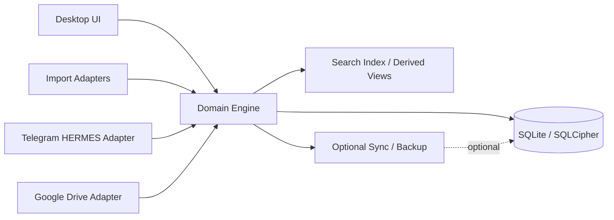
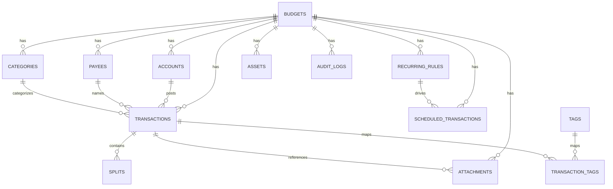
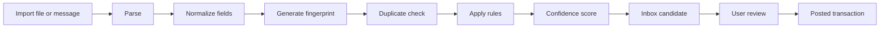
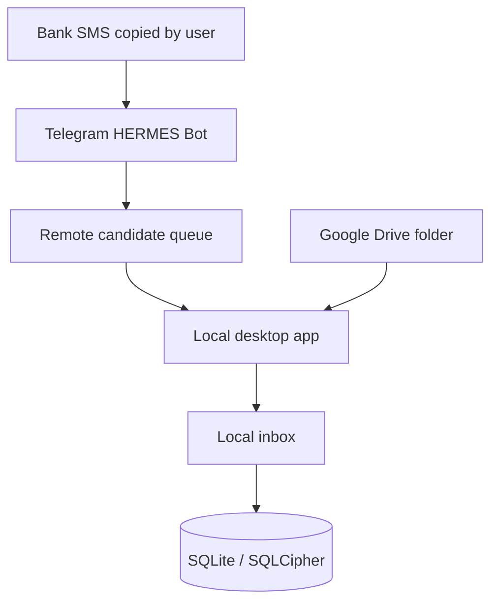

# Building a Private Offline-First Budgeting App with Telegram Ingestion

## Executive Summary

This report recommends building the application as a **desktop-first, local-first budgeting system** with **SQLite as the source of truth**, **SQLCipher for optional at-rest database encryption**, a **React or similar web UI embedded in Tauri**, and a **small local service layer** that handles imports, parsing, encryption, and background jobs. That choice best fits the request’s priorities: private use, offline reliability, controlled attack surface, and the ability to add integrations without turning the app into a cloud dependency. The architectural model should be: **all budgeting logic runs locally; all remote integrations are adapters feeding a local inbox; sync is optional, additive, and never the primary truth**. This is aligned with local-first principles, which treat the device copy as primary and make the network optional. citeturn8view0turn10view0turn11view1turn36view0turn36view2

The clearest practical reference system is **Actual Budget**, not because it should be copied, but because its public docs confirm a viable implementation pattern: local data plus optional server sync, import pipelines for CSV/QIF/OFX/QFX/CAMT, duplicate detection using file IDs plus fuzzy matching, a rules engine for payee/category cleanup, split transactions, tagging, reconciliation, and a programmatic local API for custom import/export workflows. Actual explicitly states that its client stores data locally, syncs in the background, and that its official API is **not** an HTTP API but a headless local/client package with full programmatic access to the budget. Those are highly reusable patterns for a private, offline-first clone in spirit without touching any proprietary YNAB code or internals. citeturn41view0turn27view0turn27view1turn28view0turn28view1turn28view2turn28view3turn41view2

For **Telegram ingestion through a HERMES agent**, the safest design is **not** to make Telegram a write path into the core ledger. Instead, Telegram should deliver messages into a **transaction inbox** as **unposted candidate transactions**. The user then confirms, edits, or rejects them locally. Telegram’s Bot API supports both webhooks and long polling, provides `secret_token` headers for webhooks, supports update filtering, and documents meaningful bot rate limits. Because local devices are usually not publicly reachable, **polling from the local app or local helper** is the most practical default; webhook delivery to a private local device should be considered an advanced option only when the user deliberately exposes a secure endpoint. citeturn13view0turn12view1turn12view5turn33view0turn33view2

For **Google Drive import**, the design should remain intentionally narrow. Use Drive only as an **optional import source or backup transport**, not as a collaborative database. The strongest least-privilege shape is a dedicated app folder or dedicated imported-files folder, polled incrementally using `changes.getStartPageToken` and `changes.list`, or watched via `changes.watch` only if the user already operates a public HTTPS receiver. Google explicitly recommends narrow scopes such as `drive.file`, and its docs distinguish that from broad restricted scopes like `drive.readonly`. citeturn15view1turn15view2turn34view2turn34view3turn15view5

The key implementation conclusion is this: **build a single-device MVP first**. Make it excellent at budgeting, imports, reconciliation, scheduled transactions, asset tracking, and transaction review. Add Telegram inbox ingestion next. Add Google Drive import and backup afterward. Defer multi-device writable sync until the core data model and merge semantics are stable. Community evidence from open-source finance projects reinforces that sync complexity and bank-import fragility are recurring failure points, especially around provider churn, CRDT/event-log growth, and mobile reliability. citeturn17view0turn19view0turn19view1turn21view3

## Design Ground Truth and Reference Systems

The design target here is **“YNAB-like behavior”**, not YNAB implementation parity. The report therefore relies on **official docs, open-source repositories, and community discussions** to specify a budgeting system that supports zero-based budgeting, envelopes, reconciliation, rules, imports, tags, splits, and multi-budget structures, while explicitly avoiding reverse-engineering any proprietary code. The most reusable public patterns come from Actual Budget, Firefly III, Beancount, GnuCash, hledger, Ledger, and Money Manager Ex. These projects cover the space from envelope budgeting to double-entry accounting to file-based and self-hosted finance systems. citeturn41view0turn6view0turn31view4turn32view0turn30view3turn31view3turn30view4

A useful architectural division emerges from the sources:

| Project | What it proves | What to adopt | What not to copy blindly |
|---|---|---|---|
| Actual Budget | Local copies plus optional sync; rich transaction workflows; custom importer API | Local-first sync posture, rules engine, import dedupe, reconciliation UX | Its exact storage/mutation implementation; its specific sync file shape |
| Firefly III | Self-hosted personal finance with broader account management and importer ecosystem | Import staging, richer account types, rules, shared/self-hosted mindset | Server-centric assumptions for a private offline MVP |
| Beancount / Ledger / hledger | Durable, auditable financial models with strong accounting invariants | Double-entry discipline, explicit postings, append-friendly audit thinking | Plain-text-first UX for mainstream budgeting users |
| GnuCash | Mature personal/small-business bookkeeping with import/export longevity | Reconciliation, import durability, long-lived schema thinking | Desktop complexity and legacy breadth beyond MVP |
| Money Manager Ex | SQLite-backed desktop finance with import/report depth | Desktop/offline ergonomics, import/report scope | Older desktop architecture patterns if aiming for modern local-first UI |

This table is an analytical synthesis, but it is grounded in the cited projects’ public docs and repositories. citeturn41view0turn41view2turn19view1turn21view3turn31view4turn31view3turn30view3turn32view0turn30view4

Three high-confidence design truths appear repeatedly across the sources. First, **local-first software treats the local copy as primary**, with network use becoming background synchronization rather than a prerequisite. Second, **SQLite remains the most pragmatic default for local finance apps** because it gives transactions, indexing, foreign keys, predictable backups, and great performance on one host. Third, **replication and sync should be incremental and explicit**, because that is where many self-hosted finance systems accumulate operational pain. Ink & Switch’s local-first essay, SQLite’s WAL documentation, and PouchDB/CouchDB replication docs all point in that direction. citeturn8view0turn10view0turn11view0turn26view0turn26view1

There are also some high-confidence caution signals from the community. Firefly III discussions show that “automatic import” is often at the mercy of third-party provider economics and regional coverage. Actual’s current issue list shows ongoing concerns around bank-sync edge cases, CRDT message-table growth, and mobile/PWA reliability. Those do not invalidate those systems; they simply show where complexity tends to concentrate. For this build, that argues for a deliberate **manual-or-semi-automatic ingestion layer first**, with provider abstraction and quarantine queues rather than direct posting into the ledger. citeturn19view1turn21view3turn17view0

## Architecture and Stack Selection

The architecture should be split into five layers: a **presentation layer**, a **domain engine**, a **persistence layer**, an **integration layer**, and an **optional sync/backup layer**. The presentation layer renders budget screens and local inbox UX. The domain engine owns all budgeting rules, category calculations, reconciliation state, recurring transactions, duplicate detection, and forecasting. The persistence layer owns SQLite, migrations, query materialization, and attachment indexing. The integration layer hosts adapters for CSV/QIF/OFX parsing, Telegram/HERMES ingestion, and Google Drive watch/poll import. The optional sync/backup layer is intentionally downstream and must never become the primary authority for budget state. That local-first posture is consistent with the literature and with Actual’s public sync model. citeturn8view0turn41view0turn41view2



### Storage and offline-first patterns

**SQLite** should be the canonical store. SQLite WAL mode gives strong local performance and reader/writer concurrency on the same host, but SQLite also explicitly warns that WAL is not for network filesystems. That makes SQLite ideal for a local app and inappropriate as a shared network database across devices. Foreign keys must also be enabled explicitly per connection in SQLite. citeturn10view0turn11view0

**IndexedDB** is the right browser-native fallback if the app later becomes a PWA or needs an embedded browser-side cache. MDN describes IndexedDB as a transactional low-level API for large structured client-side storage, whereas `localStorage` persists across sessions but is fundamentally a simpler key/value store and is not the right place for a real budget ledger. citeturn26view2turn26view3

**PouchDB/CouchDB** become relevant only if the app eventually needs device-to-device sync, durable change feeds, or a browser-first architecture. PouchDB supports one-way and bidirectional sync, live replication, and retry semantics; CouchDB’s replication model is incremental and one-way by design, with separate conflict handling. That is powerful, but it is also substantially more complex than a single-device SQLite app. citeturn26view0turn26view1

**SQLCipher** is the right option when “private” means more than “works offline.” Its docs require that the key be applied before the first DB operation, and they document key derivation and `cipher_status` checks. For password handling, OWASP recommends strong slow password hashing such as Argon2id and explicitly advises against storing passwords in plaintext or with fast hashes. citeturn11view1turn39view0

### Stack comparison

The scoring below is a **design judgment**, not a source fact. Scores are on a 10-point scale and are weighted most heavily toward offline reliability and privacy.

| Stack | Offline reliability | Privacy potential | Dev effort | Cross-platform | Weighted score | Contextual reading |
|---|---:|---:|---:|---:|---:|---|
| **Tauri + React + SQLite/SQLCipher** | 9 | 9 | 6 | 8 | **8.3** | Best desktop-first balance |
| Flutter + Drift/SQLite | 9 | 9 | 6 | 9 | **8.4** | Best if mobile and desktop must launch together |
| Electron + React + SQLite/SQLCipher | 9 | 7 | 8 | 8 | **8.1** | Fastest JS-only build path, heavier runtime |
| .NET MAUI + SQLite | 8 | 8 | 6 | 9 | **7.8** | Strong if team is C#-heavy |
| Next.js PWA + IndexedDB/PouchDB | 7 | 7 | 8 | 10 | **7.7** | Fast distribution, weaker OS integration |
| React Native + WatermelonDB + SQLite | 8 | 8 | 6 | 8 | **7.6** | Good if mobile is primary |

The evidence behind those judgments is straightforward. Tauri uses the system webview, supports flexible frontend choices, emphasizes a secure Rust-based foundation, and can produce very small binaries. Electron embeds Chromium and Node.js into its binary, which makes development easy for JS teams but increases bundle/runtime weight. Flutter’s own SQLite cookbook demonstrates local DB persistence, though its cited `sqflite` recipe is limited to Android, iOS, and macOS for that package. WatermelonDB explicitly positions itself as lazy, offline-first, and backed by SQLite on a separate native thread. .NET MAUI officially targets Android, iOS, macOS, and Windows and documents SQLite integration via `sqlite-net-pcl` or `Microsoft.Data.Sqlite`. PWA stacks get broad reach and IndexedDB, but their background job, filesystem, keychain, and local-service capabilities are weaker than native desktop shells. citeturn36view0turn36view2turn36view3turn23view0turn25view3turn25view0turn25view1turn36view4turn24view0turn26view2

### Recommended build stack

The strongest recommendation for this specific brief is:

- **Shell**: Tauri  
- **Frontend**: React + TypeScript  
- **State**: lightweight client state plus query cache  
- **Database**: SQLite, with SQLCipher optional from day one  
- **Persistence layer**: Rust local service module around SQLite rather than relying on browser-only storage  
- **Attachments**: filesystem blobs plus DB metadata  
- **Search**: indexed tables first; FTS only where clearly needed  
- **Import/parsing jobs**: local background worker  
- **Authentication**: local password, Argon2id-derived wrapping key, optional OS keychain unlock  
- **Remote integrations**: adapters feeding a local inbox; no direct writes into the posted ledger

That recommendation is an inference from the sources, but it is strongly supported by the cited capabilities of Tauri, SQLite, SQLCipher, and OS keystores. citeturn36view0turn36view2turn10view0turn11view1turn40view1turn40view3

### Modular decomposition

A clean modular layout for the codebase should look like this:

| Module | Responsibility |
|---|---|
| `core_money` | money type, currency precision, rounding, posting math |
| `core_budget` | envelopes, balances, rollovers, overspending, credit-card payment logic |
| `core_schedule` | recurring rules, schedule expansion, next occurrence calculation |
| `core_import` | CSV/OFX/QIF parsers, mapping, normalization, duplicate detection |
| `core_parse` | SMS/Telegram text parsing, confidence scoring, parser registry |
| `core_accounts` | reconciliation, transfers, opening balances, account states |
| `core_assets` | assets, valuations, investment snapshots, forecasting inputs |
| `core_audit` | append-only audit log and object diffs |
| `infra_db` | migrations, repositories, transactions, encryption bootstrap |
| `infra_files` | attachments, checksuming, export/import bundles |
| `adapter_telegram` | HERMES message fetch, auth checks, canonical transaction candidate queue |
| `adapter_drive` | Drive polling/watch, file caching, import scheduling |
| `ui_desktop` | budget view, ledger UI, inbox, reports, settings |

## Data Model and Persistence Design

The model below is a **recommended implementation specification**, not a claim about any proprietary application’s internal schema. It is informed by public behavior from Actual’s rules, splits, reconciliation, tags, credit-card guidance, and import docs, plus proven accounting ideas from Beancount, Ledger, hledger, GnuCash, and SQLite best practices. citeturn27view0turn27view1turn28view0turn28view1turn28view2turn28view3turn29view0turn31view4turn31view3turn30view3turn32view0turn11view0

The key modeling decisions are:

- Store **all currency values as integer minor units**.
- Use **UUID/ULID text IDs** for portability and offline merges.
- Keep **attachments outside the DB**; store hashes and metadata in SQLite.
- Keep **audit logs append-only**.
- Keep **transaction candidates** and **posted transactions** separate.
- Treat **budget month balances** as derived or materialized views, not the only source of truth.
- Enable `PRAGMA foreign_keys = ON`.
- Use WAL mode for local concurrency, but do not put the DB on a network filesystem. citeturn10view0turn11view0

### ERD

Text ERD:

- One `budget` has many `accounts`, `categories`, `payees`, `transactions`, `scheduled_transactions`, `recurring_rules`, `assets`, `attachments`, and `audit_logs`.
- One `transaction` belongs to one `account`, may reference one `payee`, one `category`, zero or one parent transaction, and may have many `splits`, tags, and attachments.
- One `account` may be linked to one `asset` or investment profile.
- One `scheduled_transaction` expands using one `recurring_rule`.
- `tags` are many-to-many with `transactions`.
- `multi_budget_support` is represented structurally by `budgets` plus optional sharing metadata.



### Budgets

**Purpose.** Logical tenant boundary for one independent budget file.

| Aspect | Specification |
|---|---|
| Fields | `id`, `name`, `base_currency`, `timezone`, `month_start_day`, `archived_at`, `created_at`, `updated_at`, `encryption_enabled`, `version` |
| Relationships | Parent to accounts, categories, payees, transactions, schedules, assets |
| Constraints | `name` non-empty; `base_currency` ISO code; unique `(name, archived_at IS NULL)` advisable locally |
| Derived fields | `net_worth`, `available_to_assign`, `last_sync_at`, `last_reconciled_at` |
| Indexing | PK on `id`; index on `archived_at`; unique on active name if wanted |
| Validation | timezone must be IANA string; month start 1–28 |
| SQLite note | Store one DB with many budgets or one DB per budget; for privacy and backup simplicity, **one DB per budget** is preferable |

Example JSON:

```json
{
  "id": "bud_01JZQ4JSP8Y6V7M8BR3T6Q9G3N",
  "name": "Family Budget",
  "base_currency": "USD",
  "timezone": "Europe/Berlin",
  "month_start_day": 1,
  "encryption_enabled": true
}
```

Example SQL:

```sql
CREATE TABLE budgets (
  id TEXT PRIMARY KEY,
  name TEXT NOT NULL,
  base_currency TEXT NOT NULL CHECK(length(base_currency) = 3),
  timezone TEXT NOT NULL,
  month_start_day INTEGER NOT NULL CHECK(month_start_day BETWEEN 1 AND 28),
  encryption_enabled INTEGER NOT NULL DEFAULT 0,
  archived_at TEXT,
  version INTEGER NOT NULL DEFAULT 1,
  created_at TEXT NOT NULL,
  updated_at TEXT NOT NULL
);
CREATE INDEX idx_budgets_archived_at ON budgets(archived_at);
```

### Accounts

**Purpose.** Cash, credit, liability, investment, and off-budget tracking containers.

| Aspect | Specification |
|---|---|
| Fields | `id`, `budget_id`, `name`, `account_type`, `currency`, `on_budget`, `institution_name`, `mask`, `opening_balance_minor`, `opening_balance_date`, `closed_at`, `sort_order`, `notes`, `created_at`, `updated_at` |
| Relationships | Belongs to budget; has many transactions; may link to assets/import connections |
| Constraints | unique `(budget_id, name)` among active accounts; `account_type` enum |
| Derived fields | `working_balance`, `cleared_balance`, `uncleared_balance`, `current_liability` |
| Indexing | `(budget_id, sort_order)`, `(budget_id, on_budget)`, `(budget_id, account_type)` |
| Validation | `currency` ISO code; opening date required if opening balance non-zero |
| SQLite note | Credit accounts should not need a different table; handle semantics in engine |

Example JSON:

```json
{
  "id": "acc_chk_001",
  "budget_id": "bud_001",
  "name": "Main Checking",
  "account_type": "checking",
  "currency": "USD",
  "on_budget": true,
  "opening_balance_minor": 250000,
  "opening_balance_date": "2026-01-01"
}
```

Example SQL:

```sql
CREATE TABLE accounts (
  id TEXT PRIMARY KEY,
  budget_id TEXT NOT NULL REFERENCES budgets(id) ON DELETE CASCADE,
  name TEXT NOT NULL,
  account_type TEXT NOT NULL CHECK(account_type IN (
    'checking','savings','cash','credit_card','loan','investment','asset','liability'
  )),
  currency TEXT NOT NULL CHECK(length(currency)=3),
  on_budget INTEGER NOT NULL DEFAULT 1,
  institution_name TEXT,
  mask TEXT,
  opening_balance_minor INTEGER NOT NULL DEFAULT 0,
  opening_balance_date TEXT,
  closed_at TEXT,
  sort_order INTEGER NOT NULL DEFAULT 0,
  notes TEXT,
  created_at TEXT NOT NULL,
  updated_at TEXT NOT NULL
);
CREATE INDEX idx_accounts_budget_sort ON accounts(budget_id, sort_order);
CREATE INDEX idx_accounts_budget_type ON accounts(budget_id, account_type);
```

### Transactions

**Purpose.** Canonical ledger events after user confirmation.

| Aspect | Specification |
|---|---|
| Fields | `id`, `budget_id`, `account_id`, `date`, `authorized_date`, `posted_at`, `amount_minor`, `currency`, `direction`, `payee_id`, `category_id`, `memo`, `notes`, `status`, `cleared`, `reconciled`, `is_transfer`, `transfer_account_id`, `import_source`, `import_fingerprint`, `source_message_id`, `parent_transaction_id`, `created_at`, `updated_at` |
| Relationships | Belongs to account; optional payee/category; optional parent; has many splits/tags/attachments |
| Constraints | either simple transaction or parent-of-splits; transfer must have `transfer_account_id`; parent txn not also directly categorized if full split model used |
| Derived fields | `normalized_payee`, `effective_month`, `is_inflow`, `is_outflow` |
| Indexing | `(account_id, date DESC)`, `(budget_id, date DESC)`, `(import_fingerprint)`, `(source_message_id)`, `(payee_id, amount_minor, date)` |
| Validation | amount non-zero except reconciliation adjustments if allowed; transfer cannot target same account |
| SQLite note | Add partial unique indexes for imported fingerprints where not null |

Example JSON:

```json
{
  "id": "txn_001",
  "budget_id": "bud_001",
  "account_id": "acc_chk_001",
  "date": "2026-07-07",
  "amount_minor": -4599,
  "currency": "USD",
  "direction": "outflow",
  "payee_id": "pay_uber",
  "category_id": "cat_transport",
  "memo": "Airport ride",
  "status": "posted",
  "cleared": 1,
  "reconciled": 0,
  "import_source": "telegram"
}
```

Example SQL:

```sql
CREATE TABLE transactions (
  id TEXT PRIMARY KEY,
  budget_id TEXT NOT NULL REFERENCES budgets(id) ON DELETE CASCADE,
  account_id TEXT NOT NULL REFERENCES accounts(id) ON DELETE CASCADE,
  date TEXT NOT NULL,
  authorized_date TEXT,
  posted_at TEXT,
  amount_minor INTEGER NOT NULL,
  currency TEXT NOT NULL CHECK(length(currency)=3),
  direction TEXT NOT NULL CHECK(direction IN ('inflow','outflow')),
  payee_id TEXT REFERENCES payees(id) ON DELETE SET NULL,
  category_id TEXT REFERENCES categories(id) ON DELETE SET NULL,
  memo TEXT,
  notes TEXT,
  status TEXT NOT NULL CHECK(status IN ('candidate','posted','void')),
  cleared INTEGER NOT NULL DEFAULT 0,
  reconciled INTEGER NOT NULL DEFAULT 0,
  is_transfer INTEGER NOT NULL DEFAULT 0,
  transfer_account_id TEXT REFERENCES accounts(id) ON DELETE SET NULL,
  import_source TEXT,
  import_fingerprint TEXT,
  source_message_id TEXT,
  parent_transaction_id TEXT REFERENCES transactions(id) ON DELETE CASCADE,
  created_at TEXT NOT NULL,
  updated_at TEXT NOT NULL
);
CREATE INDEX idx_txn_account_date ON transactions(account_id, date DESC);
CREATE INDEX idx_txn_budget_date ON transactions(budget_id, date DESC);
CREATE INDEX idx_txn_fingerprint ON transactions(import_fingerprint);
CREATE INDEX idx_txn_match ON transactions(payee_id, amount_minor, date);
```

### Splits

Actual’s public docs confirm the essential invariant: child split amounts must sum to the parent amount. That should be modeled and validated both in the app and in database checks where practical. citeturn28view1

| Aspect | Specification |
|---|---|
| Fields | `id`, `parent_transaction_id`, `line_no`, `category_id`, `amount_minor`, `memo`, `created_at`, `updated_at` |
| Relationships | Belongs to parent transaction |
| Constraints | sum(children.amount_minor) = parent.amount_minor |
| Derived fields | `share_pct` |
| Indexing | `(parent_transaction_id, line_no)` |
| Validation | parent must exist; line numbers unique per parent |
| SQLite note | enforce sum invariant in application service or trigger |

Example JSON:

```json
[
  {"line_no": 1, "category_id": "cat_groceries", "amount_minor": -3200},
  {"line_no": 2, "category_id": "cat_household", "amount_minor": -1399}
]
```

Example SQL:

```sql
CREATE TABLE splits (
  id TEXT PRIMARY KEY,
  parent_transaction_id TEXT NOT NULL REFERENCES transactions(id) ON DELETE CASCADE,
  line_no INTEGER NOT NULL,
  category_id TEXT REFERENCES categories(id) ON DELETE SET NULL,
  amount_minor INTEGER NOT NULL,
  memo TEXT,
  created_at TEXT NOT NULL,
  updated_at TEXT NOT NULL,
  UNIQUE(parent_transaction_id, line_no)
);
CREATE INDEX idx_splits_parent ON splits(parent_transaction_id);
```

### Payees

Actual’s rules documentation shows that payee normalization and auto-created rules are central to keeping imports usable. That strongly argues for first-class payees and alias metadata. citeturn28view0

| Aspect | Specification |
|---|---|
| Fields | `id`, `budget_id`, `name`, `normalized_name`, `default_category_id`, `alias_json`, `is_transfer_payee`, `last_used_at`, `created_at`, `updated_at` |
| Relationships | Used by transactions; optional default category |
| Constraints | unique `(budget_id, normalized_name)` |
| Derived fields | usage count, average amount, last merchant tokens |
| Indexing | `(budget_id, normalized_name)`, `(last_used_at DESC)` |
| Validation | trimmed name required |
| SQLite note | consider FTS later; start with normalized text index |

Example JSON:

```json
{
  "id": "pay_uber",
  "budget_id": "bud_001",
  "name": "Uber",
  "normalized_name": "uber",
  "default_category_id": "cat_transport"
}
```

Example SQL:

```sql
CREATE TABLE payees (
  id TEXT PRIMARY KEY,
  budget_id TEXT NOT NULL REFERENCES budgets(id) ON DELETE CASCADE,
  name TEXT NOT NULL,
  normalized_name TEXT NOT NULL,
  default_category_id TEXT REFERENCES categories(id) ON DELETE SET NULL,
  alias_json TEXT,
  is_transfer_payee INTEGER NOT NULL DEFAULT 0,
  last_used_at TEXT,
  created_at TEXT NOT NULL,
  updated_at TEXT NOT NULL,
  UNIQUE(budget_id, normalized_name)
);
CREATE INDEX idx_payees_budget_norm ON payees(budget_id, normalized_name);
```

### Categories

**Purpose.** Envelope containers, including synthetic credit-card payment categories if using YNAB-like handling.

| Aspect | Specification |
|---|---|
| Fields | `id`, `budget_id`, `group_name`, `name`, `category_type`, `parent_category_id`, `rollover_mode`, `goal_type`, `goal_target_minor`, `goal_due_date`, `archived_at`, `sort_order`, `created_at`, `updated_at` |
| Relationships | Used by transactions/splits; belongs to budget |
| Constraints | unique `(budget_id, group_name, name)` among active categories |
| Derived fields | `available_minor`, `assigned_minor`, `activity_minor`, `overspent_minor` |
| Indexing | `(budget_id, sort_order)`, `(budget_id, archived_at)` |
| Validation | goal amounts non-negative; rollover enum valid |
| SQLite note | monthly category balances should usually be materialized in a separate derived table |

Example JSON:

```json
{
  "id": "cat_groceries",
  "budget_id": "bud_001",
  "group_name": "Living",
  "name": "Groceries",
  "category_type": "regular",
  "rollover_mode": "carry_positive_only",
  "goal_type": "monthly_funding",
  "goal_target_minor": 50000
}
```

Example SQL:

```sql
CREATE TABLE categories (
  id TEXT PRIMARY KEY,
  budget_id TEXT NOT NULL REFERENCES budgets(id) ON DELETE CASCADE,
  group_name TEXT NOT NULL,
  name TEXT NOT NULL,
  category_type TEXT NOT NULL CHECK(category_type IN ('regular','credit_payment','tracking')),
  parent_category_id TEXT REFERENCES categories(id) ON DELETE SET NULL,
  rollover_mode TEXT NOT NULL CHECK(rollover_mode IN (
    'none','carry_positive_only','carry_positive_and_negative'
  )),
  goal_type TEXT,
  goal_target_minor INTEGER,
  goal_due_date TEXT,
  archived_at TEXT,
  sort_order INTEGER NOT NULL DEFAULT 0,
  created_at TEXT NOT NULL,
  updated_at TEXT NOT NULL
);
CREATE INDEX idx_categories_budget_sort ON categories(budget_id, sort_order);
```

### Scheduled transactions

Actual includes scheduled transactions as a first-class budgeting feature, so they should exist independently from posted transactions. citeturn4view1turn29view2

| Aspect | Specification |
|---|---|
| Fields | `id`, `budget_id`, `account_id`, `payee_id`, `category_id`, `template_amount_minor`, `currency`, `memo_template`, `next_due_date`, `last_generated_date`, `active`, `recurring_rule_id`, `auto_post_mode`, `created_at`, `updated_at` |
| Relationships | Belongs to budget/account; references recurring rule |
| Constraints | one active rule per schedule | 
| Derived fields | `days_until_due`, `forecast_month`, `expected_cash_effect` |
| Indexing | `(budget_id, next_due_date)`, `(active, next_due_date)` |
| Validation | next due date required when active |
| SQLite note | generate into candidate transactions before posting, not directly into posted ledger |

Example JSON:

```json
{
  "id": "sch_rent",
  "budget_id": "bud_001",
  "account_id": "acc_chk_001",
  "payee_id": "pay_landlord",
  "category_id": "cat_rent",
  "template_amount_minor": -120000,
  "next_due_date": "2026-08-01",
  "auto_post_mode": "candidate_only"
}
```

Example SQL:

```sql
CREATE TABLE scheduled_transactions (
  id TEXT PRIMARY KEY,
  budget_id TEXT NOT NULL REFERENCES budgets(id) ON DELETE CASCADE,
  account_id TEXT REFERENCES accounts(id) ON DELETE SET NULL,
  payee_id TEXT REFERENCES payees(id) ON DELETE SET NULL,
  category_id TEXT REFERENCES categories(id) ON DELETE SET NULL,
  template_amount_minor INTEGER NOT NULL,
  currency TEXT NOT NULL CHECK(length(currency)=3),
  memo_template TEXT,
  next_due_date TEXT NOT NULL,
  last_generated_date TEXT,
  active INTEGER NOT NULL DEFAULT 1,
  recurring_rule_id TEXT REFERENCES recurring_rules(id) ON DELETE SET NULL,
  auto_post_mode TEXT NOT NULL CHECK(auto_post_mode IN ('manual','candidate_only','auto_post')),
  created_at TEXT NOT NULL,
  updated_at TEXT NOT NULL
);
CREATE INDEX idx_sched_due ON scheduled_transactions(active, next_due_date);
```

### Recurring rules

| Aspect | Specification |
|---|---|
| Fields | `id`, `budget_id`, `freq`, `interval_n`, `by_month_day`, `by_weekday`, `rrule_text`, `end_after_count`, `end_on_date`, `skip_weekends_mode`, `created_at`, `updated_at` |
| Relationships | Drives one or more schedules |
| Constraints | either structured recurrence fields or `rrule_text`; not both if you want simplicity |
| Derived fields | `next_occurrence(date)` |
| Indexing | `(budget_id, freq)` |
| Validation | recurrence must be parseable |
| SQLite note | compute next occurrence in app code, not SQL |

Example JSON:

```json
{
  "id": "rr_monthly_1",
  "budget_id": "bud_001",
  "freq": "monthly",
  "interval_n": 1,
  "by_month_day": 1,
  "skip_weekends_mode": "move_previous_business_day"
}
```

Example SQL:

```sql
CREATE TABLE recurring_rules (
  id TEXT PRIMARY KEY,
  budget_id TEXT NOT NULL REFERENCES budgets(id) ON DELETE CASCADE,
  freq TEXT NOT NULL CHECK(freq IN ('daily','weekly','monthly','yearly')),
  interval_n INTEGER NOT NULL DEFAULT 1,
  by_month_day INTEGER,
  by_weekday TEXT,
  rrule_text TEXT,
  end_after_count INTEGER,
  end_on_date TEXT,
  skip_weekends_mode TEXT NOT NULL DEFAULT 'none',
  created_at TEXT NOT NULL,
  updated_at TEXT NOT NULL
);
```

### Attachments

| Aspect | Specification |
|---|---|
| Fields | `id`, `budget_id`, `transaction_id`, `asset_id`, `file_name`, `mime_type`, `size_bytes`, `sha256_hex`, `storage_path`, `ocr_text`, `created_at` |
| Relationships | Optional transaction or asset attachment |
| Constraints | unique `sha256_hex` per budget if dedup desired |
| Derived fields | preview path, content status |
| Indexing | `(transaction_id)`, `(asset_id)`, `(sha256_hex)` |
| Validation | only allow safe MIME whitelist |
| SQLite note | store files on disk; never inline arbitrary BLOBs for receipts in MVP |

Example JSON:

```json
{
  "id": "att_001",
  "transaction_id": "txn_001",
  "file_name": "receipt.jpg",
  "mime_type": "image/jpeg",
  "size_bytes": 234873,
  "sha256_hex": "..."
}
```

Example SQL:

```sql
CREATE TABLE attachments (
  id TEXT PRIMARY KEY,
  budget_id TEXT NOT NULL REFERENCES budgets(id) ON DELETE CASCADE,
  transaction_id TEXT REFERENCES transactions(id) ON DELETE CASCADE,
  asset_id TEXT REFERENCES assets(id) ON DELETE CASCADE,
  file_name TEXT NOT NULL,
  mime_type TEXT NOT NULL,
  size_bytes INTEGER NOT NULL,
  sha256_hex TEXT NOT NULL,
  storage_path TEXT NOT NULL,
  ocr_text TEXT,
  created_at TEXT NOT NULL
);
CREATE INDEX idx_att_txn ON attachments(transaction_id);
CREATE INDEX idx_att_asset ON attachments(asset_id);
CREATE INDEX idx_att_sha ON attachments(sha256_hex);
```

### Tags

Actual’s public tag model uses note-embedded tags, but for this implementation it is better to make tags first-class while still allowing note extraction. citeturn28view3

| Aspect | Specification |
|---|---|
| Fields | `tags.id`, `budget_id`, `name`, `color`, `description`, `created_at`; plus join `transaction_tags(transaction_id, tag_id)` |
| Relationships | many-to-many with transactions |
| Constraints | unique `(budget_id, name)` |
| Derived fields | tag usage count |
| Indexing | `(budget_id, name)` and join indexes |
| Validation | slug-safe tag names |
| SQLite note | extracting hashtags from notes can populate tag joins asynchronously |

Example JSON:

```json
{
  "tag": {"id": "tag_trip", "name": "Vacation2026", "color": "#7c3aed"},
  "links": [{"transaction_id": "txn_001", "tag_id": "tag_trip"}]
}
```

Example SQL:

```sql
CREATE TABLE tags (
  id TEXT PRIMARY KEY,
  budget_id TEXT NOT NULL REFERENCES budgets(id) ON DELETE CASCADE,
  name TEXT NOT NULL,
  color TEXT,
  description TEXT,
  created_at TEXT NOT NULL,
  UNIQUE(budget_id, name)
);
CREATE TABLE transaction_tags (
  transaction_id TEXT NOT NULL REFERENCES transactions(id) ON DELETE CASCADE,
  tag_id TEXT NOT NULL REFERENCES tags(id) ON DELETE CASCADE,
  PRIMARY KEY (transaction_id, tag_id)
);
CREATE INDEX idx_tag_budget_name ON tags(budget_id, name);
```

### Audit logs

| Aspect | Specification |
|---|---|
| Fields | `id`, `budget_id`, `actor_type`, `actor_id`, `event_type`, `entity_type`, `entity_id`, `before_json`, `after_json`, `correlation_id`, `created_at` |
| Relationships | Belongs to budget; references entity by polymorphic identifiers |
| Constraints | append-only; no updates except by admin repair |
| Derived fields | user-visible change history |
| Indexing | `(budget_id, created_at DESC)`, `(entity_type, entity_id)` |
| Validation | event type required |
| SQLite note | compress large diffs if volume grows |

Example JSON:

```json
{
  "event_type": "transaction.updated",
  "entity_type": "transaction",
  "entity_id": "txn_001",
  "before_json": {"category_id":"cat_misc"},
  "after_json": {"category_id":"cat_transport"}
}
```

Example SQL:

```sql
CREATE TABLE audit_logs (
  id TEXT PRIMARY KEY,
  budget_id TEXT NOT NULL REFERENCES budgets(id) ON DELETE CASCADE,
  actor_type TEXT NOT NULL,
  actor_id TEXT,
  event_type TEXT NOT NULL,
  entity_type TEXT NOT NULL,
  entity_id TEXT NOT NULL,
  before_json TEXT,
  after_json TEXT,
  correlation_id TEXT,
  created_at TEXT NOT NULL
);
CREATE INDEX idx_audit_budget_time ON audit_logs(budget_id, created_at DESC);
CREATE INDEX idx_audit_entity ON audit_logs(entity_type, entity_id);
```

### Multi-budget support

This is mostly a system feature rather than a separate ledger object, but it should still have explicit metadata if the app may later support shared budgets.

| Aspect | Specification |
|---|---|
| Fields | `budget_members.id`, `budget_id`, `role`, `display_name`, `device_id`, `key_fingerprint`, `created_at` |
| Relationships | Secondary table for budgets |
| Constraints | unique `(budget_id, display_name)` or public key fingerprint |
| Derived fields | member count, last active device |
| Indexing | `(budget_id, role)` |
| Validation | roles in `owner`, `editor`, `viewer` if collaboration later exists |
| SQLite note | for a private MVP, keep this dormant and use only local owner metadata |

Example SQL:

```sql
CREATE TABLE budget_members (
  id TEXT PRIMARY KEY,
  budget_id TEXT NOT NULL REFERENCES budgets(id) ON DELETE CASCADE,
  role TEXT NOT NULL CHECK(role IN ('owner','editor','viewer')),
  display_name TEXT NOT NULL,
  device_id TEXT,
  key_fingerprint TEXT,
  created_at TEXT NOT NULL
);
```

### Assets

| Aspect | Specification |
|---|---|
| Fields | `id`, `budget_id`, `name`, `asset_type`, `linked_account_id`, `quantity`, `unit`, `cost_basis_minor`, `current_value_minor`, `valuation_date`, `ticker`, `location`, `notes`, `created_at`, `updated_at` |
| Relationships | Belongs to budget; optional linked account; optional attachments |
| Constraints | `asset_type` enum |
| Derived fields | unrealized gain/loss, value trend |
| Indexing | `(budget_id, asset_type)`, `(ticker)` |
| Validation | current value date required if current value provided |
| SQLite note | holdings/lots can be added later in a child table if investment tracking deepens |

Example JSON:

```json
{
  "id": "asset_house_001",
  "budget_id": "bud_001",
  "name": "Primary Residence",
  "asset_type": "real_estate",
  "current_value_minor": 42500000,
  "valuation_date": "2026-06-30"
}
```

Example SQL:

```sql
CREATE TABLE assets (
  id TEXT PRIMARY KEY,
  budget_id TEXT NOT NULL REFERENCES budgets(id) ON DELETE CASCADE,
  name TEXT NOT NULL,
  asset_type TEXT NOT NULL CHECK(asset_type IN (
    'real_estate','vehicle','brokerage','retirement','crypto','collectible','other'
  )),
  linked_account_id TEXT REFERENCES accounts(id) ON DELETE SET NULL,
  quantity REAL,
  unit TEXT,
  cost_basis_minor INTEGER,
  current_value_minor INTEGER,
  valuation_date TEXT,
  ticker TEXT,
  location TEXT,
  notes TEXT,
  created_at TEXT NOT NULL,
  updated_at TEXT NOT NULL
);
CREATE INDEX idx_assets_budget_type ON assets(budget_id, asset_type);
```

## Budgeting Engine, Import Pipeline, and User Experience

### Budgeting engine logic

The right budgeting engine for this product is **envelope-based, cash-aware, and liability-explicit**. That means users assign only money they currently have, category balances carry intent forward through time, and liabilities such as credit cards are tracked separately from cash holdings. This is conceptually compatible with public envelope-budgeting references and with Actual’s published guidance on categories, credit cards, reimbursements, returns, and reconciliation, while remaining an implementation proposal rather than a proprietary clone. citeturn29view0turn29view1turn28view2

#### Core formulas

**Available to assign**

```text
available_to_assign
= sum(on_budget_cash_accounts.current_working_balance_minor)
- sum(current_month.category_assignments_minor)
- reserved_for_synthetic_payment_categories_minor
```

If you choose a stricter “Actual-like” interpretation, negative on-budget credit balances can reduce total budget funds. If you choose a stricter “YNAB-like” interpretation, cash accounts remain the assignable pool and card-payment availability is represented by a synthetic payment category. For a private clone, the **separate synthetic payment category** model is cleaner and easier to explain.

**Category available**

```text
rollover_in
= case rollover_mode
    when none then max(previous_month.available_end_minor, 0)
    when carry_positive_only then max(previous_month.available_end_minor, 0)
    when carry_positive_and_negative then previous_month.available_end_minor
  end

available_end_minor
= rollover_in
+ assigned_this_month_minor
+ inflows_to_category_minor
- outflows_from_category_minor
```

**Credit-card payment-ready amount**

```text
payment_ready_minor(card)
= previous_payment_ready_minor
+ funded_card_spending_minor
- refunds_to_card_minor
- card_payments_made_minor
```

If a card purchase is only partially covered by category funds, only the covered portion increases `payment_ready_minor`; the remainder becomes debt.

**Reconciliation difference**

```text
reconciliation_difference_minor
= statement_cleared_balance_minor
- ledger_cleared_balance_minor
```

#### Pseudocode

```text
for each posted transaction t:
  if t.is_split_parent:
    process child splits only

  if t.account.type in cash_accounts:
    apply cash movement to account balance
    if t.category exists:
      category.activity += signed_category_effect(t)

  if t.account.type == credit_card:
    apply liability movement to account balance
    if t.category exists:
      category.activity += signed_category_effect(t)
      covered = min(abs(t.amount), max(category.available_before, 0))
      payment_category(card).available += covered
      if covered < abs(t.amount):
        record_credit_overspending(abs(t.amount) - covered)

  if t.is_transfer between on-budget cash accounts:
    no category effect unless explicit exception

  if t.is_payment_to_credit_card:
    payment_category(card).available -= payment_amount
    checking.balance -= payment_amount
    credit_card.balance += payment_amount
```

#### Worked example

Start state:

- Checking: `$2,000`
- Credit card balance: `$0`
- Groceries available: `$500`
- Card payment category: `$0`

Event: user buys groceries for `$120` on the credit card.

Result:

- Checking stays `$2,000`
- Card balance becomes `-$120`
- Groceries available becomes `$380`
- Card payment category becomes `$120`

Event: user pays `$120` from checking to the card.

Result:

- Checking becomes `$1,880`
- Card balance becomes `$0`
- Card payment category becomes `$0`

This is the cleanest user-facing model because the purchase affects the spending category when the spending happens, and the payment is merely the later movement of already-reserved cash.

#### Rollovers and overspending

The safest default is:

- positive balances roll forward automatically,
- negative balances in normal categories do **not** roll unless explicitly enabled,
- reimbursement categories may enable negative rollover, matching Actual’s public guidance for reimbursable spending categories. citeturn29view1

#### Age-of-money

Because proprietary implementation details are out of scope, the best approach is a **design approximation**, clearly labeled as such.

**Recommended metric**

Use a FIFO lot tracker over **cash inflows only**:

1. Every on-budget inflow creates a cash lot with an arrival date.
2. Every outflow consumes lots FIFO.
3. For each outflow, compute age = `outflow_date - lot_arrival_date`.
4. Report a rolling arithmetic mean or median over the latest N funded outflows.

```text
age_of_money_days
= avg(last_n_consumed_lot_ages_days)
```

This captures the behavioral goal of “how long dollars sit before being spent” without claiming to replicate any proprietary algorithm.

### Offline import pipeline

Actual publicly confirms support for CSV, QIF, OFX, QFX, and CAMT, recommends OFX/QFX when possible, and describes duplicate avoidance using provider IDs first and then same-date/same-amount/similar-payee matching. Its rules docs also show why normalization and learning layers matter. Those are the right design anchors for this app’s import pipeline. citeturn27view0turn28view0

Recommended pipeline:



#### File formats

- **CSV**: map columns manually or via saved templates.
- **OFX/QFX**: preferred when available because IDs are usually richer and dedupe is stronger.
- **QIF**: supported, but weaker metadata quality than OFX/QFX.
- **CAMT**: useful for some banks and regions. citeturn27view0

#### Duplicate detection strategy

Use a **tiered matcher**:

1. **Hard match**: exact external transaction ID or import fingerprint.
2. **Strong soft match**: same account, amount, normalized payee, date within ±2 days.
3. **Split-aware match**: if existing parent+children total equals imported total and merchant/date align.
4. **Manual merge UI**: modeled after Actual’s published merge logic. citeturn27view0turn27view1

Example fingerprint:

```text
sha256(
  account_id + "|" +
  normalized_external_id + "|" +
  normalized_amount + "|" +
  normalized_date + "|" +
  normalized_payee
)
```

#### Payee cleanup and rules engine

Rules should run in ordered sequence, just like Actual documents: if conditions match, apply actions, then continue. Recommended rule types:

- replace payee tokens,
- choose category,
- add tag,
- infer transfer,
- set memo,
- suppress noise text,
- map merchant aliases,
- split if known pattern.

Sample rule JSON:

```json
{
  "id": "rule_uber",
  "priority": 100,
  "conditions": [
    {"field": "raw_payee", "op": "contains_ci", "value": "uber"}
  ],
  "actions": [
    {"type": "set_payee", "value": "Uber"},
    {"type": "set_category", "value": "cat_transport"}
  ]
}
```

### UI and UX blueprints

The key screens should be optimized for **fast review and low-friction correction**, not for accounting theatrics.

#### Budget screen

Layout:

- left sidebar: budgets, accounts, quick filters
- main grid: category groups with `Assigned`, `Activity`, `Available`
- top summary: `Available to Assign`, month switcher, quick actions
- right panel: scheduled due soon, overspent categories, inbox count

Public UI inspiration exists in Actual’s tour page and Flathub listing; use them only as references for density and layout patterns, and confirm each source’s terms before reusing imagery or branding. citeturn35image2turn35image7

#### Ledger screen

Layout:

- account header with working, cleared, uncleared balances
- transaction list with bulk actions
- quick add row
- candidate badge for imported-but-unconfirmed items
- fuzzy duplicate warning
- split drawer inline

#### Inbox screen

This is the most important screen for Telegram and file import:

- source badge: `telegram`, `csv`, `ofx`, `drive`
- parser confidence
- extracted fields
- original raw text / raw row side by side
- quick actions: approve, approve+learn rule, merge, reject, edit

#### Reconciliation screen

Modeled on actual workflow expectations:

- statement balance input
- cleared transaction checklist
- live difference
- optional one-shot adjustment transaction if allowed
- audit log entry when closed. citeturn28view2

#### Assets and forecasting screen

- asset cards with last valuation
- debt payoff forecast
- cash runway forecast
- scheduled outflows and recurring income
- scenario simulation: “if rent + salary + planned car payment happen, what remains?”

## Telegram HERMES and Google Drive Integrations

### Telegram HERMES ingestion

Telegram’s official docs document the core mechanics needed here: the Bot API is HTTP-based, bots connect through a backend, updates are received by `getUpdates` or webhooks, `setWebhook` supports a `secret_token`, update types can be filtered, webhook status exposes pending updates and last errors, and the FAQ gives practical sending limits. citeturn13view1turn12view1turn12view5turn13view3turn33view0

The cleanest design is:

1. User copies SMS transaction text into a private Telegram chat with the HERMES bot.
2. HERMES parses the text into a canonical transaction candidate.
3. HERMES stores that candidate in an adapter queue.
4. The local app fetches the queue and inserts **candidate** records into the inbox.
5. The user confirms locally before the ledger is affected.

This avoids turning Telegram into a direct posting authority and reduces the damage from parse errors.

### Telegram integration options

| Option | How it works | Pros | Cons | Recommendation |
|---|---|---|---|---|
| Local polling | Local app/helper calls `getUpdates` and advances offset | No public endpoint; simplest topology | Bot token on device; app must be online periodically | **Best default** |
| Hosted webhook relay | Public HERMES endpoint receives updates, local app later pulls from relay | Stable inbound delivery | Adds cloud relay and token surface | Good if user already runs a small server |
| Direct webhook to local device | Telegram posts to user device endpoint | Low latency | Needs public HTTPS or tunnel; larger attack surface | Advanced only |
| Manual export | Bot replies with JSON/CSV; user imports manually | Maximum control | Most friction | Best “hard privacy” fallback |

Telegram officially notes that webhook mode and `getUpdates` are mutually exclusive while the webhook is set. It also supports webhook secret headers and documents supported ports for webhook delivery. citeturn13view0turn12view1

### Security and authentication for Telegram

Recommended controls:

- hard allowlist for `chat_id` and `user_id`
- private chat only by default
- if using webhook, require `X-Telegram-Bot-Api-Secret-Token`
- use a secret path in the webhook URL as Telegram’s FAQ recommends
- store bot token encrypted at rest
- never auto-post ledger entries from Telegram without local confirmation
- rate-limit replies to avoid accidental 429s
- log raw message, parsed output, parser version, and confidence score

Telegram’s FAQ says bots should avoid more than one message per second in a single chat, more than 20 per minute in a group, and around 30 per second for bulk notifications without paid broadcast features. For this application, those are rarely binding because the main load is inbound parsing, not outbound broadcasting. citeturn33view0

### Telegram message formats

Use **two ingestion modes**.

**Freeform SMS paste**

```text
Card 1234 purchase USD 45.99 at UBER *TRIP on 2026-07-07 18:43
```

**Structured preferred format**

```text
#txn
amt=45.99
ccy=USD
merchant=Uber
date=2026-07-07
time=18:43
acct=card:1234
raw=Card 1234 purchase USD 45.99 at UBER *TRIP on 2026-07-07 18:43
```

The structured mode dramatically improves parsing fidelity and should be encouraged after onboarding.

### Parsing strategy

Use three tiers.

**Tier one: deterministic regex and dictionaries**  
Preferred default for privacy and debuggability.

Regex examples:

```regex
(?P<currency>\bUSD\b|\bEUR\b|\bEGP\b|\$|€|£)?
\s*
(?P<amount>\d{1,3}(?:[,\s]\d{3})*(?:\.\d{2})?)
```

```regex
(?:card|acct|a\/c|ending|xxxx)[^\d]{0,8}(?P<last4>\d{4})
```

```regex
(?:at|from|merchant|to)\s+(?P<merchant>[A-Za-z0-9\*\-\.&' ]{2,80})
```

```regex
(?P<date>\d{4}-\d{2}-\d{2}|\d{2}[\/\-]\d{2}[\/\-]\d{2,4})
(?:\s+(?P<time>\d{1,2}:\d{2}(?::\d{2})?))?
```

**Tier two: heuristic normalizer**  
Examples:

- strip issuer prefixes,
- convert localized decimals,
- map `AMZN Mktp`, `AMAZON`, `AMZN.COM/BILL` → `Amazon`,
- infer inflow keywords: `salary`, `refund`, `reversal`, `cashback`,
- infer transfer keywords: `payment received`, `card payment`, `from savings`.

**Tier three: optional NLP fallback**  
Only if user opts in. This should preferably run locally or in a tightly controlled self-hosted component. Use it only to produce candidates and confidence scores, never authoritative postings.

### Error handling

Every candidate should carry:

```json
{
  "parse_status": "partial",
  "confidence": 0.74,
  "missing_fields": ["account_id"],
  "warnings": ["merchant_low_confidence"],
  "raw_text": "..."
}
```

Threshold guidance:

- `>= 0.90`: safe to prefill and suggest one-click approve
- `0.70–0.89`: manual review required
- `< 0.70`: keep as unresolved inbox item

### Google Drive integration

Google’s Drive API supports both polling and push. Push requires a public HTTPS callback receiver and a watch channel. Incremental polling is done by storing a start page token and calling `changes.list`. Scoped access should be as narrow as possible, and Google explicitly recommends non-sensitive scopes such as `drive.file` when feasible. citeturn15view1turn15view5turn34view2turn34view3

Recommended design:

- dedicated folder or `appDataFolder`
- accepted file types: `.csv`, `.ofx`, `.qfx`, `.qif`, `.ndjson`
- each import file immutable after write, preferably timestamped
- local cache stores: file id, revision-ish metadata, checksum, imported-at, candidate count
- import once, then archive/tag source locally

**Polling** should be the default because it works without exposing the user’s machine:

```text
1. changes.getStartPageToken()
2. changes.list(pageToken=stored_token)
3. fetch changed file metadata
4. download new/changed files
5. parse into inbox candidates
6. persist newStartPageToken
```

**Push** is optional for advanced deployments only. If used, Drive docs require a receiving HTTPS webhook, and the watch endpoint accepts narrow scopes including `drive.file` and `drive.metadata.readonly`. citeturn15view4turn15view5turn34view2

Recommended scopes:

- `drive.file`
- `drive.metadata.readonly`

Avoid `drive.readonly` unless the user explicitly wants broad access, because Google classifies it as a restricted scope. citeturn15view1turn15view2

Conflict strategy:

- Drive never overwrites the local ledger automatically
- remote files become inbox candidates only
- if file contents change after prior import, compare checksum and treat as **new revision**
- add source tag like `#drv_import_2026_07`

### Integration recommendation

The safest combined topology is:



## Security, Delivery Roadmap, and Source Inventory

### Threat model

The biggest privacy and integrity risks here are not SQL injection or generic web threats. They are **device compromise**, **bot token leakage**, **cloud metadata leakage**, **poisoned imports**, and **accidental sync complexity**.

| Threat | What is at risk | Control |
|---|---|---|
| Lost or stolen laptop | Full budget DB, attachments, cached tokens | full-disk encryption, SQLCipher, OS session lock, short idle lock |
| Malware on device | DB, bot token, export files | local encryption, keychain storage, minimal privileges, signed builds |
| Telegram bot hijack | raw SMS text, candidate queue | strict chat/user allowlist, secret token headers, rotate token, no auto-post |
| Import poisoning | fake duplicates, bad merchants, wrong amounts | inbox quarantine, confidence scoring, rule previews, audit log |
| Drive scope overreach | unrelated files | `drive.file` + `drive.metadata.readonly`, dedicated folder, no broad scopes |
| Sync corruption | data divergence or replay | single-device MVP, append-only audit log, explicit export/import resets |
| Password compromise | DB unlock | Argon2id password hashing/wrapping, optional keychain storage, rate limiting |
| Attachment leakage | receipts and statements | external encrypted file store, checksum dedupe, access controls |

For password safety, OWASP recommends Argon2id with strong parameters and explicitly warns against plaintext or fast hashes. For local secret storage, Android Keystore keeps keys non-exportable and can bind them to secure hardware, while Apple’s Keychain uses encrypted storage with Secure Enclave-backed protections and access controls. citeturn39view0turn40view1turn40view3

### Recommended security baseline

Minimum baseline for MVP:

- Argon2id for local password verification/wrapping  
- SQLCipher if the user enables “encrypted vault” mode  
- bot token and Drive refresh token stored in OS keychain, not in the DB  
- `PRAGMA foreign_keys = ON` and WAL mode  
- signed installers  
- attachment MIME allowlist  
- no public inbound endpoint by default  
- export bundles encrypted with user-provided passphrase  

SQLite WAL and SQLCipher both come with specific operational implications: WAL is local-host oriented and adds `-wal`/`-shm` files; SQLCipher requires the key before first DB access and allows runtime checks like `cipher_status`. citeturn10view0turn11view1

### MVP roadmap

| Phase | Scope | Exit criteria |
|---|---|---|
| Foundation | Tauri app shell, SQLite schema, budget/account/category/transaction CRUD, audit log | usable local budget with no imports |
| Budget engine | category balances, month rollover, zero-based assignment, reconciliation, splits, tags, schedules | single-device budgeting usable daily |
| Import core | CSV/OFX/QIF parsers, mapping templates, dedupe, rules, inbox | bank file import is reliable |
| Telegram HERMES | bot adapter, parser registry, candidate inbox, auth allowlists | SMS copy-paste to candidate flow works end-to-end |
| Assets and forecasts | assets, liabilities, valuation snapshots, runway and cash forecast | net worth and planning screens usable |
| Optional Drive | scoped OAuth, polling, local cache, change tokens | import from Drive folder works safely |
| Optional sync | exports, backups, then maybe narrow single-writer sync | no silent divergence in tests |

### Final build specification

**Recommended build spec**

- **App shell**: Tauri
- **UI**: React + TypeScript
- **DB**: SQLite, WAL mode
- **Encryption**: SQLCipher optional, enabled per budget file
- **Secrets**: Argon2id + OS keychain
- **Core tables**: budgets, accounts, categories, payees, transactions, splits, tags, transaction_tags, scheduled_transactions, recurring_rules, assets, attachments, audit_logs
- **Import formats**: CSV, OFX, QFX, QIF in MVP
- **Integrations**: Telegram candidate inbox first, Drive polling second
- **Posting rule**: no remote integration posts directly without local review
- **Backups**: encrypted export bundle + local rolling snapshots
- **Future sync stance**: single-writer or explicit export/import before any full multi-device merge model

### Open questions and limitations

This report is intentionally **implementation-oriented**, but a few items remain design choices rather than verified facts:

- Exact “Age of Money” behavior is proposed as a **design approximation**, not a claim about YNAB internals.
- “HERMES” is treated as a **generic Telegram-capable agent** with webhook/API access because no proprietary HERMES spec was provided.
- Telegram parsing examples assume English-centric transaction text; multi-locale merchant grammars will need real sample corpora.
- Google Drive **push** is technically supported, but for most private users **polling** is the better operational trade-off unless they already manage public HTTPS endpoints.
- Shared multi-user budgets should stay out of the MVP unless collaboration is a true requirement.

### Selected source inventory

Reliability scores are an **analytical assessment** on a 5-point scale.

| Source | URL | Access date | Type | Reliability | Relevance | Supports |
|---|---|---:|---|---:|---|---|
| Actual sync docs citeturn41view0 | `https://actualbudget.org/docs/getting-started/sync/` | 2026-07-07 | Official docs | 5 | Very high | local-first sync posture, optional encryption, local copies |
| Actual API docs citeturn41view2 | `https://actualbudget.org/docs/api/` | 2026-07-07 | Official docs | 5 | Very high | non-HTTP programmatic API, local importer/exporter model |
| Actual import docs citeturn27view0 | `https://actualbudget.org/docs/transactions/importing/` | 2026-07-07 | Official docs | 5 | Very high | CSV/QIF/OFX/QFX/CAMT, dedupe, import workflow |
| Actual merge docs citeturn27view1 | `https://actualbudget.org/docs/transactions/merging/` | 2026-07-07 | Official docs | 5 | High | duplicate merge logic |
| Actual rules docs citeturn28view0 | `https://actualbudget.org/docs/budgeting/rules/` | 2026-07-07 | Official docs | 5 | Very high | import rules, normalization, auto-learning ideas |
| Actual split docs citeturn28view1 | `https://actualbudget.org/docs/transactions/split-transactions/` | 2026-07-07 | Official docs | 5 | High | split invariants and UX |
| Actual reconciliation docs citeturn28view2 | `https://actualbudget.org/docs/accounts/reconciliation/` | 2026-07-07 | Official docs | 5 | High | reconciliation workflow |
| Actual tags docs citeturn28view3 | `https://actualbudget.org/docs/transactions/tags/` | 2026-07-07 | Official docs | 5 | Medium | tag semantics |
| Actual credit-card docs citeturn29view0 | `https://actualbudget.org/docs/budgeting/credit-cards/` | 2026-07-07 | Official docs | 5 | Very high | credit-card handling concepts |
| Actual returns/reimbursements citeturn29view1 | `https://actualbudget.org/docs/budgeting/returns-and-reimbursements/` | 2026-07-07 | Official docs | 5 | High | reimbursements, negative rollover rationale |
| Actual backup docs citeturn41view1 | `https://actualbudget.org/docs/backup-restore/backup/` | 2026-07-07 | Official docs | 5 | High | mutation-log growth, backup/export patterns |
| Actual GitHub repo citeturn3view1 | `https://github.com/actualbudget/actual` | 2026-07-07 | Open-source repo | 5 | High | open-source reference implementation |
| Firefly III repo citeturn6view0 | `https://github.com/firefly-iii/firefly-iii` | 2026-07-07 | Open-source repo | 5 | High | self-hosted finance reference |
| Firefly III issues citeturn19view0 | `https://github.com/firefly-iii/firefly-iii/issues` | 2026-07-07 | Community/dev | 3 | Medium | real-world edge cases around banking, balances, rules |
| Firefly III discussions list citeturn19view1 | `https://github.com/orgs/firefly-iii/discussions` | 2026-07-07 | Community/dev | 3 | Medium | importer and banking pain points |
| Firefly discussion on import providers citeturn21view3 | `https://github.com/orgs/firefly-iii/discussions/11875` | 2026-07-07 | Community/dev | 3 | High | provider fragility and regional import limits |
| Beancount docs citeturn31view0turn31view1turn31view2 | `https://beancount.github.io/docs/` | 2026-07-07 | Open-source docs | 5 | High | double-entry concepts, import architecture |
| Beancount repo citeturn31view4 | `https://github.com/beancount/beancount` | 2026-07-07 | Open-source repo | 5 | High | text-based accounting architecture reference |
| GnuCash repo citeturn32view0turn32view4 | `https://github.com/Gnucash/gnucash` | 2026-07-07 | Open-source repo | 5 | High | mature accounting/import longevity |
| hledger site citeturn30view3 | `https://hledger.org/` | 2026-07-07 | Open-source docs | 5 | Medium | plain-text accounting and import mindset |
| Ledger repo citeturn31view3 | `https://github.com/ledger/ledger` | 2026-07-07 | Open-source repo | 5 | Medium | durable accounting/report model |
| Money Manager Ex repo citeturn30view4 | `https://github.com/moneymanagerex/moneymanagerex` | 2026-07-07 | Open-source repo | 4 | Medium | desktop SQLite finance precedent |
| Local-first essay citeturn8view0 | `https://www.inkandswitch.com/essay/local-first/` | 2026-07-07 | Primary essay | 5 | Very high | local-first principles |
| Local-first paper PDF citeturn8view1turn9view0 | `https://martin.kleppmann.com/papers/local-first.pdf` | 2026-07-07 | Primary paper | 5 | High | deeper local-first theory |
| PouchDB replication guide citeturn26view0 | `https://pouchdb.com/guides/replication.html` | 2026-07-07 | Official docs | 4 | High | live sync, retry, replication semantics |
| CouchDB replication docs citeturn26view1 | `https://docs.couchdb.org/en/stable/replication/index.html` | 2026-07-07 | Official docs | 5 | High | incremental replication model |
| MDN IndexedDB citeturn26view2 | `https://developer.mozilla.org/en-US/docs/Web/API/IndexedDB_API` | 2026-07-07 | Platform docs | 5 | High | browser-side transactional local storage |
| MDN localStorage citeturn26view3 | `https://developer.mozilla.org/en-US/docs/Web/API/Window/localStorage` | 2026-07-07 | Platform docs | 5 | Medium | contrast with IndexedDB |
| SQLite WAL docs citeturn10view0 | `https://www.sqlite.org/wal.html` | 2026-07-07 | Official docs | 5 | Very high | concurrency, same-host limitations, checkpoints |
| SQLite foreign keys citeturn11view0 | `https://www.sqlite.org/foreignkeys.html` | 2026-07-07 | Official docs | 5 | High | FK behavior and enablement |
| SQLCipher API docs citeturn11view1 | `https://www.zetetic.net/sqlcipher/sqlcipher-api/` | 2026-07-07 | Official docs | 5 | Very high | encrypted SQLite configuration |
| OWASP cryptographic storage citeturn11view2 | `https://cheatsheetseries.owasp.org/cheatsheets/Cryptographic_Storage_Cheat_Sheet.html` | 2026-07-07 | Security guidance | 5 | High | storage-layer encryption strategy |
| OWASP password storage citeturn39view0 | `https://cheatsheetseries.owasp.org/cheatsheets/Password_Storage_Cheat_Sheet.html` | 2026-07-07 | Security guidance | 5 | Very high | Argon2id and password handling |
| Telegram Bot API citeturn13view1turn12view1turn12view5 | `https://core.telegram.org/bots/api` | 2026-07-07 | Official docs | 5 | Very high | webhook/polling/security mechanics |
| Telegram Bots FAQ citeturn33view0 | `https://core.telegram.org/bots/faq` | 2026-07-07 | Official docs | 5 | Very high | rate limits, webhook advice |
| Telegram webhook guide citeturn33view2 | `https://core.telegram.org/bots/webhooks` | 2026-07-07 | Official docs | 5 | High | webhook operational details |
| Google Drive push notifications citeturn15view5 | `https://developers.google.com/workspace/drive/api/guides/push` | 2026-07-07 | Official docs | 5 | High | push requirements |
| Google Drive change tracking citeturn34view3turn15view3 | `https://developers.google.com/workspace/drive/api/guides/manage-changes` | 2026-07-07 | Official docs | 5 | Very high | start page token and incremental polling |
| Google Drive scopes guide citeturn15view1turn15view2 | `https://developers.google.com/workspace/drive/api/guides/api-specific-auth` | 2026-07-07 | Official docs | 5 | Very high | least-privilege scope choice |
| Google Drive files.list citeturn34view0turn34view1 | `https://developers.google.com/workspace/drive/api/reference/rest/v3/files/list` | 2026-07-07 | Official reference | 5 | High | folder queries and appDataFolder |
| Google Drive changes.watch citeturn34view2turn15view4 | `https://developers.google.com/workspace/drive/api/reference/rest/v3/changes/watch` | 2026-07-07 | Official reference | 5 | High | watch endpoint and scopes |
| Tauri overview citeturn36view0turn36view2turn36view3 | `https://tauri.app/start/` | 2026-07-07 | Official docs | 5 | Very high | desktop shell recommendation |
| Electron intro citeturn23view0 | `https://www.electronjs.org/docs/latest/` | 2026-07-07 | Official docs | 5 | High | Electron comparison baseline |
| Flutter SQLite cookbook citeturn25view3 | `https://docs.flutter.dev/cookbook/persistence/sqlite` | 2026-07-07 | Official docs | 5 | High | Flutter comparison baseline |
| WatermelonDB docs citeturn25view0turn25view1 | `https://watermelondb.dev/docs` | 2026-07-07 | Official docs | 4 | High | React Native offline-first comparison |
| .NET MAUI overview citeturn36view4turn25view4 | `https://learn.microsoft.com/en-us/dotnet/maui/what-is-maui?view=net-maui-10.0` | 2026-07-07 | Official docs | 5 | Medium | MAUI comparison baseline |
| .NET MAUI SQLite docs citeturn24view0 | `https://learn.microsoft.com/en-us/dotnet/maui/data-cloud/database-sqlite?view=net-maui-9.0` | 2026-07-07 | Official docs | 5 | Medium | SQLite integration baseline |
| Android Keystore docs citeturn40view1 | `https://developer.android.com/privacy-and-security/keystore` | 2026-07-07 | Official docs | 5 | High | Android secret storage |
| Apple Keychain docs citeturn40view3 | `https://support.apple.com/guide/security/keychain-data-protection-secb0694df1a/web` | 2026-07-07 | Official docs | 5 | High | Apple secret storage |

