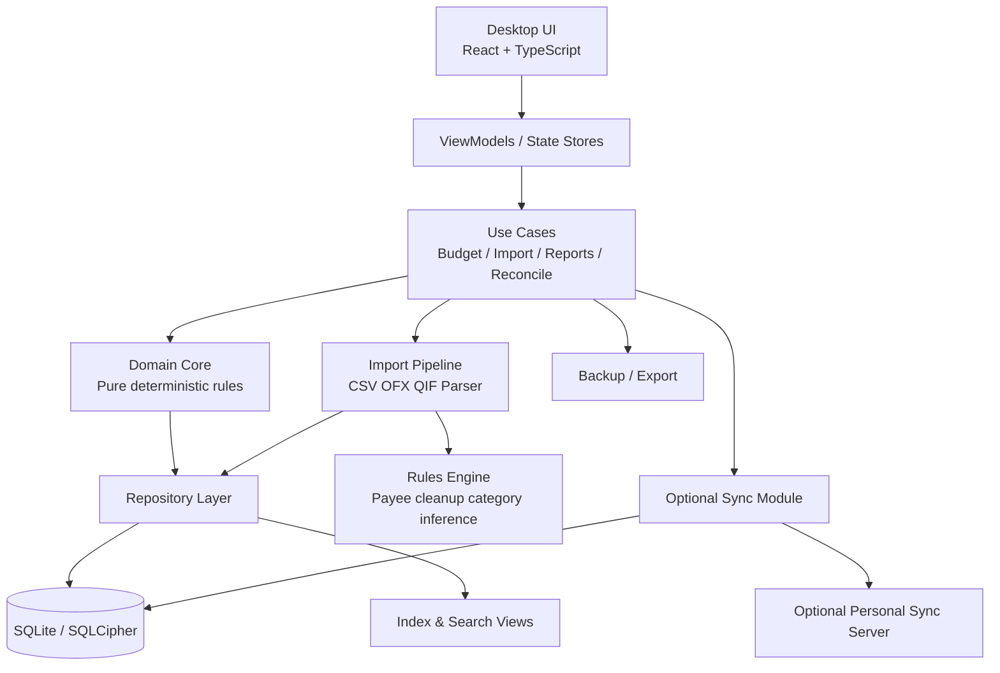
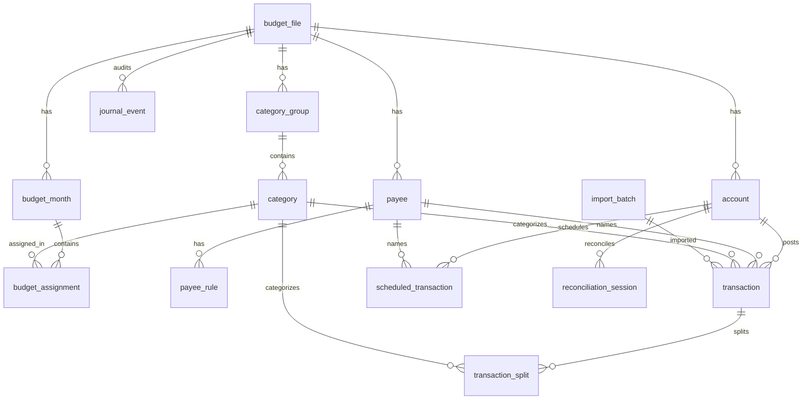
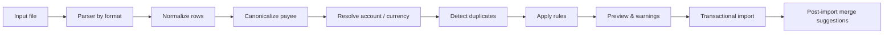
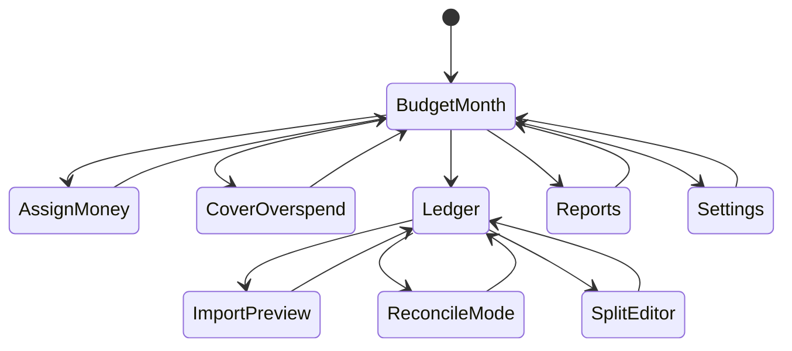

# Building a Private Offline First Budgeting App Inspired by YNAB

## Executive Technical Summary

A private, offline-first budgeting app in the style of YNAB is technically feasible without cloning proprietary code if you keep the design centered on five principles: local-authoritative data, exact integer money math, explicit monthly budget state, strong import/deduplication pipelines, and optional rather than mandatory sync. The strongest public technical reference implementation is **Actual Budget**, because it is explicitly local-first, open source, supports local data plus background sync, exposes an Electron-based desktop build, and documents budgeting, imports, reconciliation, duplicate merging, reporting, and sync-reset behavior in detail. Its docs also confirm an important architectural pattern: each device keeps a local copy, the server is a sync/backup transport, and sync reset compresses historical mutations into a new baseline. That is extremely relevant if your goal is a personal, private app that should still work fully with no network. citeturn24view6turn24view8turn55view0turn59view0turn60view0turn60view2

For a **personal protective offline deployment**, the best overall stack is **Tauri + React + TypeScript + SQLite/SQLCipher**, with a repository-driven MVVM-ish frontend and a deterministic budgeting engine in a shared core domain module. Tauri gives you a lighter desktop shell than Electron while still letting you use a browser-grade UI; its SQL plugin supports SQLite and migrations in atomic transactions. SQLite is a particularly strong fit because WAL mode improves reader/writer concurrency, atomic commit behavior is well documented, and SQLCipher adds full-database encryption using SQLite-compatible storage. If you later need mobile, the nearest equivalent stack is **Flutter + Drift + SQLite/SQLCipher**. citeturn31view5turn34view1turn34view2turn31view0turn32view3turn31view7

The budgeting model should be implemented as a **monthly allocation ledger over real account cash**, not as a pure projection layer. Public envelope-budgeting docs from Actual confirm the key behaviors: all current money is what can be budgeted now; all income can be assigned until “To Budget” reaches zero; leftover category balances roll forward; overspending is normally removed from next month’s “To Budget”; and users move money between categories when plans change. Those mechanics strongly suggest modeling budget state by month and category, with explicit derived fields for assigned, activity, available, rollover, and overspent. citeturn56view1turn57view1turn57view2turn57view3turn57view4

Credit cards are the hardest part of a YNAB-like system. Public official source material is incomplete on exact internals, but the available evidence is enough to design a robust non-proprietary equivalent: keep the card as a liability account, keep purchases as category spending, maintain a synthetic or system-managed payment category per on-budget credit account, and automatically move **cash-backed** purchase amounts into the payment category. Initial carried debt should not auto-fund the payment category; instead it should be handled by a debt payoff target. This is partly supported by Actual’s documentation that on-budget card debt must be captured in a category, by Actual’s public UI references showing dedicated “Credit Card Payments” categories, and by YNAB’s public API support for specialized credit-card-payment category targets. The exact formula below is therefore an **implementation recommendation**, not a verified copy of YNAB’s proprietary behavior. citeturn56view1turn53image3turn36view2

The most important implementation recommendation is this: **treat sync as optional and file-local storage as the primary truth**. That directly matches local-first guidance from Ink & Switch, matches Actual’s architecture, and materially improves privacy, resilience, and personal data ownership. If you never add sync, you still get a very strong app. If you add sync later, keep it mutation-based, encrypted end-to-end, and recoverable with sync reset plus immutable backups. citeturn27view0turn55view0turn56view0

## Source Map

### Primary and official sources

The highest-confidence sources below are official docs, official repositories, and primary project materials. Access date for all items: **2026-07-07**.

- **Actual Budget README** — URL: `https://github.com/actualbudget/actual/blob/master/README.md` — Reliability: 5/5 — Supports: local-first positioning, NodeJS, open-source status, local-only apps. Limitation: high-level, not full schema docs. citeturn22view6turn24view6turn24view8turn51view3turn51view4
- **Actual Budget package.json** — URL: `https://github.com/actualbudget/actual/blob/master/package.json` — Reliability: 5/5 — Supports: Electron workspace, web workspace, sync-server workspace, better-sqlite3 rebuild, monorepo structure. Limitation: implementation clues, not conceptual docs. citeturn22view7turn23view0turn51view0turn51view1turn51view2
- **Actual Budget sync docs** — URL: `https://actualbudget.org/docs/getting-started/sync/` — Reliability: 5/5 — Supports: local copy on each device, optional server, E2EE, sync reset, mutation compression, local unencrypted warning. Limitation: does not fully disclose crypto internals. citeturn55view0
- **Actual Budget privacy policy** — URL: `https://actualbudget.org/docs/privacy-policy/` — Reliability: 5/5 — Supports: local storage, no tracking, user-owned data, device-generated encryption key. Limitation: privacy statement, not technical threat model. citeturn56view0
- **Actual envelope budgeting docs** — URL: `https://actualbudget.org/docs/getting-started/envelope-budgeting/` — Reliability: 5/5 — Supports: zero-sum budgeting, “give every dollar a job,” month-ahead concept, credit-card debt must be represented in category logic. Limitation: educational, not formal spec. citeturn56view1
- **Actual budgeting docs** — URL: `https://actualbudget.org/docs/budgeting/` — Reliability: 5/5 — Supports: To Budget workflow, Available Funds, Hold for next month, overspending rollover behavior, moving money, negative-balance rollover option. Limitation: UI-centric rather than formal data model. citeturn57view1turn57view2turn57view3turn57view4
- **Actual importing docs** — URL: `https://actualbudget.org/docs/transactions/importing/` — Reliability: 5/5 — Supports: CSV/QIF/OFX/QFX/CAMT imports, field mapping, dedupe heuristics, reimportDeleted behavior. Limitation: no formal parser API contract in the page. citeturn59view0
- **Actual duplicate merge docs** — URL: `https://actualbudget.org/docs/transactions/merging/` — Reliability: 5/5 — Supports: merge rules, precedence of synced/imported/manual data, earlier-date fallback. Limitation: manual merge; not complete auto-merge ruleset. citeturn58view0
- **Actual reconciliation docs** — URL: `https://actualbudget.org/docs/accounts/reconciliation/` — Reliability: 5/5 — Supports: cleared vs uncleared states, reconciliation flow, use of synced balance. Limitation: does not define journal entries formally. citeturn60view0
- **Actual payees docs** — URL: `https://actualbudget.org/docs/transactions/payees/` — Reliability: 5/5 — Supports: payee cleanup, matching rules, default categories, category learning. Limitation: not a full automation engine spec. citeturn60view1
- **Actual reports docs** — URL: `https://actualbudget.org/docs/reports/` — Reliability: 5/5 — Supports: dashboards, filters, cash-flow, net-worth, spending, crossover point. Limitation: no SQL examples. citeturn60view2
- **YNAB public API docs** — URL: `https://api.ynab.com/` — Reliability: 5/5 — Supports: public resource model, delta requests, server_knowledge sync token, categories, accounts, scheduled transactions, transactions, money movements, category goal fields, credit card payment targets. Limitation: API surface, not internal implementation. citeturn36view0turn36view2turn36view3turn36view5
- **Buckets official site** — URL: `https://www.budgetwithbuckets.com/` — Reliability: 4/5 — Supports: privacy-first local storage, offline desktop emphasis, envelope budgeting, SimpleFIN import bridge. Limitation: not open source. citeturn20view0
- **Buckets guide** — URL: `https://www.budgetwithbuckets.com/guide/` — Reliability: 4/5 — Supports: app concepts and technical file-format entry point. Limitation: user guide, not full architecture. citeturn20view1
- **Buckets file format** — URL: `https://www.budgetwithbuckets.com/guide/fileformat/` — Reliability: 5/5 — Supports: SQLite budget files, integer amounts, FI ids, SQLite triggers updating balances, schema caveats. Limitation: proprietary app schema may change without notice. citeturn21view0
- **Firefly III README** — URL: `https://github.com/firefly-iii/firefly-iii/blob/main/readme.md` — Reliability: 5/5 — Supports: self-hosted model, budgets/categories/tags, recurring transactions, rules, reports, REST JSON API, 2FA, Docker. Limitation: not offline-first. citeturn22view0
- **Firefly III composer.json** — URL: `https://github.com/firefly-iii/firefly-iii/blob/main/composer.json` — Reliability: 5/5 — Supports: Laravel stack, Artisan workflow. Limitation: package list, not architecture explanation. citeturn22view8turn23view4turn23view5
- **Beancount repo** — URL: `https://github.com/beancount/beancount` — Reliability: 5/5 — Supports: double-entry from text files, report generation, web interface, scale and maturity. Limitation: not envelope-first. citeturn18view2turn23view8
- **Beancount docs** — URL: `https://beancount.github.io/docs/` — Reliability: 4/5 — Supports: user manual and tutorial/example ledger references. Limitation: docs page is index-level in fetched view. citeturn18view3turn24view5
- **Ledger repo** — URL: `https://github.com/ledger/ledger` — Reliability: 5/5 — Supports: plaintext double-entry command-line accounting. Limitation: not app-architectural for GUI budgeting. citeturn18view4turn24view0
- **Ledger manual** — URL: `https://ledger-cli.org/doc/ledger3.html` — Reliability: 5/5 — Supports: double-entry fundamentals, balance-to-zero invariant, reporting model. Limitation: text-journal oriented, not envelope UX. citeturn18view5turn24view2
- **hledger repo** — URL: `https://github.com/simonmichael/hledger` — Reliability: 5/5 — Supports: CLI/TUI/web interfaces, privacy, plain-text accounting ecosystem. Limitation: not envelope UX. citeturn18view6turn23view9
- **hledger site** — URL: `https://hledger.org/` — Reliability: 4/5 — Supports: project home and docs pointer. Limitation: fetched lines were limited. citeturn18view7
- **Money Manager Ex repo** — URL: `https://github.com/moneymanagerex/moneymanagerex` — Reliability: 5/5 — Supports: C++17, wxWidgets, wxSQLite3, SQLite3, cross-platform desktop. Limitation: not YNAB-style budgeting by default. citeturn18view8turn23view6
- **GnuCash repo** — URL: `https://github.com/Gnucash/gnucash` — Reliability: 5/5 — Supports: mature desktop accounting, CMake build, double-entry lineage. Limitation: accounting-first rather than envelope UX. citeturn18view9turn23view7
- **Ink & Switch local-first essay** — URL: `https://www.inkandswitch.com/essay/local-first/` — Reliability: 5/5 — Supports: local-first principles, ownership, optional network, privacy/security motivation. Limitation: conceptual, not a finance app guide. citeturn27view0
- **SQLite WAL** — URL: `https://www.sqlite.org/wal.html` — Reliability: 5/5 — Supports: WAL concurrency and performance, checkpoint behavior. Limitation: one engine strategy, not full app architecture. citeturn27view3turn34view0turn34view1turn34view5
- **SQLite atomic commit** — URL: `https://www.sqlite.org/atomiccommit.html` — Reliability: 5/5 — Supports: transactional guarantees, rollback behavior, power-failure resilience. Limitation: low-level engine internals. citeturn27view4turn34view2turn34view4
- **SQLCipher** — URL: `https://www.zetetic.net/sqlcipher/` — Reliability: 5/5 — Supports: SQLite-compatible encryption, 256-bit AES, tamper resistance, cross-platform. Limitation: homepage-level details only. citeturn27view5turn31view0turn31view2
- **Electron safeStorage** — URL: `https://www.electronjs.org/docs/latest/api/safe-storage` — Reliability: 5/5 — Supports: encryptString/decryptString, OS-backed secret storage integration. Limitation: key-value secret support, not full database encryption. citeturn27view6turn31view3
- **Tauri SQL plugin docs** — URL: `https://v2.tauri.app/plugin/sql/` — Reliability: 5/5 — Supports: SQLite use, migrations, transaction atomicity. Limitation: plugin docs, not full security guidance. citeturn27view7turn31view5
- **Flutter architecture docs** — URL: `https://docs.flutter.dev/app-architecture` — Reliability: 5/5 — Supports: recommended architecture, MVVM/state management, layering emphasis. Limitation: framework-generic rather than finance-specific. citeturn27view8turn32view3
- **Drift docs** — URL: `https://drift.simonbinder.eu/` — Reliability: 5/5 — Supports: type-safe SQL, validation, migrations, transactions, DAOs. Limitation: Flutter/Dart specific. citeturn27view9turn31view7
- **IndexedDB docs** — URL: `https://developer.mozilla.org/en-US/docs/Web/API/IndexedDB_API` — Reliability: 5/5 — Supports: transactional browser DB, indexes, local structured storage. Limitation: browser storage semantics vary by platform. citeturn27view2turn32view4
- **Web Storage docs** — URL: `https://developer.mozilla.org/en-US/docs/Web/API/Web_Storage_API` — Reliability: 5/5 — Supports: `localStorage`/`sessionStorage` are synchronous and not suitable for large datasets. Limitation: browser-only and simplistic storage. citeturn35view0
- **PouchDB replication guide** — URL: `https://pouchdb.com/guides/replication.html` — Reliability: 4/5 — Supports: local/remote sync, live replication, retry, conflicts, multi-master sync model. Limitation: CouchDB-style document store rather than relational budgeting schema. citeturn27view1turn33view0turn33view3
- **Next.js PWA guide** — URL: `https://nextjs.org/docs/app/guides/progressive-web-apps` — Reliability: 5/5 — Supports: manifest, service worker, installability, HTTPS/security headers, static export considerations, optional offline plugin. Limitation: web/PWA guidance rather than native/offline DB depth. citeturn28view3turn52view0turn52view1turn52view2
- **WatermelonDB docs** — URL: `https://watermelondb.dev/docs` — Reliability: 4/5 — Supports: offline-first React/React Native, SQLite-backed reactive model, lazy loading, sync hooks. Limitation: not desktop-focused. citeturn28view0

### Community and issue tracker sources

These are useful as **community signals**, not primary truth. They are valuable because they reveal real operational pain points.

- **Actual Budget issues** — URL: `https://github.com/actualbudget/actual/issues` — Reliability: 3/5 — Supports: real-world issues around CRDT message growth, PWA hangs, schedules, browser refresh errors, bank sync edge cases. Limitation: issue titles are symptoms, not resolved root causes. citeturn42view0
- **Firefly III issues** — URL: `https://github.com/firefly-iii/firefly-iii/issues` — Reliability: 3/5 — Supports: recurring/subscription requests, duplicate piggy-bank transactions, banking transfer detection, rule-trigger requests, running-balance bugs. Limitation: open issues can overrepresent edge cases. citeturn42view2turn43view0turn43view1
- **Firefly III discussions** — URL: `https://github.com/orgs/firefly-iii/discussions` — Reliability: 3/5 — Supports: data-importer duplicate issues, reconciliation questions, sinking-fund modeling, rule-trigger requests, API-spec gaps. Limitation: community Q&A, not formal commitments. citeturn45view0
- **Buckets issue tracker** — URL: `https://github.com/buckets/application/issues` — Reliability: 3/5 — Supports: future balances, macro sequencing, sync-import zero transactions, SimpleFIN integration pain points. Limitation: not open-source core code. citeturn46view0
- **Money Manager Ex issues** — URL: `https://github.com/moneymanagerex/moneymanagerex/issues` — Reliability: 3/5 — Supports: unique constraints, backup regressions, transfer/double-transaction confusion, webapp/desktop connection issues. Limitation: heterogeneous bug pool across long-lived app. citeturn49view0

## Conceptual System Architecture and Recommended Stack

### Conceptual architecture

**Verified facts.** Actual demonstrates a successful local-first architecture with a desktop app, browser UI, local data copy, optional sync server, and mutation-log compaction on sync reset. YNAB’s public API separately shows that a budgeting system of this class benefits from resource-level delta fetches and monotonically increasing sync knowledge tokens. SQLite and WAL provide the concurrency and atomicity characteristics you want for a local authoritative store. citeturn55view0turn36view5turn34view1turn34view2

**Recommendation.** Build the app as a layered local-first system:



The **domain core** should be framework-independent and pure. It owns budgeting math, derived fields, duplicate-detection decisions, reconciliation suggestions, and report query definitions. The **repository layer** owns SQLite transactions, migrations, indexes, and encryption hooks. The **UI** should never contain money math. That separation is the minimum viable architecture for correctness and maintainability. This also aligns well with Flutter’s recommended architectural guidance around intentional layering and MVVM/state-management, even if you implement the desktop product in Tauri/React instead. citeturn32view3turn31view5

### Architectural style choices

A budgeting app of this class benefits from a **hybrid of MVVM and event-sourced auditing**, not from full CQRS/event sourcing as a primary persistence model. **Inference.** Use MVVM at the UI layer, repositories plus immutable domain services in the application layer, and a relational store for current truth. Keep an append-only `journal_event` or `mutation_log` table for auditability, undo/redo, import provenance, and optional sync; do not make projections the sole source of truth. Actual’s sync reset docs explicitly mention historical mutations being compressed into a single file, which is strong evidence that append-only mutation history is useful operationally, but also that compaction is necessary if you do not want unbounded growth. citeturn55view0turn42view0

The backend can be **fully embedded** for the offline build: no HTTP server is required for MVP. If you later add sync, make it an optional module that exchanges encrypted mutations or encrypted snapshots against a user-controlled server, rather than converting the app into a cloud-first design. This follows both Actual’s documented “local on device + chosen server in background” approach and the broader local-first principles from Ink & Switch. citeturn55view0turn27view0

### Stack comparison

Scores below are **inferences** grounded in the cited platform capabilities, tooling, and operational signals. Scale: 1 poor, 5 strong.

| Stack | Offline reliability | Privacy | Dev ease | UI perf | DB robustness | Cross-platform | Maintainability | Security | Notes |
|---|---:|---:|---:|---:|---:|---:|---:|---:|---|
| Tauri + React + TS + SQLite/SQLCipher | 5 | 5 | 4 | 4 | 5 | 4 | 4 | 5 | Best fit for private desktop-first build |
| Electron + React + TS + better-sqlite3 + SQLCipher | 5 | 5 | 5 | 4 | 5 | 5 | 4 | 4 | Easiest if borrowing patterns from Actual |
| Flutter + Drift + SQLite/SQLCipher | 5 | 5 | 4 | 5 | 5 | 5 | 4 | 5 | Best if mobile parity matters soon |
| React Native + WatermelonDB + SQLite | 4 | 4 | 3 | 4 | 4 | 4 | 3 | 4 | Good mobile option, weaker desktop story |
| Next.js PWA + IndexedDB/PouchDB | 3 | 4 | 4 | 4 | 3 | 5 | 3 | 3 | Fast iteration, but browser storage/service-worker edge cases remain |

The **recommended stack is Tauri + React + TypeScript + SQLite/SQLCipher**. Tauri’s SQL plugin supports SQLite and migration execution in transactions; SQLite WAL gives robust single-user local behavior; SQLCipher provides full database encryption; and a browser UI remains productive and familiar. Compared with a PWA, it avoids browser-origin storage quotas, service-worker complexity, synchronous `localStorage` pitfalls, and some real-world idle/hanging risks seen in community reports for PWA-style deployments. Compared with Electron, it should ship smaller and use fewer resources, though Electron remains the safer choice if you want to mimic Actual’s existing technical patterns more directly. citeturn31view5turn34view1turn34view2turn31view0turn35view0turn32view4turn52view0turn52view2turn42view0

If you want the nearest publicly evidenced production analogue, choose **Electron + web frontend + optional sync server**, because Actual already proves that architecture in the budgeting domain. If you want the best privacy-weighted fresh build, choose **Tauri**. citeturn51view1turn51view2turn55view0

## Database Design and Offline First Storage

### Domain model and ERD description

**Recommended entities**

- `budget_file`
- `currency`
- `account`
- `category_group`
- `category`
- `budget_month`
- `budget_assignment`
- `payee`
- `payee_rule`
- `transaction`
- `transaction_split`
- `scheduled_transaction`
- `import_batch`
- `reconciliation_session`
- `journal_event`
- `attachment` optional

**Core relationships**



**Recommended modeling choices**

Store money as **signed 64-bit integers**. For a YNAB-inspired app, the cleanest compromise is `amount_milli` in **milliunits** so that `$12.34` becomes `12340`. That choice matches YNAB’s public API convention and still preserves exact math. Buckets separately confirms the general rule that finance apps should store integer amounts, not floats. citeturn36view2turn21view0

Use **explicit month records** instead of recomputing monthly state ad hoc. That makes envelope rollovers, overspending carry, “hold for next month,” and historical reporting much simpler and auditable. Actual’s budgeting docs strongly support that explicit monthly workflow. citeturn57view1turn57view2

Keep **accounts** and **categories** separate. Ledger/Beancount/hledger prove the durability of balanced account models, while envelope systems add a second planning dimension over category allocations. That means the model should distinguish: real cash/liability movement in account ledgers, and planning/availability state in category-month allocations. citeturn24view2turn23view8turn23view9

### Primary fields, constraints, derived fields, indexes, validation

| Entity | Primary fields | Key constraints | Derived fields / notes | Important indexes |
|---|---|---|---|---|
| `budget_file` | `id`, `name`, `base_currency_code`, `created_at`, `updated_at`, `schema_version` | single active base currency | local file metadata | PK |
| `currency` | `code`, `symbol`, `decimal_digits` | ISO-like unique code | formatting only | PK |
| `account` | `id`, `budget_file_id`, `name`, `type`, `currency_code`, `on_budget`, `closed`, `opening_balance_milli`, `opened_on` | name unique per budget among active accounts | `working_balance`, `cleared_balance`, `uncleared_balance` | `(budget_file_id, on_budget)`, `(budget_file_id, type)` |
| `category_group` | `id`, `budget_file_id`, `name`, `sort_order`, `system_group_type` | ordered within budget | supports special groups like CC payments | `(budget_file_id, sort_order)` |
| `category` | `id`, `group_id`, `name`, `is_hidden`, `is_system`, `target_type`, `target_milli`, `target_date`, `rollover_mode`, `linked_account_id` | unique name within group | for CC payment category `linked_account_id` references liability account | `(group_id, sort_order)` |
| `budget_month` | `id`, `budget_file_id`, `month_ym`, `available_funds_milli`, `held_for_future_milli`, `overspent_from_prev_milli` | unique month per budget | `to_budget = available_funds - assigned - held` | `(budget_file_id, month_ym)` unique |
| `budget_assignment` | `budget_month_id`, `category_id`, `assigned_milli`, `activity_milli`, `available_milli`, `carry_in_milli`, `carry_out_milli` | unique `(budget_month_id, category_id)` | `available = carry_in + assigned - activity +/- adjustments` | unique composite |
| `payee` | `id`, `budget_file_id`, `name`, `canonical_name`, `default_category_id`, `transfer_account_id`, `favorite`, `learning_enabled` | canonical name unique optionally | supports cleanup and transfer payees | `(budget_file_id, canonical_name)` |
| `payee_rule` | `id`, `payee_id`, `match_type`, `pattern`, `priority`, `is_active` | ordered by priority | exact/contains/regex | `(payee_id, priority)` |
| `transaction` | `id`, `account_id`, `date_posted`, `date_effective`, `amount_milli`, `payee_id`, `raw_import_payee`, `category_id`, `notes`, `transfer_account_id`, `cleared_state`, `import_batch_id`, `external_id`, `is_deleted`, `is_parent_split` | either category or transfer, not both; balance sign conventions by account type | `running_balance` is query-derived, not stored | `(account_id, date_posted, id)`, `(account_id, external_id)`, `(import_batch_id)` |
| `transaction_split` | `id`, `parent_transaction_id`, `category_id`, `amount_milli`, `notes` | sum of splits = parent amount | parent has no direct category | `(parent_transaction_id)` |
| `scheduled_transaction` | `id`, `account_id`, `next_due_on`, `rrule`, `amount_milli`, `payee_id`, `category_id`, `transfer_account_id`, `auto_create`, `last_created_on` | either category or transfer | materialize into transactions | `(account_id, next_due_on)` |
| `import_batch` | `id`, `account_id`, `source_type`, `file_name`, `imported_at`, `sha256`, `row_count`, `reimport_deleted` | file hash unique per account if desired | provenance and dedupe anchor | `(account_id, imported_at)` |
| `reconciliation_session` | `id`, `account_id`, `statement_ending_on`, `target_balance_milli`, `started_at`, `finished_at`, `status` | one open session per account | diff is computed live | `(account_id, status)` |
| `journal_event` | `id`, `budget_file_id`, `entity_type`, `entity_id`, `event_type`, `payload_json`, `created_at`, `device_id` | append-only | supports audit, undo, optional sync export | `(budget_file_id, created_at)`, `(entity_type, entity_id)` |

**Validation rules**

- No floating-point money anywhere.
- `transaction.amount_milli != 0`.
- Parent split transaction has `is_parent_split = 1` and `category_id IS NULL`.
- Non-split transaction must have exactly one of:
  - `category_id IS NOT NULL`
  - `transfer_account_id IS NOT NULL`
  - income category if modeled as special category.
- For on-budget transfer between two accounts, create **two mirrored ledger rows** linked by `transfer_id`, or one logical transfer expanded into two postings in the repository layer.
- `budget_month.month_ym` should be canonical `YYYY-MM`.
- `scheduled_transaction.rrule` should be normalized and validated when saved.
- `account.type` constrained to enum: `checking | savings | cash | credit_card | loan | investment | asset | liability`.
- `cleared_state` constrained to enum: `uncleared | cleared | reconciled`.

### SQLite schema

This is a **recommended MVP schema**, not a recovered proprietary schema:

```sql
PRAGMA foreign_keys = ON;
PRAGMA journal_mode = WAL;
PRAGMA synchronous = NORMAL;
PRAGMA temp_store = MEMORY;

CREATE TABLE budget_file (
  id TEXT PRIMARY KEY,
  name TEXT NOT NULL,
  base_currency_code TEXT NOT NULL,
  schema_version INTEGER NOT NULL DEFAULT 1,
  created_at TEXT NOT NULL,
  updated_at TEXT NOT NULL
);

CREATE TABLE account (
  id TEXT PRIMARY KEY,
  budget_file_id TEXT NOT NULL REFERENCES budget_file(id) ON DELETE CASCADE,
  name TEXT NOT NULL,
  type TEXT NOT NULL CHECK (type IN (
    'checking','savings','cash','credit_card','loan','investment','asset','liability'
  )),
  currency_code TEXT NOT NULL,
  on_budget INTEGER NOT NULL CHECK (on_budget IN (0,1)),
  closed INTEGER NOT NULL DEFAULT 0 CHECK (closed IN (0,1)),
  opening_balance_milli INTEGER NOT NULL DEFAULT 0,
  opened_on TEXT NOT NULL,
  created_at TEXT NOT NULL,
  updated_at TEXT NOT NULL
);

CREATE UNIQUE INDEX ux_account_name_active
ON account(budget_file_id, name, closed);

CREATE TABLE category_group (
  id TEXT PRIMARY KEY,
  budget_file_id TEXT NOT NULL REFERENCES budget_file(id) ON DELETE CASCADE,
  name TEXT NOT NULL,
  sort_order INTEGER NOT NULL,
  system_group_type TEXT,
  created_at TEXT NOT NULL,
  updated_at TEXT NOT NULL
);

CREATE TABLE category (
  id TEXT PRIMARY KEY,
  group_id TEXT NOT NULL REFERENCES category_group(id) ON DELETE CASCADE,
  name TEXT NOT NULL,
  sort_order INTEGER NOT NULL,
  is_hidden INTEGER NOT NULL DEFAULT 0 CHECK (is_hidden IN (0,1)),
  is_system INTEGER NOT NULL DEFAULT 0 CHECK (is_system IN (0,1)),
  target_type TEXT,
  target_milli INTEGER,
  target_date TEXT,
  rollover_mode TEXT NOT NULL DEFAULT 'carry_positive'
    CHECK (rollover_mode IN ('carry_positive','carry_all','reset_zero','carry_negative')),
  linked_account_id TEXT REFERENCES account(id),
  created_at TEXT NOT NULL,
  updated_at TEXT NOT NULL
);

CREATE UNIQUE INDEX ux_category_name_per_group
ON category(group_id, name);

CREATE TABLE budget_month (
  id TEXT PRIMARY KEY,
  budget_file_id TEXT NOT NULL REFERENCES budget_file(id) ON DELETE CASCADE,
  month_ym TEXT NOT NULL,
  available_funds_milli INTEGER NOT NULL DEFAULT 0,
  held_for_future_milli INTEGER NOT NULL DEFAULT 0,
  overspent_from_prev_milli INTEGER NOT NULL DEFAULT 0,
  created_at TEXT NOT NULL,
  updated_at TEXT NOT NULL,
  UNIQUE (budget_file_id, month_ym)
);

CREATE TABLE budget_assignment (
  budget_month_id TEXT NOT NULL REFERENCES budget_month(id) ON DELETE CASCADE,
  category_id TEXT NOT NULL REFERENCES category(id) ON DELETE CASCADE,
  carry_in_milli INTEGER NOT NULL DEFAULT 0,
  assigned_milli INTEGER NOT NULL DEFAULT 0,
  activity_milli INTEGER NOT NULL DEFAULT 0,
  available_milli INTEGER NOT NULL DEFAULT 0,
  carry_out_milli INTEGER NOT NULL DEFAULT 0,
  PRIMARY KEY (budget_month_id, category_id)
);

CREATE TABLE payee (
  id TEXT PRIMARY KEY,
  budget_file_id TEXT NOT NULL REFERENCES budget_file(id) ON DELETE CASCADE,
  name TEXT NOT NULL,
  canonical_name TEXT NOT NULL,
  default_category_id TEXT REFERENCES category(id),
  transfer_account_id TEXT REFERENCES account(id),
  favorite INTEGER NOT NULL DEFAULT 0 CHECK (favorite IN (0,1)),
  learning_enabled INTEGER NOT NULL DEFAULT 1 CHECK (learning_enabled IN (0,1)),
  created_at TEXT NOT NULL,
  updated_at TEXT NOT NULL
);

CREATE INDEX ix_payee_canonical ON payee(budget_file_id, canonical_name);

CREATE TABLE payee_rule (
  id TEXT PRIMARY KEY,
  payee_id TEXT NOT NULL REFERENCES payee(id) ON DELETE CASCADE,
  match_type TEXT NOT NULL CHECK (match_type IN ('exact','contains','regex')),
  pattern TEXT NOT NULL,
  priority INTEGER NOT NULL DEFAULT 100,
  is_active INTEGER NOT NULL DEFAULT 1 CHECK (is_active IN (0,1))
);

CREATE INDEX ix_payee_rule_lookup ON payee_rule(payee_id, priority, is_active);

CREATE TABLE import_batch (
  id TEXT PRIMARY KEY,
  account_id TEXT NOT NULL REFERENCES account(id) ON DELETE CASCADE,
  source_type TEXT NOT NULL CHECK (source_type IN ('csv','ofx','qif','qfx','camt','manual','api')),
  file_name TEXT,
  file_sha256 TEXT,
  row_count INTEGER NOT NULL DEFAULT 0,
  reimport_deleted INTEGER NOT NULL DEFAULT 1 CHECK (reimport_deleted IN (0,1)),
  imported_at TEXT NOT NULL
);

CREATE TABLE transaction_entry (
  id TEXT PRIMARY KEY,
  account_id TEXT NOT NULL REFERENCES account(id) ON DELETE CASCADE,
  transfer_ref TEXT,
  parent_transaction_id TEXT REFERENCES transaction_entry(id) ON DELETE CASCADE,
  date_posted TEXT NOT NULL,
  date_effective TEXT,
  amount_milli INTEGER NOT NULL CHECK (amount_milli <> 0),
  payee_id TEXT REFERENCES payee(id),
  raw_import_payee TEXT,
  category_id TEXT REFERENCES category(id),
  notes TEXT,
  transfer_account_id TEXT REFERENCES account(id),
  import_batch_id TEXT REFERENCES import_batch(id),
  external_id TEXT,
  cleared_state TEXT NOT NULL DEFAULT 'uncleared'
    CHECK (cleared_state IN ('uncleared','cleared','reconciled')),
  is_parent_split INTEGER NOT NULL DEFAULT 0 CHECK (is_parent_split IN (0,1)),
  is_deleted INTEGER NOT NULL DEFAULT 0 CHECK (is_deleted IN (0,1)),
  created_at TEXT NOT NULL,
  updated_at TEXT NOT NULL,
  CHECK (
    (is_parent_split = 1 AND category_id IS NULL) OR
    (is_parent_split = 0)
  )
);

CREATE INDEX ix_tx_account_date ON transaction_entry(account_id, date_posted, id);
CREATE INDEX ix_tx_external ON transaction_entry(account_id, external_id);
CREATE INDEX ix_tx_import_batch ON transaction_entry(import_batch_id);

CREATE TABLE transaction_split (
  id TEXT PRIMARY KEY,
  parent_transaction_id TEXT NOT NULL REFERENCES transaction_entry(id) ON DELETE CASCADE,
  category_id TEXT NOT NULL REFERENCES category(id),
  amount_milli INTEGER NOT NULL CHECK (amount_milli <> 0),
  notes TEXT
);

CREATE INDEX ix_split_parent ON transaction_split(parent_transaction_id);

CREATE TABLE scheduled_transaction (
  id TEXT PRIMARY KEY,
  account_id TEXT NOT NULL REFERENCES account(id) ON DELETE CASCADE,
  next_due_on TEXT NOT NULL,
  rrule TEXT NOT NULL,
  amount_milli INTEGER NOT NULL CHECK (amount_milli <> 0),
  payee_id TEXT REFERENCES payee(id),
  category_id TEXT REFERENCES category(id),
  transfer_account_id TEXT REFERENCES account(id),
  auto_create INTEGER NOT NULL DEFAULT 0 CHECK (auto_create IN (0,1)),
  last_created_on TEXT
);

CREATE INDEX ix_sched_due ON scheduled_transaction(account_id, next_due_on);

CREATE TABLE reconciliation_session (
  id TEXT PRIMARY KEY,
  account_id TEXT NOT NULL REFERENCES account(id) ON DELETE CASCADE,
  statement_ending_on TEXT NOT NULL,
  target_balance_milli INTEGER NOT NULL,
  started_at TEXT NOT NULL,
  finished_at TEXT,
  status TEXT NOT NULL CHECK (status IN ('open','completed','aborted'))
);

CREATE INDEX ix_reconcile_open ON reconciliation_session(account_id, status);

CREATE TABLE journal_event (
  id TEXT PRIMARY KEY,
  budget_file_id TEXT NOT NULL REFERENCES budget_file(id) ON DELETE CASCADE,
  entity_type TEXT NOT NULL,
  entity_id TEXT NOT NULL,
  event_type TEXT NOT NULL,
  payload_json TEXT NOT NULL,
  device_id TEXT,
  created_at TEXT NOT NULL
);

CREATE INDEX ix_event_timeline ON journal_event(budget_file_id, created_at);
```

### Example JSON records

```json
{
  "account": {
    "id": "acc_chk_01",
    "name": "Main Checking",
    "type": "checking",
    "on_budget": true,
    "currency_code": "USD",
    "opening_balance_milli": 2500000
  },
  "category": {
    "id": "cat_groceries",
    "group_id": "grp_monthly",
    "name": "Groceries",
    "target_type": "monthly_refill",
    "target_milli": 600000,
    "rollover_mode": "carry_positive"
  },
  "budget_assignment": {
    "budget_month_id": "m_2026_07",
    "category_id": "cat_groceries",
    "carry_in_milli": 125000,
    "assigned_milli": 600000,
    "activity_milli": -412340,
    "available_milli": 312660
  },
  "transaction": {
    "id": "tx_2026_07_001",
    "account_id": "acc_cc_01",
    "date_posted": "2026-07-03",
    "amount_milli": -84250,
    "payee_id": "payee_trader_joes",
    "category_id": "cat_groceries",
    "cleared_state": "cleared",
    "external_id": "OFX:20260703:991827"
  }
}
```

### SQLite local strategies

Use **WAL mode** for day-to-day operation because readers do not block writers and vice versa, which keeps reporting, search, and editing responsive. Use periodic checkpoints on idle, app close, and successful backup points. Use `foreign_keys = ON` always. Prefer `synchronous = NORMAL` for normal operation and a temporary `FULL` during backup/export if you want extra conservatism. SQLite’s own docs are very explicit about both WAL concurrency and rollback/WAL atomicity semantics. citeturn34view1turn34view4turn34view5

For desktop offline safety, combine:
- SQLCipher or equivalent full DB encryption,
- OS full-disk encryption,
- key material in OS keychain/safe storage,
- immutable timestamped backup copies,
- export to encrypted archive on user request. citeturn31view0turn31view2turn31view3turn55view0

## Budgeting Engine and Import Pipeline

### Budgeting formulas

**Verified behaviors** from public sources:
- Budget only current cash, not forecast income. citeturn57view1
- “To Budget”/available funds can be held for next month. citeturn57view2turn57view3
- Leftover category balances can roll forward. citeturn57view2turn57view4
- Overspending is commonly removed from next month’s “To Budget,” with an optional mode to roll negative category balances for reimbursements. citeturn57view2turn57view4
- Reconciliation is cleared/uncleared matching against statement balances. citeturn60view0

**Recommended engine formulas**

For month `m` and category `c`:

```text
cash_on_hand_m
  = sum(balance of all on_budget cash/asset accounts at month cut-off)
    - sum(balance of all on_budget liability accounts that should reduce budget cash only through explicit debt modeling as designed)

available_funds_m
  = unassigned_income_carry_in_m + income_received_in_m - overspent_from_prev_m

assigned_m,c
  = sum(user budget allocations into category c in month m)

activity_m,c
  = -sum(posted spending transactions categorized to c in month m)
    + sum(refunds/reimbursements categorized to c in month m)

carry_in_m,c
  = if rollover_mode = carry_positive
      then max(0, available_(m-1,c))
      else if rollover_mode = carry_all
      then available_(m-1,c)
      else 0

available_m,c
  = carry_in_m,c + assigned_m,c + activity_m,c + system_adjustments_m,c

to_budget_m
  = available_funds_m - sum(assigned_m,all_categories) - held_for_future_m
```

For normal overspending at month close:

```text
overspent_from_prev_(m+1)
  = sum(abs(min(0, available_m,c))) over categories
    where rollover_mode != carry_negative

available_(m+1,c)
  = 0 for negative categories unless carry_negative is enabled
```

That matches the public Actual workflow closely while remaining implementation-independent. citeturn57view1turn57view2turn57view4

### Credit card handling

**Inference supported by public evidence.** The closest reproducible non-proprietary behavior is:

1. A credit card is an **on-budget liability account**.
2. Each on-budget credit card gets a linked **system payment category**.
3. A card purchase categorized to `Groceries`:
   - records debt increase in the card account,
   - increases `Groceries` activity,
   - **moves the same cash-backed amount** from general budget capacity into the card payment category.
4. A payment transfer from checking to card:
   - decreases checking,
   - decreases card liability,
   - decreases the linked payment category available.
5. Existing debt at setup time does **not** auto-create payment funds; user must assign money to the payment category or a debt payoff target.
6. Interest/fees on the card should not auto-fund the payment category; they are a category expense and increase debt until covered.

Worked example:

```text
Initial:
Checking = 2,000.00
Credit Card = -300.00 existing debt
Groceries available = 600.00
CC Payment available = 0.00

New grocery purchase on CC = 84.25
After purchase:
Credit Card account = -384.25
Groceries activity = -84.25
Groceries available = 515.75
CC Payment available = 84.25

User pays 80.00 from checking to CC:
Checking = 1,920.00
Credit Card account = -304.25
CC Payment available = 4.25

User assigns 100.00 more to CC Payment to pay down prior debt:
CC Payment available = 104.25
```

This pattern is consistent with Actual’s public guidance that on-budget card debt must be captured in a category, its public UI references for “Credit Card Payments,” and YNAB’s public API support for dedicated credit-card-payment targets. Treat it as a **recommended replica pattern**, not a verified internal YNAB clone. citeturn56view1turn53image3turn36view2

### Scheduled transactions and reconciliation

Scheduled transactions should be stored as templates plus recurrence rules, then materialized into pending/real ledger entries when due. YNAB’s public API surface includes scheduled transactions as first-class resources, and Actual and Firefly both expose recurring/scheduled transaction concepts publicly. That is enough evidence that recurrence belongs in the domain model, not just in UI reminders. citeturn36view0turn36view5turn22view0

Reconciliation should be statement-led:
- a transaction can move `uncleared -> cleared -> reconciled`,
- reconciliation sessions store target statement balance,
- the UI computes the diff in real time as users mark entries,
- reconciled entries become read-mostly and require explicit override to edit. Actual’s public docs describe the cleared/uncleared workflow directly. citeturn60view0

### Age of money

**Inference.** Public primary technical documentation for YNAB’s exact metric was not retrieved in this research set, so the following is an implementable approximation rather than a verified clone.

Recommended approximation:

```text
For each cash-backed outflow transaction t in trailing 30-90 days:
age_days_t = outflow_date_t - funding_date_of_allocated_cash_t

age_of_money
  = weighted_average(age_days_t, weight = abs(cash-backed outflow amount))
```

If you do not want FIFO lot-tracking of cash provenance, a simpler proxy is:

```text
age_of_money_proxy
  = today - weighted_average(inflow_date_lots that still funded recent spending)
```

For MVP, ship this metric as **“Cash Buffer Age”** instead of “Age of Money” to avoid implying exact product parity.

### Import pipeline

Public docs from Actual provide a strong baseline: support CSV, QIF, OFX, QFX, CAMT; map CSV fields explicitly; prefer OFX/QFX because IDs are richer; and dedupe first by external ID, then by date/amount/payee similarity. Actual also auto-matches imported payees to existing cleaned payees through payee rules and can auto-assign default categories. citeturn59view0turn60view1turn58view0

Recommended pipeline:



Pseudocode:

```text
function importTransactions(accountId, source):
    rows = parseSource(source)  // csv, ofx, qif, qfx, camt
    batch = createImportBatch(accountId, source.meta)

    begin transaction
    for row in rows:
        tx = normalize(row)

        tx.raw_import_payee = tx.payee
        tx.payee = canonicalizePayee(tx.payee)   // trim, uppercase, collapse spaces, strip boilerplate

        payeeMatch = findPayeeByExactName(tx.payee)
                  ?? findPayeeByRules(tx.payee)
                  ?? createPayee(tx.payee)

        tx.payee_id = payeeMatch.id

        if payeeMatch.default_category_id and tx.category_id is null:
            tx.category_id = payeeMatch.default_category_id

        dup = findByExternalId(accountId, tx.external_id)
           ?? findSimilar(accountId,
                          dateWindow = ±3 days,
                          amount = tx.amount,
                          payeeSimilarity >= threshold)

        if dup exists:
            if shouldMerge(dup, tx):
                mergeTransactions(dup, tx)   // imported beats manual; richer source beats poorer source
            else:
                markAsPossibleDuplicate(tx, dup)
            continue

        insertTransaction(tx, batch.id)

    commit
```

Suggested duplicate precedence, borrowing from Actual’s documented merge logic:

```text
bank-sync imported > file imported > manual
if same rank: earlier canonical posted date wins as kept row
```

That precedence is directly supported for manual merge in Actual’s docs and works well as an automated policy too. citeturn58view0

### Rules and automation engine design

**Recommended design.** Keep the rules engine deterministic and side-effect-limited.

Rule scopes:
- payee normalization,
- default category assignment,
- tag attachment,
- memo rewrite,
- transfer detection,
- scheduled auto-fill,
- future-month holding rule on income,
- alert creation only, never silent destructive edits.

Rule model:

```json
{
  "id": "rule_001",
  "scope": "transaction_import",
  "priority": 50,
  "enabled": true,
  "conditions": [
    { "field": "raw_payee", "op": "contains_ci", "value": "TRADER JOE" },
    { "field": "amount_milli", "op": "lt", "value": 0 }
  ],
  "actions": [
    { "type": "set_payee", "value": "Trader Joe's" },
    { "type": "set_category", "value": "cat_groceries" }
  ]
}
```

Execution order:
1. canonicalization,
2. exact rule matches,
3. contains/regex,
4. learned-category fallback,
5. duplicate detection,
6. preview.

Actual’s payee rules and default categories provide strong evidence for this structure, and Firefly’s public feature set also reinforces first-class rule-based transaction handling. citeturn60view1turn22view0

### Reporting and analytics SQL

Representative SQLite queries for MVP:

```sql
-- Monthly spending by category
SELECT substr(t.date_posted, 1, 7) AS month_ym,
       c.name AS category,
       SUM(CASE WHEN ts.id IS NULL THEN -t.amount_milli ELSE -ts.amount_milli END) / 1000.0 AS spent
FROM transaction_entry t
LEFT JOIN transaction_split ts ON ts.parent_transaction_id = t.id
LEFT JOIN category c ON c.id = COALESCE(ts.category_id, t.category_id)
JOIN account a ON a.id = t.account_id
WHERE a.on_budget = 1
  AND COALESCE(ts.category_id, t.category_id) IS NOT NULL
  AND t.amount_milli < 0
  AND t.is_deleted = 0
GROUP BY month_ym, category
ORDER BY month_ym, spent DESC;
```

```sql
-- Cash flow by month
SELECT substr(date_posted,1,7) AS month_ym,
       SUM(CASE WHEN amount_milli > 0 THEN amount_milli ELSE 0 END) / 1000.0 AS inflow,
       SUM(CASE WHEN amount_milli < 0 THEN -amount_milli ELSE 0 END) / 1000.0 AS outflow
FROM transaction_entry t
JOIN account a ON a.id = t.account_id
WHERE a.on_budget = 1
  AND t.is_deleted = 0
GROUP BY month_ym
ORDER BY month_ym;
```

```sql
-- Net worth snapshot by day
SELECT date_posted AS day,
       SUM(amount_milli) OVER (
          PARTITION BY account_id
          ORDER BY date_posted, id
          ROWS BETWEEN UNBOUNDED PRECEDING AND CURRENT ROW
       ) / 1000.0 AS running_balance
FROM transaction_entry
WHERE is_deleted = 0;
```

Visualization suggestions:
- line: cash on hand over time,
- line/stacked area: net worth by account,
- bar: assigned vs spent vs available by category,
- waterfall: month-to-month “To Budget” changes,
- calendar heatmap: daily spend,
- reconciliation diff widget,
- “cash buffer age” trend. Actual’s public reporting model confirms this general family of widgets is useful in a budgeting app. citeturn60view2

## UI Blueprint, Security Model, MVP Roadmap, Risks, and Final Build Specification

### UI screens and state transitions

The most valuable public UI inspirations are Actual, Firefly III, and Buckets. Actual’s public examples show the month summary plus category grid and dedicated credit-card-payment sections; Firefly demonstrates dashboard/report density; Buckets reinforces local-private positioning and future-balance thinking. citeturn53image3turn53image5turn53image1turn20view0turn20view1

iturn53image3turn53image5turn53image1turn53image6

Recommended screens:

| Screen | Purpose | Data needed | Key states |
|---|---|---|---|
| Budget month | category planning and overspending control | `budget_month`, `budget_assignment`, account cash summary | loading, ready, dirty, recalculating, month-closed |
| Account ledger | transaction entry, import, reconciliation | account, ledger rows, running balances | filtered, split-edit, importing, reconcile mode |
| Import preview | mapping, dedupe, rule preview | parsed rows, duplicate candidates, rule matches | mapping-required, warnings, ready-to-commit |
| Payees & rules | cleanup and automation | payees, rules, hit counters | learning-on/off, test mode |
| Scheduled transactions | recurring bills/income | recurrence templates, due list | upcoming, due, skipped |
| Reports dashboard | analytics | query outputs, filters, date ranges | live range, static range, export |
| Settings/security | encryption, backups, storage path | key metadata, backup jobs | locked, unlocked, rotated, export-ready |

Core UI transitions:



### Security and privacy model

**Verified facts.** Actual’s public docs say local device data is still unencrypted by default, recommend full-disk encryption, and note that bank-sync credentials may sit outside budget-data E2EE on the server. SQLCipher provides full database encryption for SQLite-compatible databases. Electron exposes safeStorage for encrypting secret strings in OS-backed facilities. citeturn55view0turn31view0turn31view3

**Recommended security architecture**

- **Threat model**
  - lost laptop,
  - local file theft,
  - casual malware reading app files,
  - hostile cloud/server operator if optional sync is enabled,
  - accidental user deletion/corruption,
  - bank-import credential exposure.

- **Controls**
  - SQLCipher database encryption for the entire local DB.
  - Master key derived from user passphrase using modern KDF settings chosen by the crypto library.
  - Wrapped data-encryption key stored in OS keychain/safe storage; require passphrase on first unlock on each device.
  - App lock on idle.
  - Signed, versioned, encrypted backups.
  - Secrets separated from transaction tables.
  - For optional sync: E2E-encrypt mutations/snapshots before upload; server stores ciphertext only.
  - Full-disk encryption still recommended as a second layer.
  - Never store bank credentials in plaintext in the SQLite file.

Recommended key hierarchy:

```text
User passphrase
   -> KDF
      -> Key Encryption Key

Random Data Encryption Key
   -> encrypt SQLite database via SQLCipher
   -> wrapped by Key Encryption Key
   -> wrapped copy optionally stored in OS keychain for convenience unlock
```

### MVP roadmap

| Phase | Deliverable | Scope |
|---|---|---|
| Foundation | Local encrypted desktop app shell | Tauri/Electron shell, migrations, repositories, settings, backup/export |
| Core ledger | Accounts, payees, transactions, splits, transfers | exact integer math, running balances, search/filter |
| Budget engine | Monthly budget pages | assign, move money, rollover, overspend handling, month-ahead hold |
| Import | CSV + OFX/QFX first, then QIF/CAMT | mapping UI, payee cleanup, dedupe, preview |
| Reliability | Reconciliation + scheduled transactions | cleared states, reconcile sessions, recurring templates |
| Analytics | Reports dashboard | cash flow, net worth, category spend, export CSV |
| Hardening | Encryption UX, restore drills, test corpus | corruption tests, import fuzzing, migration tests |
| Optional sync | Personal-server encrypted sync | only after offline product is stable |

### Risks and unknowns

**Community signals.** Real-world issue trackers show that the hardest operational areas are recurring schedules, sync divergence, duplicate imports, bank API quirks, transfer detection, PWA/runtime environment differences, and backup regressions. Those are consistent across Actual, Firefly III, Buckets, and Money Manager Ex issue/discussion surfaces. citeturn42view0turn42view2turn45view0turn46view0turn49view0

Key risks:

- **Credit card semantics** are easy to get subtly wrong.
- **Recurring transaction materialization** can double-create rows around timezone/date boundaries.
- **Import dedupe** can create false positives or re-import deleted transactions if provenance handling is weak.
- **Sync history growth** will become real if you persist every mutation forever and never compact.
- **Browser/PWA storage** introduces avoidable complexity for a privacy-first personal tool.
- **Multi-currency** increases complexity sharply for budgeting availability versus account valuation.

### Open questions and limitations

The main unresolved area in this research set is the **exact internal formula used by YNAB for proprietary metrics like Age of Money and the exact proprietary credit-card implementation details**. Public YNAB API docs expose the data surface and some target semantics, but not the internal budgeting engine. Where that mattered, this report clearly distinguishes **verified public facts** from **recommended implementable inferences**. citeturn36view0turn36view2turn36view5

### Final build specification

**Recommended build**

- **Product form:** desktop-first, private, offline-first personal budgeting app.
- **Stack:** Tauri + React + TypeScript + SQLite/SQLCipher.
- **Architecture:** MVVM-ish UI, pure domain core, repository/data-access layer, append-only audit table, optional sync module.
- **Money model:** signed 64-bit milliunits.
- **Persistence:** SQLite with WAL, foreign keys, typed migrations, periodic backup/export.
- **Security:** SQLCipher + OS secret storage + optional passphrase unlock + encrypted backups.
- **Entities:** budget file, accounts, category groups/categories, months/assignments, payees/rules, transactions/splits, scheduled transactions, import batches, reconciliation sessions, audit events.
- **Imports:** CSV and OFX/QFX first; QIF/CAMT second wave; dedupe by external ID then fuzzy matching.
- **Engine behaviors:** zero-based budgeting, move-money workflow, positive rollover, negative-override mode for reimbursements, linked credit-card payment categories, cleared/reconciled states.
- **Reports:** net worth, cash flow, category spending, category balances, reconciliation differences, cash buffer age.
- **Sync:** not in MVP; if added, use encrypted user-controlled sync only.

If the objective is **maximum privacy and resilience for personal offline use**, this specification is the best balance of technical rigor, maintainability, and public-source grounding. It captures the strongest ideas visible in Actual, YNAB’s public API surface, Buckets, Firefly III, and the plain-text/double-entry ecosystem, without depending on any proprietary implementation details. citeturn55view0turn36view5turn21view0turn22view0turn24view2turn23view9